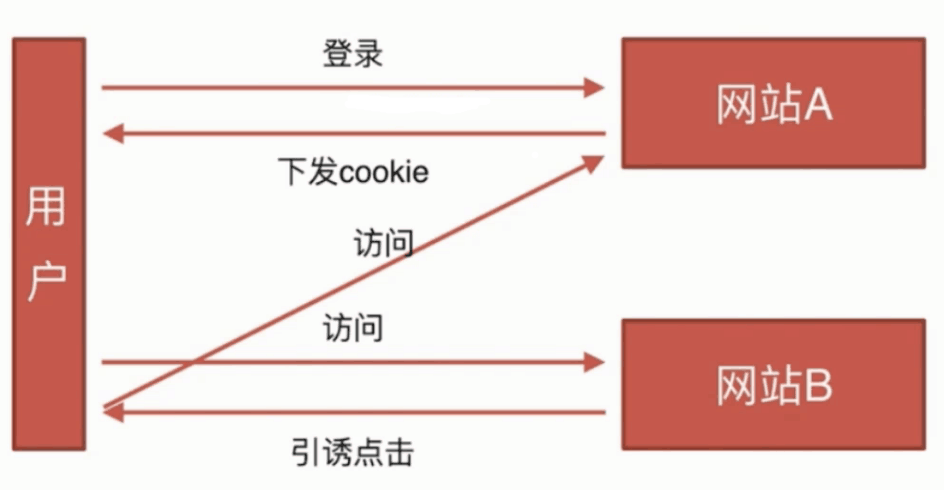

## CSRF

基本概念

CSRF, Cross-site request forgery，称为跨站请求伪造

**攻击原理**

**CSRF攻击成功的因素：**

1. 网站中某一接口存在漏洞
2. 用户在网站中登录过

**防御措施**

* Token验证
* Referer验证
* 隐藏令牌

## XSS

基本概念和缩写

XSS corss-site scripting 跨域脚本攻击

攻击原理，防御措施 http://www.imooc.com/learn/812

核心原理：向页面注入js脚本（form表单，写script eval等）
