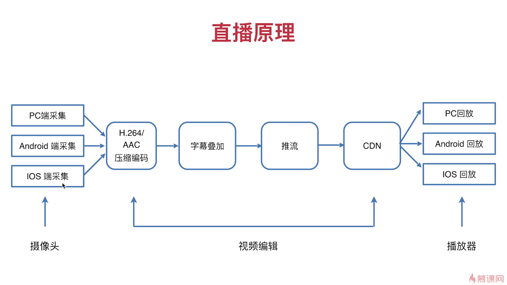
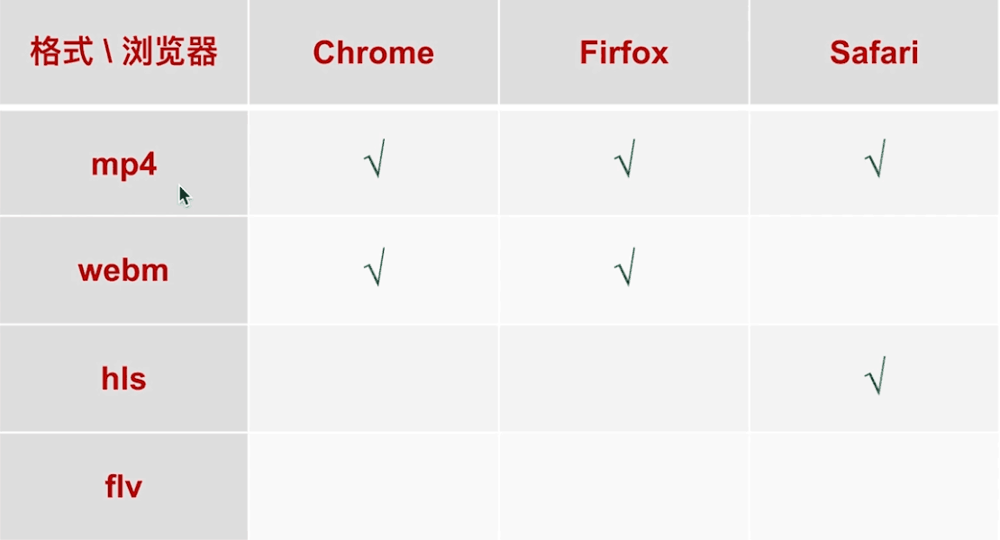

## 直播完整流程图

## 直播相关视频格式的兼容性

## 直播中常用到的协议

* HLS协议
* RTMP协议
* HTTP-FLV协议

### HLS协议

苹果推出的协议。仅safary下支持

video -> M3U8 -> segment-1.ts | segment-2.ts | segment-3.ts 

对于HLS协议的文件来说。会先发放一个M3U8文件，这是一个视频地址的索引文件，不会直接返回url

