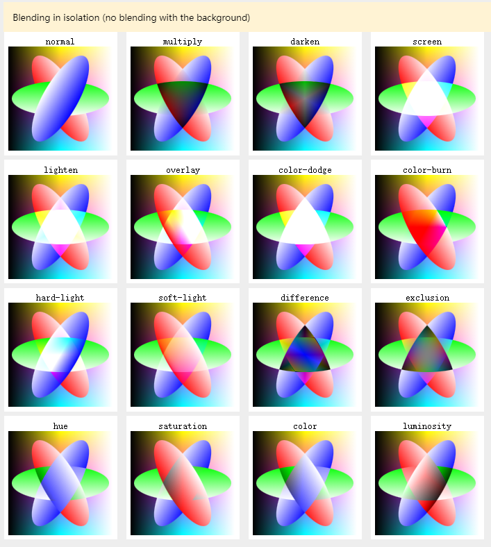
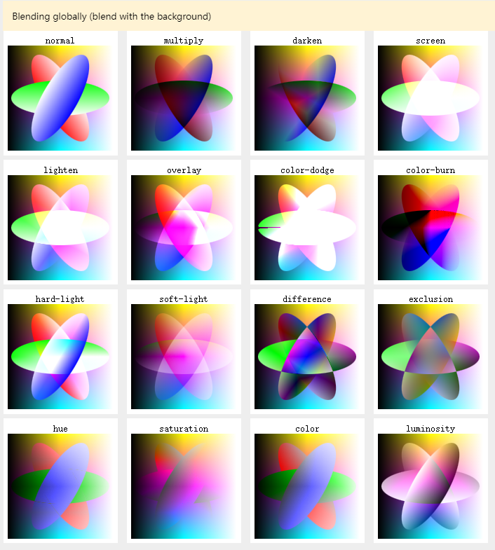

# mix-blend-mode

mix-blend-mode CSS 属性描述了元素的内容应该与元素的直系父元素的内容和元素的背景如何混合。

<https://developer.mozilla.org/zh-CN/docs/Web/CSS/mix-blend-mode>

# Mix Blend Mode

<https://www.tailwindcss.cn/docs/mix-blend-mode>





## 用法

用于控制元素如何与背景混合的实用程序。

| Class                  | Properties                    |
| ---------------------- | ----------------------------- |
| mix-blend-normal       | mix-blend-mode: normal;       |
| mix-blend-multiply     | mix-blend-mode: multiply;     |
| mix-blend-screen       | mix-blend-mode: screen;       |
| mix-blend-overlay      | mix-blend-mode: overlay;      |
| mix-blend-darken       | mix-blend-mode: darken;       |
| mix-blend-lighten      | mix-blend-mode: lighten;      |
| mix-blend-color-dodge  | mix-blend-mode: color-dodge;  |
| mix-blend-color-burn   | mix-blend-mode: color-burn;   |
| mix-blend-hard-light   | mix-blend-mode: hard-light;   |
| mix-blend-soft-light   | mix-blend-mode: soft-light;   |
| mix-blend-difference   | mix-blend-mode: difference;   |
| mix-blend-exclusion    | mix-blend-mode: exclusion;    |
| mix-blend-hue          | mix-blend-mode: hue;          |
| mix-blend-saturation   | mix-blend-mode: saturation;   |
| mix-blend-color        | mix-blend-mode: color;        |
| mix-blend-luminosity   | mix-blend-mode: luminosity;   |
| mix-blend-plus-lighter | mix-blend-mode: plus-lighter; |

### 设置元素的混合模式

使用 mix-blend-{mode} 实用程序来控制元素的内容应如何与背景混合。

```html
<div class="flex justify-center -space-x-14">
  <div class="mix-blend-multiply bg-blue-400 ..."></div>
  <div class="mix-blend-multiply bg-pink-400 ..."></div>
</div>
```

### 悬停、焦点和其他状态

Tailwind 允许您使用变体修饰符有条件地在不同状态下应用实用程序类。例如，使用 hover:mix-blend-overlay 仅在悬停时应用 mix-blend-overlay 实用程序。

```html
<div class="mix-blend-multiply hover:mix-blend-overlay">
  <!-- ... -->
</div>
```
