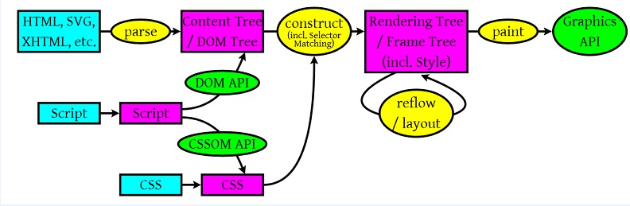
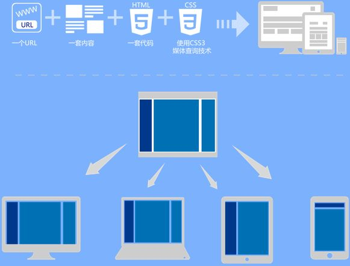
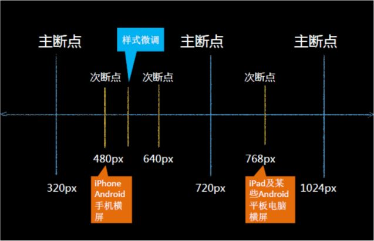
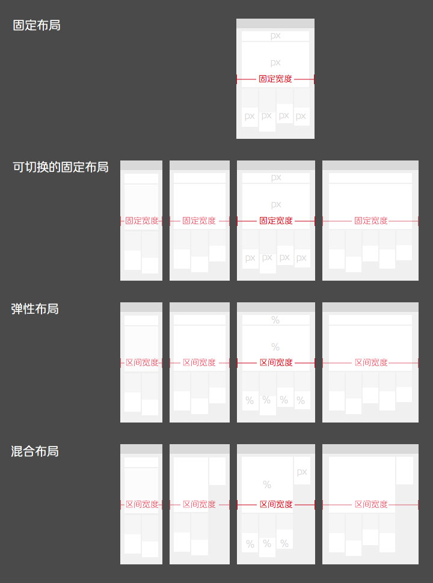
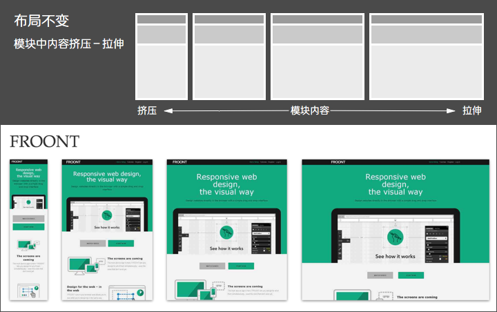
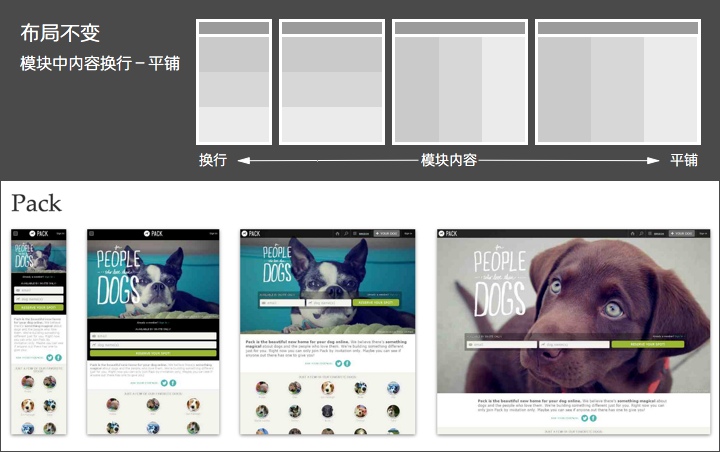
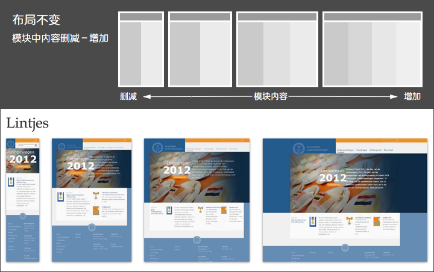
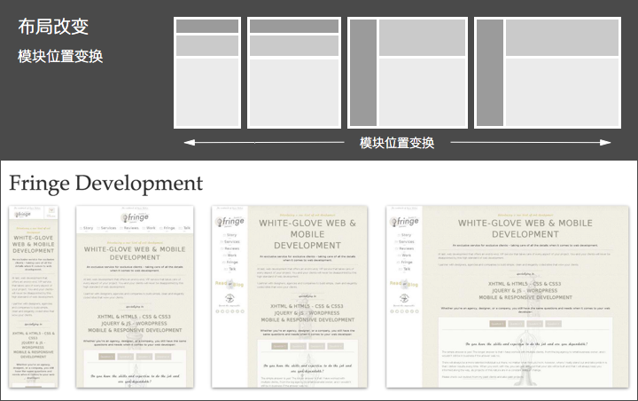
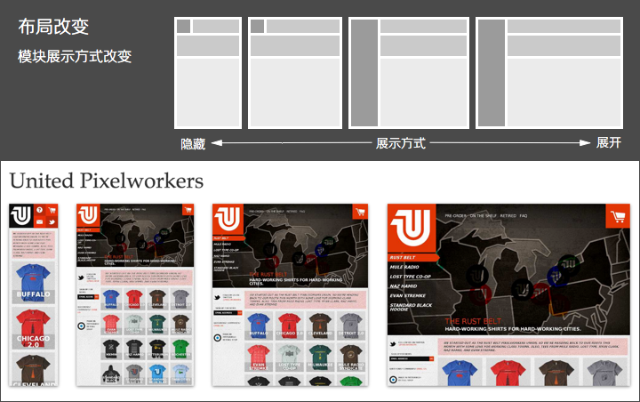
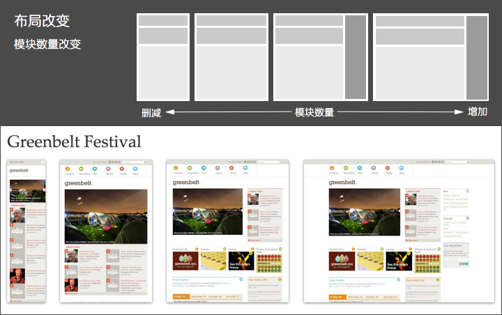

# 你应该知道的CSS小知识

[开发者文档，推荐MDN](https://developer.mozilla.org/zh-CN/docs/Learn/CSS)

## 文档流

> 自上而下，自左到右

## 布局相关

### 盒模型

  标准盒模型 width:270px; height:170px; border:5px solid pink; padding: 10px;

  盒子宽度(最终计算得300) = 自身width(270) + 左右内边距(10+10) + 左右边框宽度(5+5)

  盒子高度同理，外边距不会计算到盒子中

  怪异盒模型 box-sizing: border-box; width:300px; height:200px; border:5px solid pink; padding: 10px;

  设置的盒子宽度(300) = 自身宽度(减去padding、border计算得) + 左右内边距(10+10) + 左右边框宽度(5+5)  

### BFC: block formatting context

BFC 块级格式化上下文，是页面上的一个隔离的独立容器，容器里面的子元素不会影响到外面元素，反之亦然

### 普通流

* display: block
* display: inline
* display: inline-block
* display: flex
* display: grid

### 浮动流

float

* float: left
* float: right
* float: none (取消浮动变为正常文档流)

  

    盒子里的内容仍属于正常文档流，容器高度并不会作用于或者说是限制容器内子节点/元素的高度，因此需要overflow: hidden 让超出的内容隐藏. BFC中左右边距不会发生重叠，不然就会像现在这样超出盒子的范围
  

  

    这里设置了盒子高度并设置了其overflow:hidden，所以超出部分不会显示出来，
  

   
  

    右浮动盒子, transform:translate(-50px, 50px)
  

### 定位流

* position: static
* position: relative
* position: absolute
* position: fixed

  
static, relative 是在正常文档流内的。relative可用于定位，赋给父级容器

  

像正常文字内加显示更多，这样的一行布局，但右边的查看更多通常不在正常文档流内

    <a style="position:absolute; right:0; top:0;">查看更多</a>
  

position: fixed

## 浏览器从服务器拿到html后怎么进行渲染？

1. 解析HTML以构建DOM树：渲染引擎开始解析HTML文档，转换树中的html标签或js生成的标签到DOM节点，它被称为 -- 内容树
2. 构建渲染树：解析CSS（包括外部CSS文件和样式元素以及js生成的样式），根据CSS选择器计算出节点的样式，创建另一个树 —- 渲染树
3. 布局渲染树: 从根节点递归调用，计算每一个元素的大小、位置等，给每个节点所应该出现在屏幕上的精确坐标
4. 绘制渲染树: 遍历渲染树，每个节点将使用UI后端层来绘制

注：Reflow 和 Repain 分别出现在了第三和第四步

## 引起 Reflow 和 Repain 的一些操作

* 增加、删除、修改 DOM 结点时，会导致 Reflow 或 Repaint
* 移动 DOM 的位置，或是搞个动画的时候
* 修改 CSS 样式的时候
* Resize 窗口的时候（移动端没有这个问题），或是滚动的时候
* 修改网页的默认字体时

---

# 响应式设计

>[Ethan Marcotte 提出响应式](https://alistapart.com/article/responsive-web-design/)  
>[Adaptive CSS-Layouts: New Era In Fluid Layouts?](https://www.smashingmagazine.com/2009/06/smart-fixes-for-fluid-layouts/?utm_source=caibaojian.com)

响应式三要素： 
* 响应式图片
* 流式布局 
* 媒体查询

还有移动端必备的**viewport**

响应式网页，一般会在head里加上这一段

    <meta name="viewport" content="width=device-width, initial-scale=1.0, maximum-scale=1.0, minimum-scale=1.0, user-scalable=0">

该meta标签的作用是让当前viewport的宽度等于设备的宽度，同时不允许用户手动缩放。
也许允不允许用户缩放不同的网站有不同的要求，但让viewport的宽度等于设备的宽度，
这个应该是大家都想要的效果，如果你不这样的设定的话，那就会使用那个比屏幕宽的默认viewport，也就是说会出现横向滚动条。

相关参考：

[淘宝和网易REM适配](http://caibaojian.com/web-app-rem.html)

## 响应式图片 response image

  

  

响应式下的图片应用方案：

<picture>
    <source srcset="./img-lg.jpg" media="(min-width: 768px)">
    <source srcset="./img-md.jpg" media="(min-width: 420px)">
    
</picture>

## 流式布局 fluid layout

  
  

## 媒体查询 media query

  

### bootstrap部分源码 —— 了解栅格

    .container:before, .container:after,
    .row:before, .row:after {
      clear: both;
      display: table;
      content: " ";
    }
    .row {
      margin-right: -15px; margin-left: -15px;
    }
    .container {
      padding-right: 15px; padding-left: 15px;
      margin-right: auto; margin-left: auto;
    }
    @media (min-width: 768px) {
      .container { width: 750px; }
    }
    @media (min-width: 992px) {
      .container { width: 970px; }
    }
    @media (min-width: 1200px) {
      .container { width: 1170px; }
    }
    .col-xs-1, .col-xs-2, .col-xs-3, .col-xs-4, 
    .col-xs-5, .col-xs-6, .col-xs-7, .col-xs-8, 
    .col-xs-9, .col-xs-10, .col-xs-11, .col-xs-12 {
      float: left;
    }
    .col-xs-12 { width: 100%; }
    .col-xs-11 { width: 91.66666667%; }
    ...
    .col-xs-2 { width: 16.66666667%; }
    .col-xs-1 { width: 8.33333333%; }

    @media (min-width: 1200px) {
      .col-lg-1, .col-lg-2, .col-lg-3, .col-lg-4, 
      .col-lg-5, .col-lg-6, .col-lg-7, .col-lg-8, 
      .col-lg-9, .col-lg-10, .col-lg-11, .col-lg-12 {
        float: left;
      }
      
      .col-lg-12 { width: 100%; }
      .col-lg-11 { width: 91.66666667%; }
      ...
      .col-lg-2 { width: 16.66666667%; }
      .col-lg-1 { width: 8.33333333%; }
    }

## 响应式常见布局

采用何种方式实现布局设计，也有不同的方式，这里基于页面的实现单位而言，分为四种类型：

* 固定布局
* 可切换的固定布局
* 弹性布局
* 混合布局

### 布局实现

1. 固定布局：以像素作为页面的基本单位，不管设备屏幕及浏览器宽度，只设计一套尺寸；
2. 可切换的固定布局：同样以像素作为页面单位，参考主流设备尺寸，设计几套不同宽度的布局。通过设别的屏幕尺寸或浏览器宽度，选择最合适的那套宽度布局；
3. 弹性布局：以百分比作为页面的基本单位，可以适应一定范围内所有尺寸的设备屏幕及浏览器宽度，并能完美利用有效空间展现最佳效果；
4. 混合布局：同弹性布局类似，可以适应一定范围内所有尺寸的设备屏幕及浏览器宽度，并能完美利用有效空间展现最佳效果；只是混合像素、和百分比两种单位作为页面单位。

很多时候，单一方式的布局响应无法满足理想效果，需要结合多种组合方式，但原则上尽可能时保持简单轻巧，而且同一断点内（发生布局改变的临界点称之为断点）保持统一逻辑。否则页面实现得太过复杂，也会影响整体体验和页面性能。

## 布局不变，即页面中整体模块布局不发生变化，主要有：

### 1. 模块中内容：挤压－拉伸；

### 2. 模块中内容：换行－平铺；

### 3. 模块中内容：删减－增加；

## 布局改变，即页面中的整体模块布局发生变化，主要有： 

## 1. 模块位置变换

## 2. 模块展示方式改变：隐藏－展开

## 3.模块数量改变：删减－增加

很多时候，单一方式的布局响应无法满足理想效果，需要结合多种组合方式，但原则上尽可能时保持简单轻巧，而且同一断点内（发生布局改变的临界点称之为断点）保持统一逻辑。否则页面实现得太过复杂，也会影响整体体验和页面性能。

写在最后：

响应式设计只是一种设计理念，重要的是理解其中的思想，并不用拘泥于以上的内容，欢迎大家多多交流，一起折腾，谢谢观看。