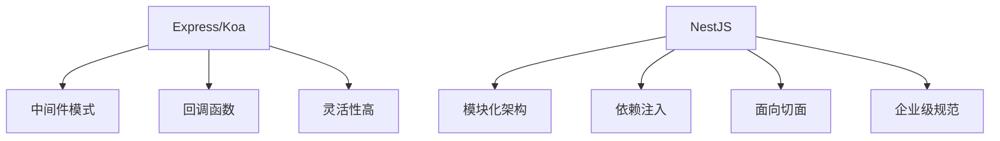

## 一、NestJS 核心设计哲学

### 1.1 架构理念

```ts
// NestJS 的核心设计受到 Angular 的启发
// 采用模块化、依赖注入、面向切面编程等企业级模式
@Module({
  imports: [/* 其他模块 */],
  controllers: [/* 控制器 */],
  providers: [/* 服务提供商 */],
  exports: [/* 导出服务 */],
})
export class AppModule {}
```

### 1.2 设计模式对比



## 二、核心概念深度解析

### 2.1 模块（Modules） - 组织架构的基石

```ts
// 用户模块示例
@Module({
  imports: [DatabaseModule, AuthModule], // 依赖模块
  controllers: [UserController],         // 控制器
  providers: [UserService, UserRepository], // 服务提供商
  exports: [UserService],                // 暴露的服务
})
export class UserModule {}

// 应用根模块
@Module({
  imports: [UserModule, ProductModule, OrderModule],
})
export class AppModule implements NestModule {
  configure(consumer: MiddlewareConsumer) {
    // 配置中间件
  }
}
```

模块的作用：

- 🏗️ 代码组织：按功能边界划分
- 🔒 封装性：内部实现对外隐藏
- 🔗 依赖管理：明确模块间关系
- 🎯 可测试性：独立测试每个模块

### 2.2 控制器（Controllers）

处理 HTTP 请求

```ts
// 用户控制器
@Controller('users')
export class UserController {
  constructor(private readonly userService: UserService) {}

  @Get() // GET /users
  @HttpCode(200)
  async findAll(@Query() query: PaginationQuery) {
    return this.userService.findAll(query);
  }

  @Get(':id') // GET /users/1
  async findOne(@Param('id') id: string) {
    return this.userService.findOne(+id);
  }

  @Post() // POST /users
  @UsePipes(ValidationPipe)
  async create(@Body() createUserDto: CreateUserDto) {
    return this.userService.create(createUserDto);
  }

  @Put(':id') // PUT /users/1
  async update(
    @Param('id') id: string,
    @Body() updateUserDto: UpdateUserDto
  ) {
    return this.userService.update(+id, updateUserDto);
  }

  @Delete(':id') // DELETE /users/1
  @HttpCode(204)
  async remove(@Param('id') id: string) {
    return this.userService.remove(+id);
  }
}
```

装饰器详解：

- @Controller('path')：定义控制器路由前缀
- @Get(), @Post(), @Put(), @Delete()：HTTP 方法装饰器
- @Param(), @Query(), @Body(), @Headers()：参数提取
- @HttpCode()：自定义状态码
- @UsePipes(), @UseGuards(), @UseInterceptors()：增强功能

### 2.3 提供者（Providers） - 业务逻辑核心

```ts
// 用户服务 - 业务逻辑层
@Injectable()
export class UserService {
  constructor(
    private readonly userRepository: UserRepository,
    private readonly configService: ConfigService,
    @Inject('EMAIL_SERVICE') private emailService: EmailService
  ) {}

  async findAll(query: PaginationQuery): Promise<User[]> {
    const { page, limit } = query;
    return this.userRepository.find({
      skip: (page - 1) * limit,
      take: limit,
    });
  }

  async findOne(id: number): Promise<User> {
    const user = await this.userRepository.findOne(id);
    if (!user) {
      throw new NotFoundException(`User with ID ${id} not found`);
    }
    return user;
  }

  async create(createUserDto: CreateUserDto): Promise<User> {
    // 业务逻辑验证
    if (await this.userRepository.exists(createUserDto.email)) {
      throw new ConflictException('Email already exists');
    }

    const user = this.userRepository.create(createUserDto);
    await this.userRepository.save(user);

    // 发送欢迎邮件
    await this.emailService.sendWelcomeEmail(user.email);

    return user;
  }
}

// 自定义提供者 - 值提供者
export const EmailServiceProvider = {
  provide: 'EMAIL_SERVICE',
  useValue: new MockEmailService(), // 可以是类、值、工厂等
};
```

### 2.4 依赖注入（Dependency Injection） - 核心机制

```ts
// 1. 基于构造函数的注入（推荐）
@Injectable()
export class UserService {
  constructor(
    private userRepository: UserRepository,
    @Optional() private logger?: Logger
  ) {}
}

// 2. 基于属性的注入
@Injectable()
export class UserService {
  @Inject(UserRepository)
  private userRepository: UserRepository;
}

// 3. 自定义提供者注册
@Module({
  providers: [
    UserService,
    {
      provide: AbstractRepository,
      useClass: UserRepository, // 类提供者
    },
    {
      provide: 'CONFIG_OPTIONS',
      useValue: { timeout: 5000 }, // 值提供者
    },
    {
      provide: 'DATABASE_CONNECTION',
      useFactory: async (config: ConfigService) => {
        return createConnection(config.get('DB_URL'));
      }, // 工厂提供者
      inject: [ConfigService],
    },
  ],
})
export class AppModule {}
```

## 三、高级特性深度解析

### 3.1 中间件（Middleware） - 请求处理管道

```ts
// 日志中间件
@Injectable()
export class LoggerMiddleware implements NestMiddleware {
  use(req: Request, res: Response, next: NextFunction) {
    console.log(`[${new Date().toISOString()}] ${req.method} ${req.url}`);
    next();
  }
}

// 认证中间件
@Injectable()
export class AuthMiddleware implements NestMiddleware {
  constructor(private readonly authService: AuthService) {}

  async use(req: Request, res: Response, next: NextFunction) {
    const token = req.headers.authorization?.split(' ')[1];
    if (!token) {
      throw new UnauthorizedException('No token provided');
    }

    try {
      const user = await this.authService.verifyToken(token);
      req.user = user; // 附加用户信息到请求对象
      next();
    } catch (error) {
      throw new UnauthorizedException('Invalid token');
    }
  }
}

// 模块中配置中间件
@Module({})
export class AppModule implements NestModule {
  configure(consumer: MiddlewareConsumer) {
    consumer
      .apply(LoggerMiddleware)
      .forRoutes('*') // 所有路由
      .apply(AuthMiddleware)
      .exclude('auth/login', 'auth/register')
      .forRoutes(UserController, ProductController);
  }
}
```

### 3.2 守卫（Guards） - 权限控制

```ts
// 角色守卫
@Injectable()
export class RolesGuard implements CanActivate {
  constructor(private reflector: Reflector) {}

  canActivate(context: ExecutionContext): boolean {
    const requiredRoles = this.reflector.get<string[]>(
      'roles',
      context.getHandler()
    );

    if (!requiredRoles) {
      return true;
    }

    const request = context.switchToHttp().getRequest();
    const user = request.user;

    return requiredRoles.some(role => user.roles?.includes(role));
  }
}

// JWT守卫
@Injectable()
export class JwtAuthGuard extends AuthGuard('jwt') {
  handleRequest(err: any, user: any, info: any) {
    if (err || !user) {
      throw err || new UnauthorizedException();
    }
    return user;
  }
}

// 在控制器中使用
@Controller('admin')
@UseGuards(JwtAuthGuard, RolesGuard)
@SetMetadata('roles', ['admin'])
export class AdminController {
  @Get('dashboard')
  getDashboard() {
    return 'Admin dashboard';
  }
}
```

### 3.3 拦截器（Interceptors） - 切面编程

```ts
// 日志拦截器
@Injectable()
export class LoggingInterceptor implements NestInterceptor {
  intercept(context: ExecutionContext, next: CallHandler): Observable<any> {
    const request = context.switchToHttp().getRequest();
    console.log(`Before: ${request.method} ${request.url}`);

    const now = Date.now();
    return next.handle().pipe(
      tap(() => {
        console.log(`After: ${Date.now() - now}ms`);
      })
    );
  }
}

// 响应格式化拦截器
@Injectable()
export class TransformInterceptor implements NestInterceptor {
  intercept(context: ExecutionContext, next: CallHandler): Observable<any> {
    return next.handle().pipe(
      map(data => ({
        code: 200,
        message: 'Success',
        data,
        timestamp: new Date().toISOString(),
      }))
    );
  }
}

// 异常拦截器
@Injectable()
export class ExceptionInterceptor implements NestInterceptor {
  intercept(context: ExecutionContext, next: CallHandler): Observable<any> {
    return next.handle().pipe(
      catchError(error => {
        // 统一异常处理
        const status = error.status || 500;
        const message = error.message || 'Internal server error';

        throw new HttpException(message, status);
      })
    );
  }
}
```

### 3.4 管道（Pipes） - 数据转换和验证

```ts
// 自定义验证管道
@Injectable()
export class CustomValidationPipe implements PipeTransform {
  async transform(value: any, metadata: ArgumentMetadata) {
    // 数据转换
    if (metadata.type === 'param' && metadata.data === 'id') {
      const id = parseInt(value, 10);
      if (isNaN(id)) {
        throw new BadRequestException('ID must be a number');
      }
      return id;
    }

    // DTO验证
    if (metadata.metatype && this.isDto(metadata.metatype)) {
      const errors = await validate(value);
      if (errors.length > 0) {
        throw new ValidationException(errors);
      }
    }

    return value;
  }

  private isDto(metatype: any): boolean {
    const types = [String, Boolean, Number, Array, Object];
    return !types.includes(metatype);
  }
}

// 在DTO中使用class-validator
export class CreateUserDto {
  @IsString()
  @MinLength(2)
  @MaxLength(50)
  name: string;

  @IsEmail()
  email: string;

  @IsStrongPassword()
  password: string;

  @IsOptional()
  @IsEnum(UserRole)
  role?: UserRole;
}
```

## Nest AOP 切面编程的优势

传统业务代码 -->
  混杂各种横切关注点
  代码重复
  难以维护
  耦合度高

AOP解决方案 -->
  分离关注点
  代码复用
  易于维护
  解耦

| 关注点类型 | 示例 | AOP 实现方式 |
|------------|------|-------------|
| **日志记录** | 方法调用日志 | 拦截器/切面 |
| **事务管理** | 数据库事务 | 装饰器/切面 |
| **权限控制** | 角色权限验证 | 守卫/切面 |
| **性能监控** | 方法执行时间 | 拦截器/切面 |
| **异常处理** | 统一异常处理 | 异常过滤器 |
| **数据验证** | 参数校验 | 管道/切面 |
| **缓存处理** | 方法结果缓存 | 拦截器/切面 |
