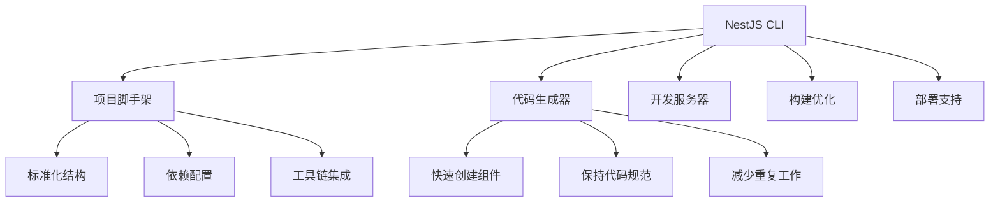

# NestJS CLI 速成指南

controller：控制器，用于处理路由，解析请求参数

handler：控制器里处理路由的方法

service：实现业务逻辑的地方，比如操作数据库等

dto：data transfer object，数据传输对象，用于封装请求体里数据的对象

module：模块，包含 controller、service 等，比如用户模块、书籍模块

entity：对应数据库表的实体

ioc：Inverse of Controller，反转控制或者叫依赖注入，只要声明依赖，运行时 Nest 会自动注入依赖的实例

aop：Aspect Oriented Programming 面向切面编程，在多个请求响应流程中可以复用的逻辑，比如日志记录等，具体包含 middleware、interceotor、guard、exception filter、pipe

nest cli：创建项目、创建模块、创建 controller、创建 service 等都可以用这个 cli 工具

---

nest 应用跑起来后，会从 AppModule 开始解析，初始化 IoC 容器，加载所有的 service 到容器里，然后解析 controller 里的路由，接下来就可以接收请求了。

其实这种架构叫做 MVC 模式，也就是 model、view、controller。

controller 接收请求参数，交给 model 处理（model 就是处理 service 业务逻辑，处理 repository 数据库访问），然后返回 view，也就是响应。

应用中会有很多 controller、service，那如果是跨多个 controller 的逻辑呢？

这种在 Nest 提供了 AOP （Aspect Oriented Programming 面向切面编程）的机制

## 一、NestJS CLI 核心概述

### 1.1 CLI 的设计哲学
```bash
# NestJS CLI 不仅仅是一个脚手架工具
# 它是一个完整的开发工作流管理系统
# 核心设计原则：约定优于配置、标准化项目结构、自动化最佳实践
```

### 1.2 CLI 在开发中的角色


## 二、核心命令详解

### 2.1 项目创建与管理命令

**创建新项目：**
```bash
# 基础创建
nest new my-project

# 指定包管理器
nest new my-project --package-manager npm
nest new my-project --package-manager yarn
nest new my-project --package-manager pnpm

# 指定版本
nest new my-project --version 8.0.0

# 跳过安装依赖
nest new my-project --skip-install

# 指定目录
nest new ./my-project
```

**项目结构生成：**
```bash
# 创建时会生成标准化结构
my-project/
├── src/
│   ├── app.controller.ts
│   ├── app.service.ts
│   ├── app.module.ts
│   └── main.ts
├── test/
├── nest-cli.json
├── package.json
├── tsconfig.json
└── README.md
```

### 2.2 代码生成器命令（核心功能）

**生成完整组件：**
```bash
# 生成模块
nest generate module users
nest g mo users

# 生成控制器
nest generate controller users
nest g co users

# 生成服务
nest generate service users
nest g s users

# 生成中间件
nest generate middleware logger
nest g mi logger

# 生成拦截器
nest generate interceptor logging
nest g in logging

# 生成守卫
nest generate guard auth
nest g gu auth

# 生成管道
nest generate pipe validation
nest g pi validation

# 生成过滤器
nest generate filter http-exception
nest g f http-exception

# 生成装饰器
nest generate decorator roles
nest g d roles
```

**生成选项详解：**
```bash
# 指定路径
nest g controller modules/users
nest g s shared/services/logger

# 扁平化结构（不创建目录）
nest g co users --flat

# 不生成测试文件
nest g mo users --no-spec

# 自定义后缀
nest g interface user.interface --suffix interface
```

### 2.3 开发与构建命令

**开发模式：**
```bash
# 启动开发服务器（支持热重载）
nest start
nest start --watch
nest start --watch --debug

# 指定端口
nest start --port 3001

# 指定配置文件
nest start --config production.json
```

**构建命令：**
```bash
# 生产构建
nest build

# 监视模式构建
nest build --watch

# 输出详细日志
nest build --verbose

# 清理构建缓存
nest build --clear-cache

# 生成源码映射
nest build --sourceMap
```

## 三、nest-cli.json 配置文件详解

### 3.1 完整配置示例
```json
{
  "$schema": "https://json.schemastore.org/nest-cli",
  "collection": "@nestjs/schematics",
  "sourceRoot": "src",
  "compilerOptions": {
    "deleteOutDir": true,
    "webpack": true,
    "tsConfigPath": "tsconfig.build.json",
    "assets": [
      {
        "include": "**/*.env",
        "outDir": "./dist",
        "watchAssets": true
      },
      {
        "include": "**/*.json",
        "outDir": "./dist"
      }
    ],
    "plugins": [
      {
        "name": "@nestjs/swagger",
        "options": {
          "dtoKeyOfComment": "description",
          "controllerKeyOfComment": "summary"
        }
      }
    ]
  },
  "generateOptions": {
    "spec": true,
    "flat": false
  },
  "monorepo": false,
  "projects": {}
}
```

### 3.2 关键配置项说明

**编译器选项：**
```json
{
  "compilerOptions": {
    "deleteOutDir": true,          // 构建前删除输出目录
    "webpack": false,              // 禁用Webpack（使用tsc）
    "tsConfigPath": "tsconfig.json", // 指定TypeScript配置
    "assets": [                    // 处理静态资源
      {
        "include": "**/*.proto",   // 包含proto文件
        "outDir": "./dist",        // 输出目录
        "watchAssets": true        // 监视资源变化
      }
    ],
    "plugins": [                   // 编译器插件
      {
        "name": "@nestjs/graphql",
        "options": {
          "introspectComments": true
        }
      }
    ]
  }
}
```

**生成选项：**
```json
{
  "generateOptions": {
    "spec": true,        // 是否生成测试文件
    "flat": false,       // 是否扁平化结构
    "specFileSuffix": "spec"  // 测试文件后缀
  }
}
```

## 四、高级用法与技巧

### 4.1 自定义生成器模板

**创建自定义模板：**
```bash
# 创建模板目录结构
mkdir -p ~/.nest-templates/rest-controller

# 创建模板文件
cat > ~/.nest-templates/rest-controller/__name__.controller.ts << 'EOF'
import { Controller, Get, Post, Body, Param } from '@nestjs/common';

@Controller('<%= dasherize(name) %>')
export class <%= classify(name) %>Controller {
  @Get()
  findAll(): string {
    return 'This action returns all <%= name %>';
  }

  @Get(':id')
  findOne(@Param('id') id: string): string {
    return `This action returns a #${id} <%= name %>`;
  }

  @Post()
  create(@Body() createDto: any): string {
    return 'This action adds a new <%= name %>';
  }
}
EOF

# 创建spec模板
cat > ~/.nest-templates/rest-controller/__name__.controller.spec.ts << 'EOF'
import { Test, TestingModule } from '@nestjs/testing';
import { <%= classify(name) %>Controller } from './<%= dasherize(name) %>.controller';

describe('<%= classify(name) %>Controller', () => {
  let controller: <%= classify(name) %>Controller;

  beforeEach(async () => {
    const module: TestingModule = await Test.createTestingModule({
      controllers: [<%= classify(name) %>Controller],
    }).compile();

    controller = module.get<<%= classify(name) %>Controller>(<%= classify(name) %>Controller);
  });

  it('should be defined', () => {
    expect(controller).toBeDefined();
  });
});
EOF
```

**使用自定义模板：**
```bash
# 生成使用自定义模板的控制器
nest generate controller users --template rest-controller
```

### 4.2 多项目工作区（Monorepo）

**创建Monorepo项目：**
```bash
# 创建monorepo项目
nest new my-monorepo --package-manager npm
cd my-monorepo

# 添加子项目
nest generate app api
nest generate app admin
nest generate lib shared

# 项目结构
my-monorepo/
├── apps/
│   ├── api/
│   └── admin/
├── libs/
│   └── shared/
└── nest-cli.json
```

**配置Monorepo：**
```json
{
  "monorepo": true,
  "projects": {
    "api": {
      "type": "application",
      "root": "apps/api",
      "entryFile": "main",
      "sourceRoot": "apps/api/src",
      "compilerOptions": {
        "tsConfigPath": "apps/api/tsconfig.app.json"
      }
    },
    "admin": {
      "type": "application",
      "root": "apps/admin",
      "entryFile": "main",
      "sourceRoot": "apps/admin/src"
    },
    "shared": {
      "type": "library",
      "root": "libs/shared",
      "entryFile": "index",
      "sourceRoot": "libs/shared/src"
    }
  }
}
```

### 4.3 集成第三方工具

**集成Swagger：**
```bash
# 安装Swagger
npm install @nestjs/swagger

# 配置nest-cli.json
{
  "compilerOptions": {
    "plugins": [
      {
        "name": "@nestjs/swagger",
        "options": {
          "dtoKeyOfComment": "description",
          "controllerKeyOfComment": "summary"
        }
      }
    ]
  }
}
```

**集成GraphQL：**
```bash
# 安装GraphQL
npm install @nestjs/graphql graphql apollo-server-express
```

```json
# 配置插件
{
  "compilerOptions": {
    "plugins": [
      {
        "name": "@nestjs/graphql",
        "options": {
          "introspectComments": true
        }
      }
    ]
  }
}
```

## 五、开发工作流最佳实践

### 5.1 标准开发流程

**初始化新功能：**
```bash
# 1. 创建功能模块
nest generate module features/users

# 2. 创建实体
nest generate class features/users/entities/user.entity

# 3. 创建DTO
nest generate class features/users/dto/create-user.dto
nest generate class features/users/dto/update-user.dto

# 4. 创建服务
nest generate service features/users/services/users

# 5. 创建控制器
nest generate controller features/users/controllers/users

# 6. 创建测试
# 自动生成，或手动补充测试用例
```

### 5.2 调试技巧

**调试配置：**
```bash
# 使用VSCode调试
nest start --debug --watch
```

对应的launch.json配置

```json
{
  "version": "0.2.0",
  "configurations": [
    {
      "type": "node",
      "request": "launch",
      "name": "Debug NestJS",
      "runtimeExecutable": "nest",
      "args": ["start", "--debug", "--watch"],
      "console": "integratedTerminal",
      "restart": true,
      "autoAttachChildProcesses": true
    }
  ]
}
```

### 5.3 性能优化

**构建优化配置：**
```json
{
  "compilerOptions": {
    "webpack": false,  // 使用tsc获得更好tree-shaking
    "deleteOutDir": true,
    "assets": [
      {
        "include": "**/*.env",
        "outDir": "./dist"
      }
    ]
  }
}
```

## 六、常见问题与解决方案

### 6.1 安装与配置问题

**权限问题：**
```bash
# 解决全局安装权限问题
npm install -g @nestjs/cli --unsafe-perm

# 或者使用nvm管理Node.js版本
nvm install 16
nvm use 16
npm install -g @nestjs/cli
```

**版本冲突：**
```bash
# 检查当前版本
nest --version

# 更新到最新版本
npm update -g @nestjs/cli

# 安装特定版本
npm install -g @nestjs/cli@8.0.0
```

### 6.2 生成器问题

**自定义生成路径：**
```bash
# 如果生成器找不到路径，使用绝对路径
nest generate module src/modules/users
```

或者修改sourceRoot配置

```json
{
  "sourceRoot": "src",
  "generateOptions": {
    "spec": true
  }
}
```

### 6.3 构建问题

**处理静态资源：**
```json
{
  "compilerOptions": {
    "assets": [
      {
        "include": "**/*.{json,env,yaml,yml}",
        "outDir": "./dist",
        "watchAssets": true
      },
      {
        "include": "**/*.proto",
        "outDir": "./dist/proto"
      }
    ]
  }
}
```

## 七、进阶技巧与插件开发

### 7.1 创建自定义Schematics

**初始化Schematics项目：**
```bash
# 创建自定义schematics
npm install -g @angular-devkit/schematics-cli
schematics blank my-nest-schematics

# 添加NestJS支持
cd my-nest-schematics
npm install @nestjs/schematics
```

**自定义生成器示例：**
```ts
// src/my-service/index.ts
import { Rule, SchematicContext, Tree } from '@angular-devkit/schematics';

export function myServiceSchematic(options: any): Rule {
  return (tree: Tree, context: SchematicContext) => {
    // 自定义生成逻辑
    context.logger.info('Generating custom service...');
    return tree;
  };
}
```

### 7.2 CLI 插件开发

**创建CLI插件：**
```bash
# 初始化插件项目
mkdir nest-cli-plugin
cd nest-cli-plugin
```
