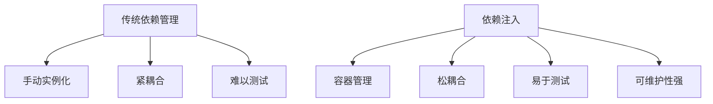
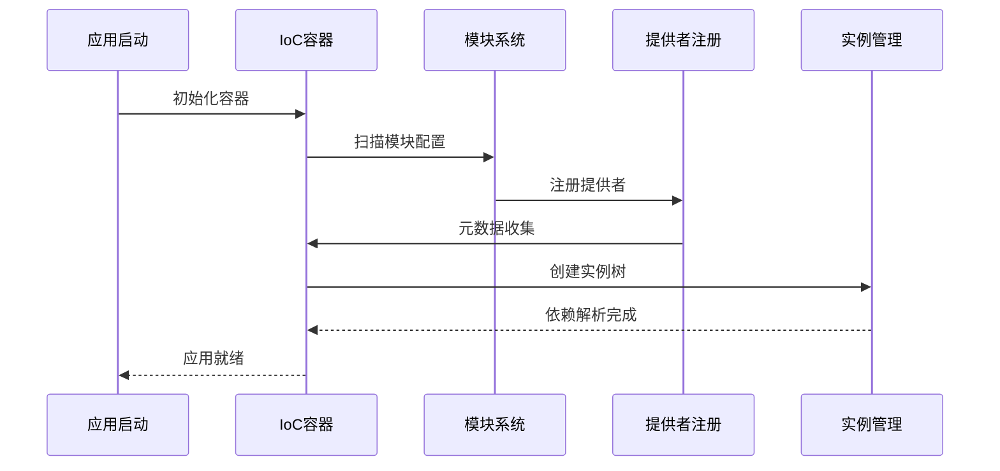

# NestJS 依赖注入机制解析

## 一、依赖注入的核心概念

### 1.1 什么是依赖注入？
```ts
// Express.js 传统模式 - 关注点混杂
app.post('/users', (req, res) => {
  // 验证、业务逻辑、错误处理混在一起
  if (!req.body.email) {
    return res.status(400).json({ error: 'Email required' });
  }

  User.create(req.body, (err, user) => {
    if (err) {
      console.error(err);
      return res.status(500).json({ error: 'Server error' });
    }
    res.json(user);
  });
});

// NestJS DI 模式 - 关注点分离
@Post()
@UsePipes(ValidationPipe)
async createUser(@Body() createUserDto: CreateUserDto) {
  return this.userService.createUser(createUserDto); // 纯净业务逻辑
}

// IoC容器自动管理依赖关系
const userService = container.get(UserService); // 自动注入Logger
```

### 1.2 设计模式对比


### 1.3 开发效率对比

```ts
// CLI 自动生成标准化代码
nest generate service users
nest generate controller users
nest generate module users

// 自动生成的标准化结构
@Injectable()
export class UsersService {
  constructor(
    private usersRepository: UsersRepository, // 自动注入
    private logger: Logger // 自动注入
  ) {}

  // 统一的代码风格和模式
}
```

| 开发活动 | 传统方式 | NestJS DI |
|---------|---------|-----------|
| **新功能开发** | 需要手动组织依赖 | 自动依赖管理 |
| **代码重构** | 高风险，易出错 | 安全的重构支持 |
| **团队协作** | 风格不一，沟通成本高 | 统一架构规范 |
| **错误排查** | 依赖关系不明确 | 清晰的依赖图谱 |

### 1.4 统一的规范架构

```ts
// 所有NestJS项目遵循相同模式
@Module({
  imports: [/* 依赖模块 */],
  controllers: [/* 控制器 */],
  providers: [/* 服务 */],
  exports: [/* 导出服务 */],
})
export class FeatureModule {}

// 统一的依赖注入模式
@Injectable()
export class StandardService {
  constructor(
    private dependency1: Dependency1,
    private dependency2: Dependency2
  ) {}
}
```

## 二、NestJS DI 核心机制

### 2.1 IoC 容器工作流程


### 2.2 提供者（Providers）注册机制

**基本注册方式：**
```typescript
@Module({
  // 1. 类提供者（最常用）
  providers: [UserService, Logger],

  // 2. 自定义令牌提供者
  providers: [
    { provide: 'USER_SERVICE', useClass: UserService },
    { provide: 'CONFIG_OPTIONS', useValue: { timeout: 5000 } },
    { provide: 'DATABASE_CONNECTION', useFactory: async () => {
        return createConnection(process.env.DATABASE_URL);
      }
    },
  ],
})
export class AppModule {}
```

**提供者类型详解：**
```typescript
// 1. 类提供者 - 最常用
{ provide: UserService, useClass: UserService }

// 2. 值提供者 - 注入固定值
{ provide: 'API_KEY', useValue: process.env.API_KEY }

// 3. 工厂提供者 - 动态创建
{ provide: 'CONNECTION', useFactory: (config: ConfigService) => {
    return createConnection(config.get('DB_URL'));
  }, inject: [ConfigService]
}

// 4. 别名提供者 - 重用现有提供者
{ provide: 'AliasLogger', useExisting: Logger }

// 5. 异步提供者 - 支持Promise
{ provide: 'ASYNC_DATA', useFactory: async () => {
    return await fetchData();
  }
}
```

## 三、依赖注入的三种方式

### 3.1 构造函数注入（推荐）
```typescript
@Injectable()
export class UserService {
  constructor(
    // 1. 直接注入类
    private readonly userRepository: UserRepository,

    // 2. 注入自定义令牌
    @Inject('EMAIL_SERVICE') private emailService: EmailService,

    // 3. 可选依赖
    @Optional() private readonly logger?: Logger,

    // 4. 属性注入（不推荐，但某些场景需要）
    @Inject(REQUEST) private request: Request
  ) {}

  async createUser(userData: CreateUserDto) {
    // 使用注入的依赖
    const user = this.userRepository.create(userData);
    await this.emailService.sendWelcomeEmail(user.email);
    return user;
  }
}
```

### 3.2 属性注入（特定场景）
```typescript
@Injectable()
export class AuthService {
  // 属性注入 - 某些框架组件需要
  @Inject(REQUEST)
  private request: Request;

  // 延迟加载的依赖
  @Inject('LAZY_SERVICE')
  private lazyService: LazyService;
}
```

### 3.3 Setter 注入（较少使用）
```typescript
@Injectable()
export class NotificationService {
  private emailService: EmailService;

  @Inject()
  setEmailService(@Inject('EMAIL_SERVICE') service: EmailService) {
    this.emailService = service;
  }
}
```

## 四、装饰器系统详解

### 4.1 核心装饰器
```typescript
// 1. @Injectable() - 标记可注入类
@Injectable()
export class UserService {}

// 2. @Inject() - 注入自定义令牌
constructor(@Inject('CACHE_MANAGER') private cacheManager: Cache) {}

// 3. @Optional() - 标记可选依赖
constructor(@Optional() private logger?: Logger) {}

// 4. @Self() - 只从当前注入器查找
constructor(@Self() private config: ConfigService) {}

// 5. @SkipSelf() - 跳过当前注入器，从父级查找
constructor(@SkipSelf() private parentService: ParentService) {}

// 6. @Host() - 限制在当前宿主查找
constructor(@Host() private hostService: HostService) {}
```

### 4.2 自定义参数装饰器
```typescript
// 创建自定义注入装饰器
export const InjectUser = createParamDecorator(
  (data: unknown, ctx: ExecutionContext) => {
    const request = ctx.switchToHttp().getRequest();
    return request.user;
  }
);

// 使用自定义装饰器
@Get('profile')
getProfile(@InjectUser() user: User) {
  return user;
}
```

## 五、模块系统与依赖范围

### 5.1 模块的依赖管理
```typescript
@Module({
  imports: [DatabaseModule, AuthModule], // 导入依赖模块

  providers: [
    UserService,
    UserRepository,
    { provide: AbstractRepository, useClass: UserRepository }
  ],

  exports: [UserService, AbstractRepository], // 导出给其他模块使用
})
export class UserModule {}

// 使用导出的服务
@Module({
  imports: [UserModule], // 导入UserModule
  providers: [OrderService],
})
export class OrderModule {
  constructor(private userService: UserService) {} // 可以注入UserService
}
```

### 5.2 依赖作用域控制

**单例作用域（默认）：**
```typescript
@Injectable({ scope: Scope.DEFAULT }) // 单例，整个应用共享
export class ConfigService {}
```

**请求作用域：**
```typescript
@Injectable({ scope: Scope.REQUEST }) // 每个请求创建新实例
export class RequestLogger {
  constructor(@Inject(REQUEST) private request: Request) {}
}
```

**瞬态作用域：**
```typescript
@Injectable({ scope: Scope.TRANSIENT }) // 每次注入创建新实例
export class TransientService {}
```

## 六、高级依赖注入模式

### 6.1 循环依赖解决方案
```typescript
// 模块A
@Module({
  providers: [ServiceA],
  exports: [ServiceA],
})
export class ModuleA {}

// 模块B
@Module({
  imports: [forwardRef(() => ModuleA)], // 前向引用
  providers: [ServiceB],
})
export class ModuleB {}

// 服务层循环依赖
@Injectable()
export class ServiceA {
  constructor(
    @Inject(forwardRef(() => ServiceB))
    private serviceB: ServiceB
  ) {}
}

@Injectable()
export class ServiceB {
  constructor(
    @Inject(forwardRef(() => ServiceA))
    private serviceA: ServiceA
  ) {}
}
```

### 6.2 动态模块模式
```typescript
@Module({})
export class ConfigModule {
  static forRoot(options: ConfigOptions): DynamicModule {
    return {
      module: ConfigModule,
      providers: [
        {
          provide: CONFIG_OPTIONS,
          useValue: options,
        },
        ConfigService,
      ],
      exports: [ConfigService],
    };
  }
}

// 使用动态模块
@Module({
  imports: [ConfigModule.forRoot({ env: 'production' })],
})
export class AppModule {}
```

### 6.3 多提供商模式
```typescript
// 注册多个同类型提供者
@Module({
  providers: [
    { provide: 'PLUGINS', useValue: PluginA, multi: true },
    { provide: 'PLUGINS', useValue: PluginB, multi: true },
    { provide: 'PLUGINS', useValue: PluginC, multi: true },
  ],
})
export class PluginModule {}

// 注入多个实例
@Injectable()
export class PluginManager {
  constructor(@Inject('PLUGINS') private plugins: any[]) {}

  initializeAll() {
    this.plugins.forEach(plugin => plugin.initialize());
  }
}
```

## 七、测试中的依赖注入

### 7.1 单元测试模拟
```typescript
describe('UserService', () => {
  let userService: UserService;
  let mockRepository: jest.Mocked<UserRepository>;

  beforeEach(async () => {
    // 创建模拟依赖
    mockRepository = {
      create: jest.fn(),
      save: jest.fn(),
      findOne: jest.fn(),
    };

    // 手动创建实例并注入模拟依赖
    userService = new UserService(mockRepository);
  });

  it('should create user', async () => {
    mockRepository.create.mockReturnValue({ id: 1, name: 'test' });
    mockRepository.save.mockResolvedValue({ id: 1, name: 'test' });

    const result = await userService.createUser({ name: 'test' });

    expect(result).toEqual({ id: 1, name: 'test' });
    expect(mockRepository.create).toHaveBeenCalledWith({ name: 'test' });
  });
});
```

### 7.2 集成测试配置
```typescript
describe('UserController', () => {
  let app: INestApplication;
  let userService: UserService;

  beforeEach(async () => {
    const moduleRef = await Test.createTestingModule({
      imports: [UserModule],
    })
      .overrideProvider(UserRepository) // 重写真实依赖
      .useValue(mockRepository)         // 使用模拟对象
      .compile();

    app = moduleRef.createNestApplication();
    userService = moduleRef.get<UserService>(UserService);
    await app.init();
  });

  afterEach(async () => {
    await app.close();
  });
});
```

## 八、依赖注入的最佳实践

### 1 架构设计最佳实践

#### 1.1 面向接口编程
```typescript
// 定义抽象接口
export interface IUserRepository {
  findById(id: number): Promise<User>;
  create(user: User): Promise<User>;
  update(id: number, updates: Partial<User>): Promise<User>;
}

// 实现具体仓库
@Injectable()
export class UserRepository implements IUserRepository {
  async findById(id: number): Promise<User> {
    return this.dataSource.getRepository(User).findOne({ where: { id } });
  }
  // 其他方法实现...
}

// 依赖抽象接口而非具体实现
@Injectable()
export class UserService {
  constructor(
    @Inject('IUserRepository')
    private userRepository: IUserRepository // 依赖抽象
  ) {}
}
```

#### 1.2 模块边界设计
```typescript
// 功能模块封装
@Module({
  providers: [
    UserService,
    { provide: 'IUserRepository', useClass: UserRepository }
  ],
  exports: [UserService, 'IUserRepository'] // 明确导出接口
})
export class UserModule {}

// 领域模块划分
@Module({
  imports: [UserModule, ProductModule], // 明确依赖
  providers: [OrderService],
})
export class OrderModule {
  constructor(
    private userService: UserService, // 只能访问导出的服务
    @Inject('IUserRepository') private userRepo: IUserRepository
  ) {}
}
```

### 2 代码组织最佳实践

#### 2.1 依赖注入规范
```typescript
// 1. 构造函数注入（推荐）
@Injectable()
export class BestPracticeService {
  constructor(
    private readonly repository: Repository, // 只读修饰符
    private readonly logger: Logger,
    @Optional() private readonly cache?: Cache // 可选依赖
  ) {}
}

// 2. 避免属性注入（除非必要）
@Injectable()
export class AvoidThisService {
  @Inject(REQUEST) // 尽量避免
  private request: Request;

  // 优先使用构造函数注入
  constructor(private config: ConfigService) {}
}
```

#### 2.2 提供者注册规范
```typescript
@Module({
  providers: [
    // 1. 类提供者（简洁写法）
    UserService,

    // 2. 明确令牌注册
    { provide: UserService, useClass: UserService },

    // 3. 值提供者（配置、常量）
    { provide: 'API_CONFIG', useValue: { timeout: 5000 } },

    // 4. 工厂提供者（动态创建）
    {
      provide: 'DATABASE_CONNECTION',
      useFactory: async (config: ConfigService) => {
        return createConnection(config.get('DATABASE_URL'));
      },
      inject: [ConfigService]
    },

    // 5. 别名提供者
    { provide: 'UserRepoAlias', useExisting: UserRepository }
  ],
})
export class AppModule {}
```

### 3 测试最佳实践

#### 3.1 单元测试策略
```typescript
describe('UserService', () => {
  let userService: UserService;
  let mockRepository: jest.Mocked<IUserRepository>;
  let mockLogger: jest.Mocked<Logger>;

  beforeEach(() => {
    // 创建模拟对象
    mockRepository = {
      findById: jest.fn(),
      create: jest.fn(),
      update: jest.fn(),
    };

    mockLogger = {
      log: jest.fn(),
      error: jest.fn(),
    };

    // 手动注入依赖
    userService = new UserService(mockRepository, mockLogger);
  });

  it('should find user by id', async () => {
    // 设置模拟返回值
    mockRepository.findById.mockResolvedValue({ id: 1, name: 'test' });

    const result = await userService.findUser(1);

    expect(result).toEqual({ id: 1, name: 'test' });
    expect(mockRepository.findById).toHaveBeenCalledWith(1);
  });

  it('should handle user not found', async () => {
    mockRepository.findById.mockResolvedValue(null);

    await expect(userService.findUser(999)).rejects.toThrow('User not found');
    expect(mockLogger.error).toHaveBeenCalled();
  });
});
```

#### 3.2 集成测试配置
```typescript
describe('UserController (integration)', () => {
  let app: INestApplication;
  let userService: UserService;

  beforeEach(async () => {
    const moduleRef = await Test.createTestingModule({
      imports: [UserModule],
    })
      // 重写真实依赖为测试实现
      .overrideProvider('IUserRepository')
      .useClass(MockUserRepository)

      .overrideProvider(Logger)
      .useValue(testLogger)

      .compile();

    app = moduleRef.createNestApplication();
    userService = moduleRef.get<UserService>(UserService);
    await app.init();
  });

  afterEach(async () => {
    await app.close();
  });
});
```

### 4 性能优化最佳实践

#### 4.1 作用域管理
```typescript
// 1. 默认单例（无状态服务）
@Injectable({ scope: Scope.DEFAULT }) // 显式声明，其实默认就是
export class UtilityService {
  // 无状态，可安全共享
}

// 2. 请求作用域（有状态服务）
@Injectable({ scope: Scope.REQUEST })
export class RequestContextService {
  constructor(@Inject(REQUEST) private request: Request) {}
}

// 3. 瞬态作用域（避免状态污染）
@Injectable({ scope: Scope.TRANSIENT })
export class TransientService {
  private state = Math.random(); // 每次注入不同实例
}
```

#### 4.2 懒加载与树摇优化
```typescript
// 配置树摇友好的模块
@Module({
  providers: [UserService],
  exports: [UserService],
})
export class UserModule {}

// 使用barrel文件避免副作用
// index.ts
export * from './user.service';
export * from './user.repository';
export * from './user.interface';
```

### 5 高级模式最佳实践

#### 5.1 动态模块模式
```typescript
@Module({})
export class ConfigModule {
  static forRoot(options: ConfigModuleOptions): DynamicModule {
    return {
      module: ConfigModule,
      providers: [
        {
          provide: CONFIG_OPTIONS,
          useValue: options,
        },
        ConfigService,
        // 条件提供者
        options.enableCache ? CacheService : null,
      ].filter(Boolean), // 过滤null值
      exports: [ConfigService],
    };
  }
}

// 使用动态配置
@Module({
  imports: [ConfigModule.forRoot({ env: 'production', enableCache: true })],
})
export class AppModule {}
```

#### 5.2 多提供商模式
```typescript
// 插件系统实现
@Module({
  providers: [
    { provide: 'PLUGIN', useClass: AuthPlugin, multi: true },
    { provide: 'PLUGIN', useClass: LoggingPlugin, multi: true },
    { provide: 'PLUGIN', useClass: ValidationPlugin, multi: true },
  ],
})
export class PluginModule {}

// 插件管理器
@Injectable()
export class PluginManager {
  constructor(@Inject('PLUGIN') private plugins: any[]) {}

  initializeAll() {
    this.plugins.forEach(plugin => {
      if (plugin.initialize) {
        plugin.initialize();
      }
    });
  }
}
```

### 6 错误处理最佳实践

#### 6.1 依赖解析错误处理
```typescript
@Injectable()
export class RobustService {
  constructor(
    @Optional() private optionalService?: OptionalService,
    @Inject('MAYBE_MISSING')
    @Optional()
    private maybeMissing?: any
  ) {
    if (!optionalService) {
      this.setupFallback();
    }
  }

  private setupFallback() {
    // 提供默认实现
  }
}
```

#### 6.2 循环依赖解决方案
```typescript
// 模块级别循环依赖
@Module({
  imports: [forwardRef(() => ModuleA)],
  providers: [ServiceB],
})
export class ModuleB {}

// 服务级别循环依赖
@Injectable()
export class ServiceA {
  constructor(
    @Inject(forwardRef(() => ServiceB))
    private serviceB: ServiceB
  ) {}
}

@Injectable()
export class ServiceB {
  constructor(
    @Inject(forwardRef(() => ServiceA))
    private serviceA: ServiceA
  ) {}
}
```

### 7 安全最佳实践

#### 7.1 依赖验证
```typescript
@Injectable()
export class SecureService {
  constructor(
    private config: ConfigService,
    @Inject('EXTERNAL_SERVICE')
    private externalService: any
  ) {
    this.validateDependencies();
  }

  private validateDependencies() {
    if (!this.config.get('API_KEY')) {
      throw new Error('Missing required configuration');
    }

    if (!this.externalService || typeof this.externalService.call !== 'function') {
      throw new Error('Invalid external service implementation');
    }
  }
}
```

#### 7.2 敏感依赖保护
```typescript
// 使用Symbol作为私有令牌
const PRIVATE_SERVICES = {
  SECRET_STORAGE: Symbol('SECRET_STORAGE'),
  ENCRYPTION_SERVICE: Symbol('ENCRYPTION_SERVICE')
};

@Module({
  providers: [
    { provide: PRIVATE_SERVICES.SECRET_STORAGE, useClass: SecureStorage },
    { provide: PRIVATE_SERVICES.ENCRYPTION_SERVICE, useClass: AesEncryption }
  ]
})
export class SecurityModule {}

// 只能在安全上下文中访问
@Injectable()
export class SecureProcessor {
  constructor(
    @Inject(PRIVATE_SERVICES.SECRET_STORAGE)
    private secretStorage: any
  ) {}
}
```

### 8 监控与调试最佳实践

#### 8.1 依赖追踪
```typescript
@Injectable()
export class TracedService {
  constructor(
    private dependency1: ServiceA,
    private dependency2: ServiceB,
    private tracer: TracerService
  ) {
    this.tracer.trackDependency('TracedService', [
      dependency1.constructor.name,
      dependency2.constructor.name
    ]);
  }
}
```

#### 8.2 性能监控
```typescript
@Injectable()
export class MonitoredService {
  private readonly dependencies: Map<string, number> = new Map();

  constructor(
    private serviceA: ServiceA,
    private serviceB: ServiceB,
    private metrics: MetricsService
  ) {
    this.setupMonitoring();
  }

  private setupMonitoring() {
    // 监控依赖初始化时间
    this.metrics.record('dependencies_count', 2);
    this.metrics.record('dependency_serviceA', performance.now());
  }
}
```

### 9 代码质量最佳实践

#### 9.1 依赖文档化
```typescript
@Injectable()
export class WellDocumentedService {
  /**
   * 用户服务构造函数
   * @param userRepository - 用户数据访问层
   * @param logger - 日志服务
   * @param config - 配置服务（可选）
   */
  constructor(
    private readonly userRepository: IUserRepository,
    private readonly logger: Logger,
    @Optional() private readonly config?: ConfigService
  ) {}
}
```

#### 9.2 依赖约束
```typescript
// 使用装饰器验证依赖
function ValidateDependencies() {
  return function (target: any) {
    const original = target;

    function construct(constructor: any, args: any[]) {
      const instance = new constructor(...args);

      // 验证依赖是否完整
      if (!instance.userRepository) {
        throw new Error('Missing required dependency: userRepository');
      }

      return instance;
    }

    return construct;
  };
}

@ValidateDependencies()
@Injectable()
export class ValidatedService {
  constructor(private userRepository: IUserRepository) {}
}
```

### 10 常见反模式与避免方法

#### 10.1 避免的反模式
```typescript
// 1. 服务定位器反模式（避免!）
export class AntiPatternService {
  private container: Container;

  getService() {
    return this.container.get(SomeService); // ❌ 不要这样做
  }
}

// 2. 紧耦合反模式
@Injectable()
export class TightlyCoupledService {
  constructor(private concreteService: ConcreteServiceImpl) {} // ❌ 依赖具体实现

  // 应该依赖接口
  constructor(@Inject('IService') private service: IService) {} // ✅
}

// 3. 上帝服务反模式
@Injectable()
export class GodService {
  // 一个服务做所有事情 ❌
  constructor(
    private userRepo: UserRepository,
    private productRepo: ProductRepository,
    private orderRepo: OrderRepository,
    private emailService: EmailService,
    private smsService: SmsService
    // ... 更多依赖
  ) {}
}
```

#### 10.2 健康依赖指标
```ts
// 依赖健康度检查
interface DependencyHealth {
  service: string;
  dependencyCount: number;
  maxRecommended: number;
  hasCircular: boolean;
  usesInterfaces: boolean;
}

// 理想指标
const idealMetrics: DependencyHealth = {
  service: 'UserService',
  dependencyCount: 3,          // 3-5个依赖为健康
  maxRecommended: 5,           // 最多不超过7个
  hasCircular: false,          // 无循环依赖
  usesInterfaces: true
```

## 九、性能优化与调试

### 9.1 DI 性能优化
```typescript
// 1. 避免不必要的请求作用域
@Injectable({ scope: Scope.DEFAULT }) // 除非必要，否则用单例
export class PerformanceService {}

// 2. 使用树摇优化
@Module({
  providers: [ServiceA, ServiceB],
})
export class FeatureModule {}

// 3. 懒加载模块
@Module({
  imports: [LazyModule], // 使用懒加载减少启动时间
})
export class AppModule {}
```

### 9.2 调试技巧
```typescript
// 1. 查看容器中的提供者
console.log(Container.getProviderIds());

// 2. 调试依赖解析过程
NestFactory.create(AppModule, {
  logger: ['verbose', 'debug']
});

// 3. 使用自定义日志记录依赖注入
@Injectable()
export class DebugService {
  constructor(
    @Inject('DEBUG')
    private debug: boolean,
    private logger: Logger
  ) {
    if (debug) {
      this.logger.log('Service initialized with dependencies');
    }
  }
}
```

NestJS的依赖注入机制提供了强大的解耦能力和灵活性，正确使用可以大幅提升代码的可维护性和可测试
