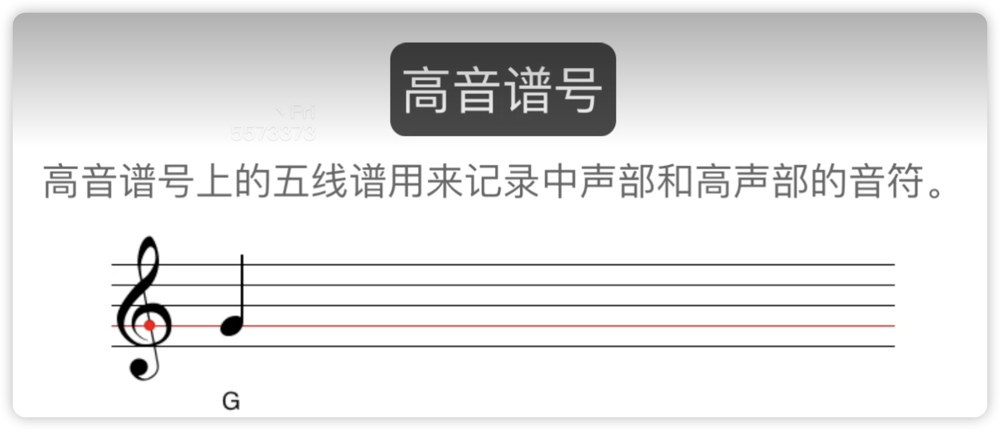
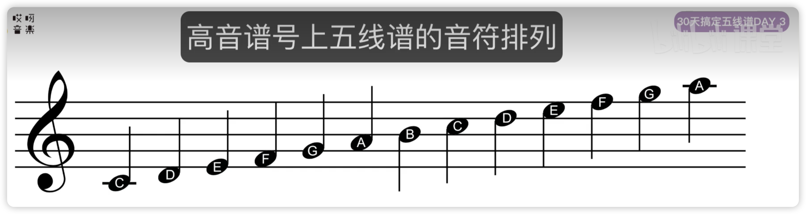
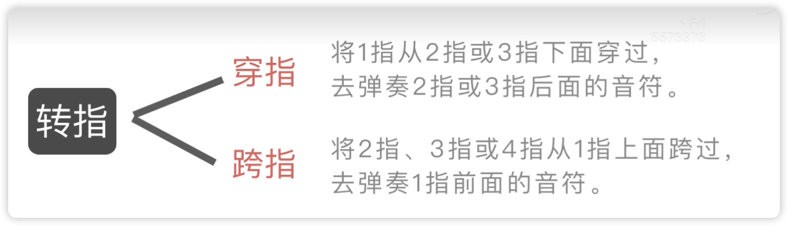
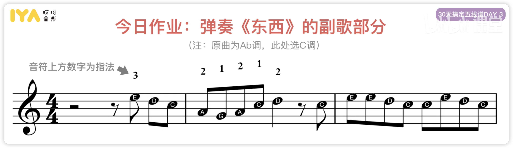
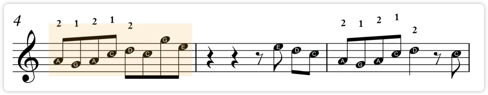
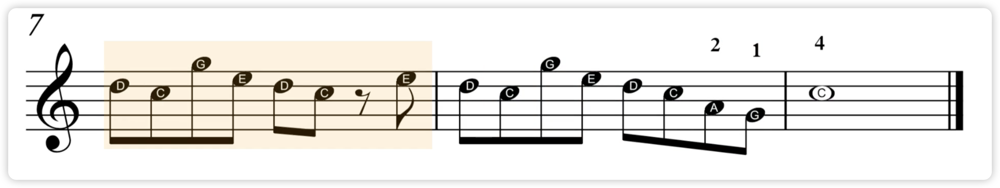

# 03高音谱号上的线与间

高音谱号

高音谱号上的五线谱用来记录中声部和高声部的音符

高音谱号上 五线谱的音符排列

### 四间

F fa
A la
C5 do
E mi

### 五线

E mi
G so
B xi
D rai
F fa

转指

- 穿指
  - 将1指从2指或3指下面穿过，去弹奏2指或3指后面的音符

- 跨指
  - 将2指、3指或4指从1指上面跨过，去弹奏1指前面的音符

## 作业

弹奏《东西》的副歌部分 （原曲Ab调，此处选C调）

