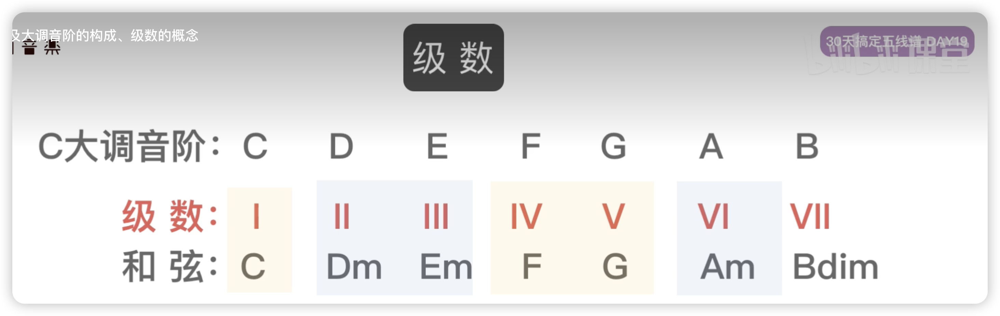

# 级数

## D大调常用和弦

自己推导试试：

D 大调音阶： D E  F# G  A B  C#

     级数： Ⅰ Ⅱ Ⅲ  Ⅳ Ⅴ Ⅵ  Ⅶ

和弦：

Ⅰ：D和弦，D F# A 大三度

Ⅱ：E和弦，E G B 小三度

Ⅲ：F#和弦，F# A C# 小三度

Ⅳ：G和弦 B C# E 大三度

Ⅴ：A和弦 B D F#，大三度

Ⅵ：B 和弦 C# E G 小三度

学习级数是为了快速找到其他大调音阶对应的和弦
