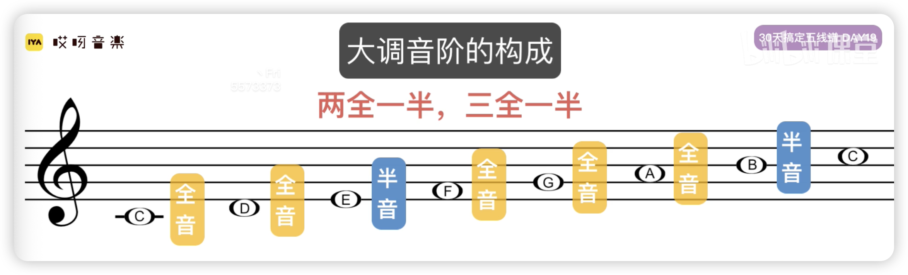

## 如何记忆音程

技巧：两音之间一共有几个字母，就是几度

## 三和弦每个音的名称

C和弦

C为根音，C到E为三度，所以E为三音，同理CG五度，G为五音

C大调，两全一半，三全一半

所以音阶是 C D E F G A B C （EF第一个半，BC第二个半）

所以根据这个规律，我推导D大调是

D E F# G A B C# D （EF第一个半，C#D第二个半）
所以D大调音阶是 D E F# G A B C# D

