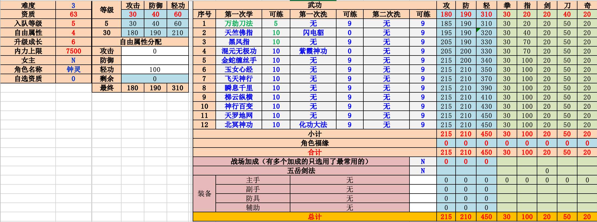
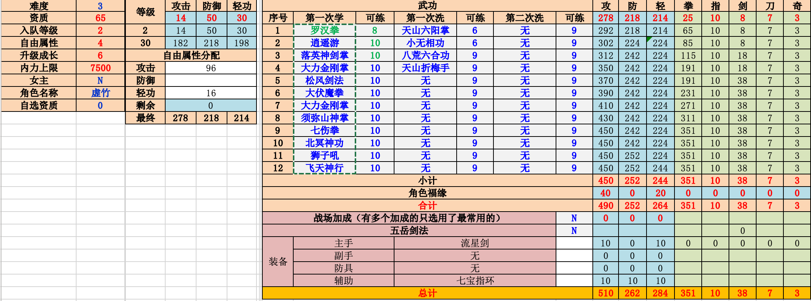
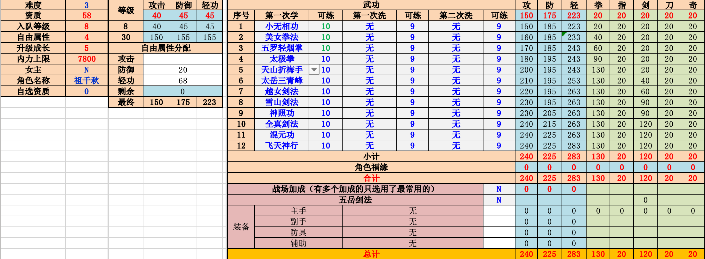

## 钟灵

全轻

万劫刀法
天竺佛指   洗闪电
黑风指
混元无极功
金蛇缠丝手
玉女心经
飞天神行
瞬息千里
梯云纵横
神行百变
天罗地网
北冥神功   化功 / 紫霞

## 虚竹

16轻 其余全攻 轻功 264（加装备284）

（感觉 284轻太低，难7 不好先手 可以试试 304轻）

罗汉拳
逍遥游
落英神剑
大力金刚
松风剑法
大伏魔拳
大力金刚
须弥山神   日月神掌
七伤拳
狮子吼
北冥神功   化功大法   紫霞神功
飞天神行

## 祖千秋

加点：防20  轻68  最终轻功 283（可全轻配合虚竹的304）

小无相功
美女拳法
五罗轻烟掌
太极拳
天山折梅手
太岳三青峰
越女剑法
雪山剑法
神照功
全真剑法
混元功
飞天神行
