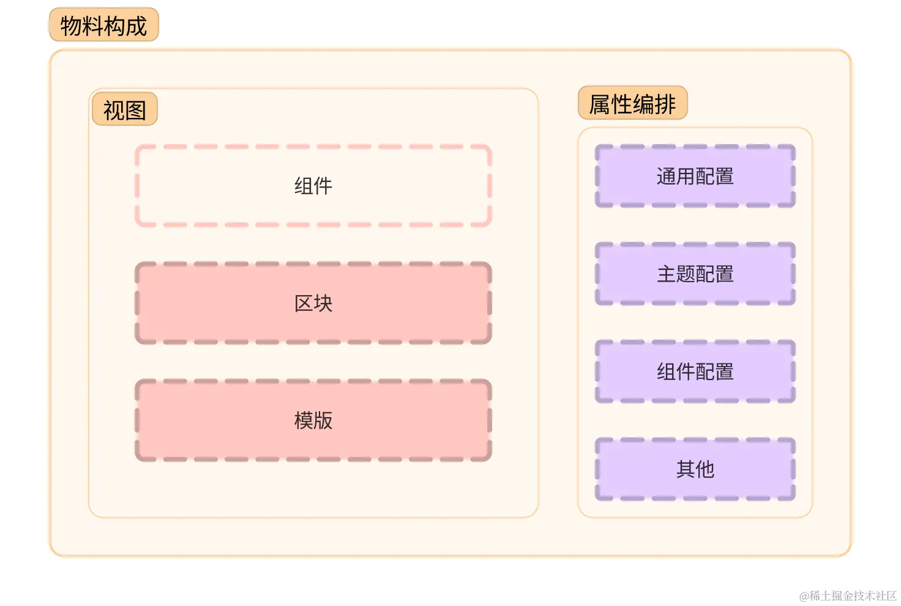

# 3.2组件与物料设计

## 组件与物料设计

物料即承担了一个提供者的角色，通过对编辑器注入物料组件来完成页面的渲染和可视化编辑器的编排，最终产生出理想的 Schema 协议。

同时也是消费端的组成之一，渲染器需要在解析 Schema 后将对应的物料渲染到页面，完成低代码的可视化产物。

低代码中使用到的物料在编辑器中填充需要额外给定一个配置编排的设置器，它与组件挂钩，两者相关联。

组件：纯显示层，可以单独的将其单独作为组件库来使用，渲染器在消费 Schema 后也需要直接使用；
属性控制器：提供一组为组件设置属性挂钩的设置器，目的是为了在编辑器中设置属性并且保存至当前的 Schema 协议当中。

### 物料库的设计

- 基础物料：低代码平台提供的基础组件库，如容器、布局（分栏，栅格）等通用类型的相关组件。甚至于按钮、弹窗等组件它都是基础组件；
- 业务物料：针对于某些特定场景业务的组件，比如说商城的规格选择组件、营销活动组件等等都属于是业务集成化的组件库；
- 定制化物料：如果接入团队又或者是贡献者团队，可以根据 CLI 来创建组件插口，发布后即可通过异步资源加载的方式对接到低代码编辑器的插座口上去，实现远程物料的载入。

### 组件的信息

分类：当前所处的分类，用于后续组件分组和归类使用（非必填）；
名称：物料在编辑器列表中显示的名称信息；
图标：物料在编辑器列表中显示的图标信息；
属性面板：通常在选中某个物料组件的时候，都会展示当前能够设置参数值的一个属性面板，它能够方便操作者可视化的为物料来设置当前的属性参数。

### 构建物料

在编辑器中使用全量物料，在真实出码和运行时环境中使用最小渲染单元的组件即可。

> 在开发物料中，并不建议将所有物料的 Schema 协议都固定，这样的约束性太强。页面级别的 Schema 协议是可以统一的，但我们建议每个物料模块的 Schema 协议都应该做到独立且内聚，可以看出在我们的物料设计是将配置项目独立打包成一个配置模块提供给设计器使用，这样的优势在于开发物料的过程中不会有非常高的技术债务且可以快速与已有的组件库进行集成，给开发物料的同学增加最大的灵活度。

> 此外，配置模板里面的内容仅仅对此物料模块生效，也就是它应该提供的是具体的业务属性，比如提供某些配置可以显示隐藏物料中的模块，而样式、多语言等通用性的配置可以通过设计器在搭建的过程中统一注入。

### 物料管理

针对不同的场景可以有以下几种解决方案：

1. 单独维护自己业务线的物料，通过 NPM 的形式进行迭代，发布时更新。业务组清晰的熟悉自身需要提供出去的物料能力，因此单独维护是较为稳妥的实现方式。缺点方面则是复用性差，无法做推广兼容;

2. 物料中心：将物料托管至物料平台中管理，借助 CI/CD 的能力可以稳定高效的迭代物料，提供出 NPM 包与 CDN 资源，方便开发者本地依赖接入或者是异步资源加载的形式接入到编辑器内。
