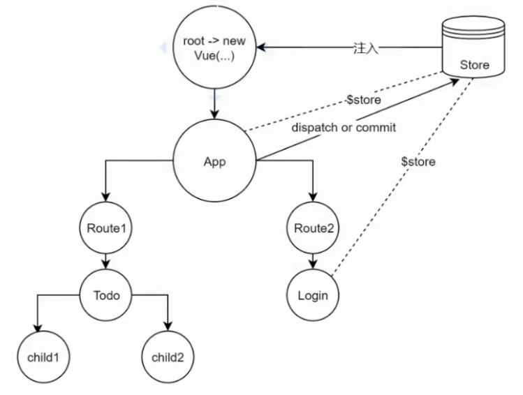

全局事件订阅， bus

```js
// utils/bus.js
import Vue from 'vue'
export default new Vue()
// store/actions.js
import bus from '../utils/bus.js'
bus.$emit('auth') // 通过全局的bus触发事件
// client-entry.js
import bus from '../utils/bus.js'
bus.$on('auth', () => {
  router.push('/login')
})
// 这样就实现了 受保护路由
```

---

getters相当于vuex里的computed 用于数据缓存 在组件中的复用中可解耦提到这层

mutations里的修改是同步的

actions 里的修改是异步的，

---



vuex里的store可以分module模块~~ 这算是对redux的一种最佳实践运用之一

```js
import Vuex from 'vuex'
import initialState from './state'
import mutations from './mutations'
import getters from './getters'
import actions from './actions'

let isDev = process.env.NODE_ENV === 'development'

export default () => {
  return new Vuex.Store({
    strict: isDev,
    // 服务端会有初始数据覆盖掉 initialState
    state: initialState,
    mutations,
    getters,
    actions,
    modules: {
      a: {
        namespaced: true, // 有此属性，则可写相同的muations actions方法了
        state: {
          text: 'hello vue'
        },
        mutations: {
          add(state, num) {
            state.num = num
          }
        },
        getters: {
          /**
           * @param {Object} state 当前模块下的 state 值
           * @param {Function} getters 当前模块下getters方法
           * @param {Object} rootState 全局的state值
           */
          numPlus(state, getters, rootState) {
            return state + 1
          }
        },
        actions: {
          add({state, commit, rootState}) {
            // commit的方法 (updateText) 会在当前模块下找,
            // 要在全局找 需加上 {root: true}
            commit('updateText', rootState.num)
          }
        }
      },
      b: {
        state: {
          text: 'good bye react'
        }
      }
    },
    plugins: [
      () => {
        store => {
          console.log('my plugin invoked')
        }
      },
    ]
  })
}
```

namespaced的方法，在调用时 需加上 命名空间，如

```js
computed() {
  // ...mapGetters(['a/numPlus']),
  ...mapGetters({
    numPlus: 'a/numPlus'
  })
},
methods: {
  ...mapMutations(['a/add'])
},
mounted() {
  this['a/add'](666)
}
```

---

### 其他api

```js
store.watch(state => state.count + 1, () => {
  // 只有上面 state 值变化，(相当于定义了一个getters)
  // 才会触发下面的回调函数
})

store.subscribe((mutation, state) => {
  // 看着是不是很眼熟  是的 redux的action啊
  console.log(mutation.type)
  console.log(mutation.payload)
})
```
