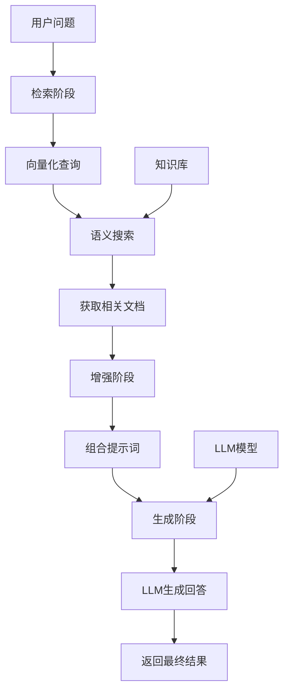

# RAG（检索增强生成）核心解析

## 一、什么是 RAG？

RAG = 检索 + 增强 + 生成 RAG = Retrieval + Augmented + Generation

一种将外部知识库与大语言模型结合的技术框架，让 AI 回答更加准确、实时、有据可依。

## 二、核心工作原理

传统 LLM 的局限：

依赖训练时的静态知识容易产生 "幻觉"（编造信息）无法访问最新或专有信息

RAG 的工作流程：

检索：从知识库中查找相关文档增强：将检索结果作为上下文提供给 LLM 生成：LLM 基于上下文生成准确回答

## 三、技术架构详解



## 四、核心组件

1. 检索器（Retriever）

向量数据库：Chroma、Pinecone、Weaviate 语义搜索：基于内容相似度混合检索：结合关键词和语义搜索

2. 知识库（Knowledge Base）

文档类型：PDF、Word、网页、数据库预处理：文本分割、向量化、索引构建更新机制：实时或定期更新

3. 生成器（Generator）

LLM 模型：GPT、Claude、Coze 等提示工程：优化上下文使用方式后处理：结果验证和优化

## 五、RAG 的优势价值

准确性提升

减少幻觉现象提供来源引用支持事实核查

实时性增强

知识库随时更新无需重新训练模型快速适应变化

成本效益

比微调更经济可重用现有基础设施灵活扩展知识范围

## 六、典型应用场景

企业级应用：

📚 智能客服系统 💼 企业内部知识问答 📊 数据分析报告生成 🔍 法律文档查询

消费者应用：

🎓 教育学习助手 🛒 电商产品咨询 🏥 医疗信息查询 📰 新闻摘要生成

## 七、技术实现实例

```py
# 伪代码示例
def rag_pipeline(question, knowledge_base):
    # 1. 检索相关文档
    relevant_docs = retrieve_documents(question, knowledge_base)

    # 2. 构建增强提示词
    context = combine_documents(relevant_docs)
    prompt = f"""基于以下上下文回答问题：
    {context}

    问题：{question}
    回答："""

    # 3. 生成回答
    answer = llm.generate(prompt)

    # 4. 返回结果和来源
    return {
        "answer": answer,
        "sources": relevant_docs
    }
```

## 八、与传统方法的对比

| 特性       | 传统       | LLM        | RAG |
| ---------- | ---------- | ---------- | --- |
| 知识时效性 | 训练时截止 | 实时更新   |
| 准确性     | 可能幻觉   | 有据可依   |
| 专业性     | 通用知识   | 领域专精   |
| 成本       | 微调昂贵   | 相对经济   |
| 透明度     | 黑盒决策   | 可追溯来源 |

## 九、挑战与解决方案

数据质量挑战

解决方案：数据清洗、质量评估、持续优化

检索精度挑战

解决方案：多模态检索、重排序算法、混合搜索

上下文长度限制

解决方案：文本摘要、关键信息提取、分层处理

## 十、未来发展展望

多模态 RAG：支持图像、视频、音频等多种格式
智能路由：自动选择最合适的检索策略
实时学习：根据反馈持续优化知识库
个性化：适配不同用户的偏好和背景

## 十一、入门建议

技术栈选择：

框架：LangChain、LlamaIndex
向量库：Chroma（轻量）、Pinecone（云服务）
LLM：OpenAI、Coze、开源模型

学习路径：

掌握基础概念和原理
搭建简单 RAG 系统
优化检索和生成质量
部署到生产环境

RAG 正在成为构建可靠 AI 应用的标配技术，让大语言模型真正落地到实际业务场景中。
