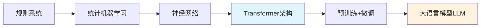

# LLM（大语言模型）全景解析

## 一、什么是 LLM？

LLM = Large Language Model（大语言模型）

基于海量文本数据训练的深度学习模型，具备理解、生成和处理人类语言的能力。

## 二、核心能力维度

语言理解能力：

📖 文本理解与推理
💬 上下文对话维护
🎯 意图识别与分类
🌐 多语言支持

内容生成能力：

✍️ 文本创作与续写
🔄 语言翻译与转换
📝 摘要与提炼
🎨 创意内容生成

逻辑推理能力：

🧠 多步问题求解
🔍 信息检索与整合
⚖️ 比较分析与判断
📊 数据推理与解释

## 三、技术架构演进



关键技术突破：

- 2017：Transformer 架构诞生（Attention Is All You Need）
- 2018：GPT-1 开启预训练时代
- 2020：GPT-3 展现涌现能力
- 2022：ChatGPT 引爆 AI 革命
- 2023：多模态大模型发展

## 四、主流模型生态

闭源模型阵营：

// OpenAI系列
- GPT-3.5：性价比平衡
- GPT-4：最强能力，成本较高
- GPT-4 Turbo：优化版，响应更快

// Anthropic系列
- Claude 2：长上下文优势
- Claude 3：多模态能力

// 其他主流
- Google Gemini：多模态集成
- Coze：中文优化，本土化

开源模型阵营：

// Meta系列
- LLaMA 2：商业友好
- LLaMA 3：持续进化

// 其他优秀开源
- Mistral：轻量高效
- ChatGLM：中英双语优化
- Baichuan：中文特化
- Qwen：阿里通义千问

## 五、核心技术创新

1. Transformer 架构

- Self-Attention：全局依赖建模
- Feed-Forward：特征变换
- Layer Norm：训练稳定性
- Residual Connection：梯度流动

2. 训练范式演进

```
graph TB
    A[预训练 Pre-training] --> B[有监督微调 SFT]
    B --> C[人类反馈强化学习 RLHF]
    C --> D[部署推理 Inference]

    subgraph 训练阶段
    A
    B
    C
    end

    subgraph 使用阶段
    D
    end
```

## LLM 的局限性

- 幻觉问题   对于领域知识的欠缺
  - 猴子打印机例子（给一只猴子打印机，总有一天能写出全套金庸）
- 特定领域的知识不了解
  - “不是底层基于逻辑和推理能力”，又说“足够使用的逻辑和推理能力”

那么 RAG 就是针对这两点进行解决的
