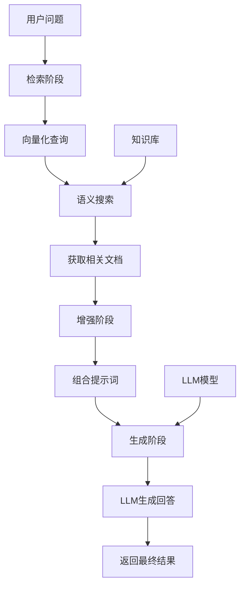

# RAG（检索增强生成）核心解析

## 一、什么是 RAG？

RAG = 检索 + 增强 + 生成 RAG = Retrieval + Augmented + Generation

一种将外部知识库与大语言模型结合的技术框架，让 AI 回答更加准确、实时、有据可依。

## 二、核心工作原理

传统 LLM 的局限：

依赖训练时的静态知识容易产生 "幻觉"（编造信息）无法访问最新或专有信息

RAG 的基本流程就是：

1. 用户输入提问
2. 检索：根据用户提问对 向量数据库 进行相似性检测，查找与回答用户问题最相关的内容
3. 增强：根据检索的结果，生成 prompt。 一般都会涉及 “仅依赖下述信息源来回答问题” 这种限制 llm 参考信息源的语句，来减少幻想，让回答更加聚焦
4. 生成：将增强后的 prompt 传递给 llm，返回数据给用户

## 三、技术架构详解



## 四、核心组件

1. 检索器（Retriever）

向量数据库：Chroma、Pinecone、Weaviate 语义搜索：基于内容相似度混合检索：结合关键词和语义搜索

2. 知识库（Knowledge Base）

文档类型：PDF、Word、网页、数据库预处理：文本分割、向量化、索引构建更新机制：实时或定期更新

3. 生成器（Generator）

LLM 模型：GPT、Claude、Coze 等提示工程：优化上下文使用方式后处理：结果验证和优化

## 五、RAG 的优势价值

- 准确性提升  减少幻觉现象提供来源引用支持事实核查

- 实时性增强  知识库随时更新无需重新训练模型快速适应变化

- 成本效益  比微调更经济可重用现有基础设施灵活扩展知识范围

## 六、典型应用场景

企业级应用：

- 📚 智能客服系统
- 💼 企业内部知识问答
- 📊 数据分析报告生成
- 🔍 法律文档查询

消费者应用：

- 🎓 教育学习助手
- 🛒 电商产品咨询
- 🏥 医疗信息查询
- 📰 新闻摘要生成

## 七、技术实现实例

```py
# 伪代码示例
def rag_pipeline(question, knowledge_base):
    # 1. 检索相关文档
    relevant_docs = retrieve_documents(question, knowledge_base)

    # 2. 构建增强提示词
    context = combine_documents(relevant_docs)
    prompt = f"""基于以下上下文回答问题：
    {context}

    问题：{question}
    回答："""

    # 3. 生成回答
    answer = llm.generate(prompt)

    # 4. 返回结果和来源
    return {
        "answer": answer,
        "sources": relevant_docs
    }
```

在理解了，RAG 的基本原理后，我们快速和宏观的介绍如何打造一个 RAG chat bot 的全流程。

1. 加载数据
因为想要根据用户的提问进行语意检索，我们需要将数据集放到向量数据库中，所以我们需要将不同的数据源加载进来。这里就涉及到多种数据源，例如 pdf、code、现存数据库、云数据库等等。

这里 langchain 提供非常丰富的集成工具，帮助我们加载来自多个数据源的数据。这个详细的内容会在对应章节介绍场景的数据源的加载方式。

2. 切分数据
gpt3.5t 的上下文窗口是 16k，gpt4t 上下文窗口是 128k，而我们很多数据源都很容易比这个大。更何况，用户的提问经常涉及多个数据源，所以我们需要对数据集进行语意化的切分，根据内容的特点和目标大模型的特点、上下文窗口等，对数据源进行合适的切分。

这里听起来比较容易，但考虑到数据源的多种多样和自然语言的特点，事实上切分函数的选择和参数的设定是非常难以控制的。理论上我们是希望每个文档块都是语意相关，并且相互独立的。

3. 嵌入（embedding）
这部分对没有机器学习相关背景的同学不容易理解。这里我们用最简单的词袋（words bag）模型来描述一下最简单的 embedding 过程，让大家更具象化的理解这个。

a. 词袋模型就是最简化的情况，把一篇 句子/文章 中的单词提前出来，就像放到一个袋子里一样，认为单词之间是独立的，并不关心词与词之间的上下文关系。
b. 假设我们有十篇英语文章，那我们可以把每个文章拆分成单词，并且还原成最初的形势（例如 did、does => do），然后我们统计每个词出现的次数。

d. 这样我们就能把一篇文章用一个向量来表示了，然后我们可以用最简单的余弦定理去计算两个向量之间的夹角，以此确定两个向量的距离。 e. 这样，我们就有了通过向量和向量之间的余弦夹角的，来衡量文章之间相似度的能力，是不是很简单。

当然，这是最最最简单的 embedding 原理，不过是所有的 embedding 和相似性搜索都是类似的原理。

回到我们 RAG 流程中，我们将切分后的每一个文档块使用 embedding 算法转换成一个向量，存储到向量数据库中（vector store）中。这样，每一个原始数据都有一个对应的向量，可以用来检索。

4.检索数据
当所有需要的数据都存储到向量数据库中后，我们就可以把用户的提问也 embedding 成向量，用这个向量去向量数据库中进行检索，找到相似性最高的几个文档块，返回。

在这里，使用什么算法去计算向量之间的距离也是需要选择的，这个我们会在对应的章节进行介绍。

5.增强 prompt

```js
你是一个 xxx 的聊天机器人，你的任务是根据给定的文档回答用户问题，并且回答时仅根据给定的文档，尽可能回答
用户问题。如果你不知道，你可以回答“我不知道”。

这是文档:
{docs}

用户的提问是:
{question}
```

6.生成
然后就是将组装好的 prompt 传递给 chatbot 进行生成回答。

## 八、与传统方法的对比

| 特性       | 传统       | LLM        | RAG |
| ---------- | ---------- | ---------- | --- |
| 知识时效性 | 训练时截止 | 实时更新   |
| 准确性     | 可能幻觉   | 有据可依   |
| 专业性     | 通用知识   | 领域专精   |
| 成本       | 微调昂贵   | 相对经济   |
| 透明度     | 黑盒决策   | 可追溯来源 |

## 九、挑战与解决方案

数据质量挑战

解决方案：数据清洗、质量评估、持续优化

检索精度挑战

解决方案：多模态检索、重排序算法、混合搜索

上下文长度限制

解决方案：文本摘要、关键信息提取、分层处理

## 十、未来发展展望

多模态 RAG：支持图像、视频、音频等多种格式
智能路由：自动选择最合适的检索策略
实时学习：根据反馈持续优化知识库
个性化：适配不同用户的偏好和背景

## 十一、入门建议

技术栈选择：

框架：LangChain、LlamaIndex
向量库：Chroma（轻量）、Pinecone（云服务）
LLM：OpenAI、Coze、开源模型

学习路径：

掌握基础概念和原理
搭建简单 RAG 系统
优化检索和生成质量
部署到生产环境

RAG 正在成为构建可靠 AI 应用的标配技术，让大语言模型真正落地到实际业务场景中。
