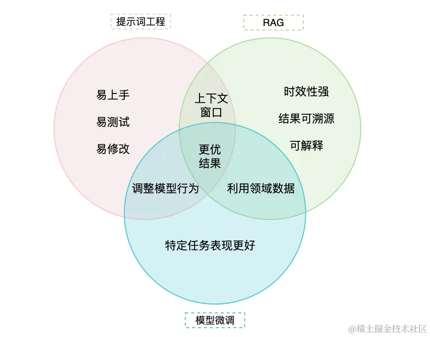

# 前言

要精通提示词工程：
1. 首先需要明确提示词工程的角色和承担的任务；
2. 掌握提示词工程的各种战略思想和战术技巧；
3. 需要具备一定的 AI 常识；（大语言模型、模型微调、提示词和提示词工程等概念）
4. 最关键的是要对业务和任务有深入的理解。

提示词创作流程：

问题定义 > 任务拆解 > 提示词创作 > 提示词评测 > 提示词调优

# 提示词创作和调优的必备知识

大语言模型（Large Language Model，简称 LLM）是一种先进的计算机程序，通过海量数据训练，掌握大量知识，能够理解和生产自然语言，擅长处理文字信息，并能执行问题回答、语言翻译、文章生产等任务。

- 性能问题（模型复杂性所需计算资源高）
- 时效性（训练数据是静态，基于某个时间，无法获取和更新信息，也无法自动验证准确性和时效性）
- 上下文丢失
- 幻觉问题（依赖训练时的数据和关联）
- 精确数字问题
- 内容合规问题（基于道德、法律）

## 提示词 Prompts

描述的文本可能包括任务的目标、任务所需的背景知识、处理的过程、输出的样例等，这段描述的文本就被称为提示词。

- 系统提示词
- 用户提示词

> 注：这里及后续讨论的都是用户提示词。  开发人员通常需要先定义任务目标，通过提示词工程创建提示词，并调用大语言模型生成结果，用户可以对结果进行反馈，开发者根据反馈持续迭代调优提示词，最终得到符合目标的提示词版本。

## 模型微调（Model Fine-tuning）

是指在原有的预训练模型基础上，使用特定领域的少量数据进行再训练，以便模型在这个特定领域的任务上表现更好。微调后的模型可以更好的理解和处理特定领域的任务，因为它接受了更多的训练。

## RAG (Retrieval-Augmented Generation)

是一种将检索系统与生成式AI模型结合的技术框架，中文可译为"检索增强生成"。它的工作流程包括三个核心步骤：

1. 检索 Retrieval
   当用户提出问题时，系统首先从外部知识库中检索相关信息
2. 增强 Augmentation
   将检索到的信息与用户的原始问题结合，创建一个"增强提示"
3. 生成 (Generation)
   大语言模型如GPT等使用这个增强提示来生产最终回答，同事能够引用和利用检索到的信息

RAG的优势在于：

- 知识更新  可以访问训练截止日期后的新信息
- 内容可溯源  回答可以引用具体的文档来源
- 减少幻觉 通过提供真实参考资料减少AI编造信息的可能
- 专业领域适应  可以让通过AI模型快速适应特定领域知识

提示词工程的优点：

简单易用：通过调整输入内容，可以快速找到最佳的提示词组合。
快速反馈：无需对模型本身进行修改，能够即时看到调整效果。
低成较本：无需高额计算资源或数据集，适合资源有限的情况。迁移到其他模型的成本也很低，不需要额外的训练。

提示词工程的缺点：

精度有限：对于复杂或专业领域，提示词的效果可能不够理想。
依赖模型和编写者水平：模型能力和编写者的水平决定了提示词工程效果的上限。
泛用性差：对于高度专业化的任务，难以满足需求。

模型微调的优点：

高精度：通过在特定领域的数据上进行微调，模型能提供更准确和专业的回答。
专业性强：适用于医学诊断、法律咨询和代码生成等需要高专业度的场景。
适应性强：模型微调可以更好地适应用户的特定需求和偏好，使其回答更加贴近实际使用场景。

模型微调的缺点：

复杂性高：过程较为复杂，需要一定的技术能力和时间。
资源需求大：需要大量计算资源和高质量的数据集。
成本较高：从数据收集到模型训练，成本较提示词工程更高。想要更换新模型，需要基于新模型重新微调。

RAG 的优点：

动态信息： 通过利用外部数据源，RAG 可提供最新且高度相关的信息。
平衡： 在提示的易用性与微调的定制性之间提供折中方案。
上下文相关性： 通过附加上下文信息增强模型的响应，生成更为详尽和丰富的输出。
RAG 的缺点：

复杂性：实施 RAG 可能较复杂，需将语言模型与检索系统集成。
资源密集：虽然比全面微调资源消耗少，但 RAG 仍然需要相当多的算力。
数据依赖性：输出质量取决于检索信息的相关性和准确性。

提示词工程强调易上手、快速调整模型输出；
RAG 注重实时更新、数据溯源和解释性；
模型微调则专注于特定领域的专业性。

它们的结合能通过优化上下文、使用领域数据和调整模型行为，可以达到生成更好的效果。

## 总结

- 提示词是我们提供给大模型的输入。
- 提示词模板是提示词的骨架。
- 提示词工程是提示词创作和调优的技巧，简单易用，但定制性有限。
- 模型微调是为了增强和拓展模型在特定领域的能力，但成本和复杂性较高。
- RAG 技术则是通过结合外部数据源，提供最新、相关的信息，是一种在提示工程与微调之间的折中方案，特别适合需要动态信息和上下文相关性的场景。

同时，也指出提示词工程不是万能的：

- 提示词工程通过不断优化提示词来达到大语言模型的能力上限。

- 如果达到能力上限后仍无法满足要求，需要考虑使用更高级的模型或更垂直的模型、重新拆分任务、检查用户输入信息的准确性和完整性，或辅之以传统的编程手段等。
