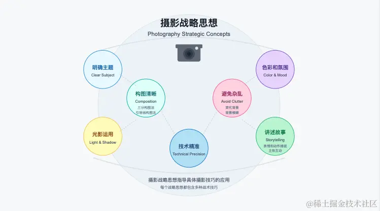
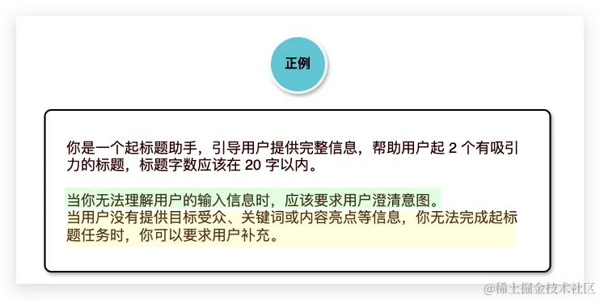
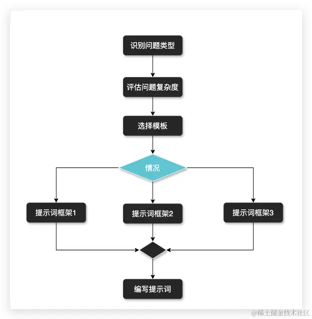
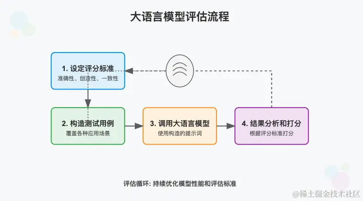
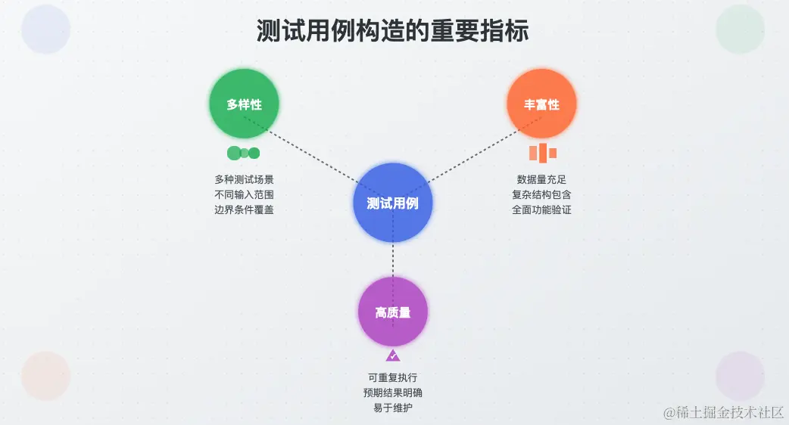
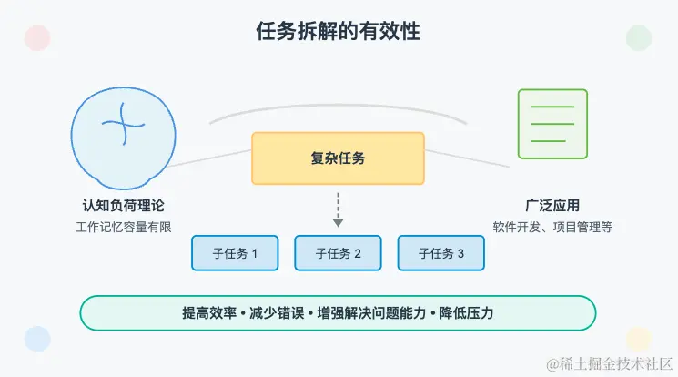

# 提示词的战略思想

何谓战略 ？

战略是指实现长期目标的总体计划和方向，代表了大方向和长期规划。掌握战略非常重要，因为它能够帮助我们明确方向、合理分配资源、识别潜在风险、统一思想，从而确保个人或组织的可持续发展。

在学习提示词之前，我们也需要从战略高度来把握提示词，避免过早陷入细节而无法看到整体：“不识庐山真面目，只缘身在此山中”。提示词的战略思想能够为提示词的创作和优化指明清晰的方向，使我们能够从整体和抽象的层面鸟瞰提示词。

拿拍照来说，摄影的具体技巧千变万化，我们很难穷尽。但是，我们可以掌握一些摄影的宏观战略思想，可能包括明确主题、构图清晰、光影运用、色彩和氛围、避免杂乱、讲述故事、技术精准、后期处理等。

每一个战略思想都包含很多战术技巧：

构图清晰： 包括三分构图法、引导线构图法等；
避免杂乱：包括简化背景、使用背景模糊、近距离拍摄主体等；
讲述故事：包括表情和动作捕捉、主体之间互动、细节特写等。

接下来我们依次介绍这些提示词战略思想，包括专注聚焦、清晰具体、充分详尽、避免歧义、保持健壮、确保安全、融会贯通、迭代调优。

## 专注聚焦

是指在我们编写提示词时，应该更专注于让大模型完成一项任务。如果在同一段提示词中让模型做的任务太多，由于提示词描述和大模型特性导致大模型每件事都干不好。

> 同编程中的单一职责

## 保持健壮

提示词应当在各种输入和情境下都能可靠地工作，生成稳定且高质量的输出，不易受到输入变化的影响。要求提示词中明确任务要求，提供足够的背景信息和上下文，考虑多种情况，确保在各种情况下都能生成可靠结果。

如上图所示，我们可以在提示词中对边界情况给出内置的处理策略，如：“当你无法理解用户输入信息时，应该要求用户澄清”、“当用户没有提供目标受众...”，这样可以让大模型有效应对各种异常情况，输出符合预期的内容。

## 确保安全

在编写提示词时，提示词应当避免引发模型生成不安全或有害内容，确保生成的内容符合道德和法律规范。通常需要提示词确定回答内容的明确限制和边界，使用中立和尊重的语言等。

## 融会贯通

所谓融会贯通是指在编写提示词时，不应拘泥于某一种提示词框架，而应在掌握各种技巧后，根据实际情况灵活运用，综合运用多种方法，以达到最佳效果。

## 迭代调优

对于复杂场景，提示词的创作很难一蹴而就，提示词工程是一个不断迭代优化的过程。需要根据模型输出的结果，选择各最恰当的方法进行优化，逐步摸索到模型能力的上限。

## 总结

从专注聚焦到清晰具体、充分详尽、避免歧义和确保安全，每一个策略都为我们指明了提示词编写的方向。

提示词编写过程中不要拘泥于某种特定的提示词框架，我们需要根据实际场景融会贯通。

此外，在进行提示词创作之前，我们需要有多次调优的心理预期。提示词的编写难以一蹴而就，需要根据结果不断进行迭代和优化，逐步逼近模型能力的上限。

# 把握提示词效果

1. 设定评分标准：明确评价生成内容的标准，包括准确性、创造性、一致性和响应时间等。

2. 构造测试用例：设计一系列测试用例，涵盖不同场景。

3. 调用大语言模型：使用构造的提示词通过大语言模型生成相应的结果。

4. 结果分析和打分：根据预先设定的评分标准，对生成结果进行全面分析和打分。

## 评估标准

定性评估 是一种通过描述性语言来评估事物的方法。它通常关注事物的性质、特点和感受，而非具体的数字或数据。由于其依赖于个人观察和描述，结果往往具有主观性。对于难以量化的模型输出，如大语言模型生成的文章质量，可以使用定性评估。例如，评估一篇生成文章的流畅性、逻辑性和吸引力等。

定量评估 则通过具体的数字和数据来评估事物的方法，关注事物的数量、比例和具体数值指标。定量评估依赖于可测量的数据，结果通常较为客观。对于结果易于量化的模型输出，优先采用定量评估标准。例如，评估生成代码的正确率、时间和空间复杂度等。

我们构造测试用例时应该重视： 多样性、丰富性和高质量 三个重要指标。

- 多样性： 按照难易程度划分，可以包括简单、中等和复杂多种类型，以确保结果的客观性。如测试翻译助手的提示词效果时，不应该只构造短的、词汇简单的文章，应该根据难度和长度构造不同类型的用例。

- 丰富性： 构造尽量多的测试用例，一般来说数量越多，结果越有说服力。如测试翻译助手的提示词效果时，我们不应该只构造一两个用例，应该构造尽可能多的用例。

- 高质量： 应构造高质量的有效用例，避免大量低质量的用例。如测试翻译助手的提示词效果时，不应该随便找几个非常简单非常常见的毫无代表性的句子。

## 科学的评估方法

控制变量法是一种科学实验方法，用于研究单一因素（变量）对结果的影响。为了确保结果的准确性，实验中需保持其他可能影响结果的因素不变。简单来说，就是在研究某一变量时，其他条件需保持不变，从而准确判断该变量对结果的影响。

常见参数包括：

- temperature（温度）： 用于控制结果随机性。值越高，结果越随机。类似于在派对上选择聊天对象的随机性，温度高意味着可能与更多不同的人聊天。
- top_p（核采样）： 决定模型从中选择下一个词的概率质量范围。例如，top_p=0.9 表示模型将从概率总和达到 90% 的词汇中选择。类似于在派对上根据兴趣排序选择前90%的人聊天。
- presence_penalty（出现惩罚）：控制模型避开已提到词汇或主题的程度。较高的出现惩罚使模型更倾向于生成新内容，避免重复。
- frequency_penalty（频率惩罚）,控制模型避免重复使用某些词汇的程度。较高频率惩罚使模型更注意词汇多样性，避免频繁使用同一词汇。
- stop（停止词） ：设置遇到哪些字符时停止输出。

不同模型和平台提供的参数可能有所差异，实际使用时需仔细阅读相关说明，通常采用默认值不需要修改。

## 总结

本节主要讲述了提示词效果评测，涵盖以下几个方面的内容：

提示词的评测流程：首先确定评分标准和构造用例，然后调用大模型产出结果，最后根据评分标准进行效果评分。
提示词的评估标准：包括相对主观的定性评估和相对客观的定量评估。
提示词用例的构造：主要包括编程和大模型的自动化评估，还包括半自动化以及纯手动构造方式。
提示词的评分方式：与用例构造类似，采用编码或大模型自动评分，必要时进行人工调整。
同时，分享了提示词评估的注意事项：

科学的评估方法（控制变量法） ：在评测不同版本的提示词效果时，应保证用例、评分标准、模型、硬件配置、模型参数等条件的一致性。

评估标准的合理性：如果评测标准与实际情况差异较大，评估结果也会有较大偏差，因此应进行合理性评估。

分数和实际表现的差异：由于多种因素可能导致测评分数与实际表现不一致，建议将分数作为参考值，用于评估每一轮提示词调优的相对效果。

# 任务拆解

人类的工作记忆容量有限。通过将复杂任务分解成小部分，可以有效减少认知负荷，从而提高信息处理和学习的效率。

无论是在软件开发、项目管理，还是日常生活中，任务拆解都能帮助我们更有效地组织和完成工作。通过将复杂的任务分解为更小、更可管理的部分，我们能够更好地理解每个步骤的要求，减少出错的可能性，并保持工作的连贯性和可控性。这种方法不仅能够提高工作效率，还能增强解决问题的能力，使我们在面对复杂任务时更加从容不迫。

根据实践总结出以下两条重要经验：

1. 在进行任务拆解前，首先思考在没有使用大模型的情况下，我们是如何完成这项任务的，以便更好地理解任务的本质。

2. 进行任务拆解时，应遵循由粗到细的粒度，避免任务拆解过于粗略或过于细致。通常情况下，先梳理任务流程，将整个任务拆解成几个大的子任务。如果某个子任务仍然过于复杂，则可以进一步拆解。

## 例1 PPT生成任务

一句话 -> PPT生成助手 -> PPT

一句话 -> PPT大纲助手 -> 大纲 -> PPT生成助手 -> PPT

## 例2 文章翻译任务

方案1

原文 -> 翻译助手 -> 译文

方案2

原文 -> 翻译助手 -> 初始译文 -> 译文润色助手 -> 最终译文

方案3

原文 -> 翻译API -> 多版本机翻译文 -> 译文助手打分 -> 最佳机翻译文 -> 译文润色助手 -> 最终译文1 -> 人工校对 -> 最终译文2

# 总结

本文介绍了应对复杂任务的有效方法：任务拆解。任务拆解有助于改进模型响应，提高可控性、调试能力和准确性。文章分享了以下任务拆解的经验：

进行任务拆解前，应先思考在没有AI的情况下如何完成任务。

进行任务拆解时，应遵循由粗到细的粒度，避免任务拆解过于粗略或过于细致。

需要强调的是，并非所有任务都应交由大模型完成。如果编程方式更有效、更高效，则应选择编程实现；如果某个子任务更适合大模型，则可以通过大语言模型来完成；而对于编程和大模型都无法很好完成的子任务，则需要人的参与。

文章还通过 PPT 生成和文章翻译两个示例，演示了如何根据上述任务拆解经验进行任务分解。合理的任务拆解至关重要，只有通过有效的任务拆解，后续编写提示词的效果才会更显著。
