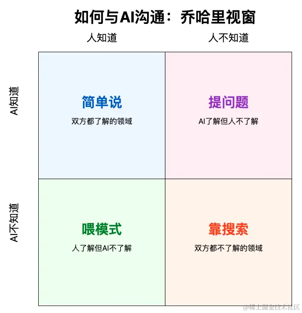
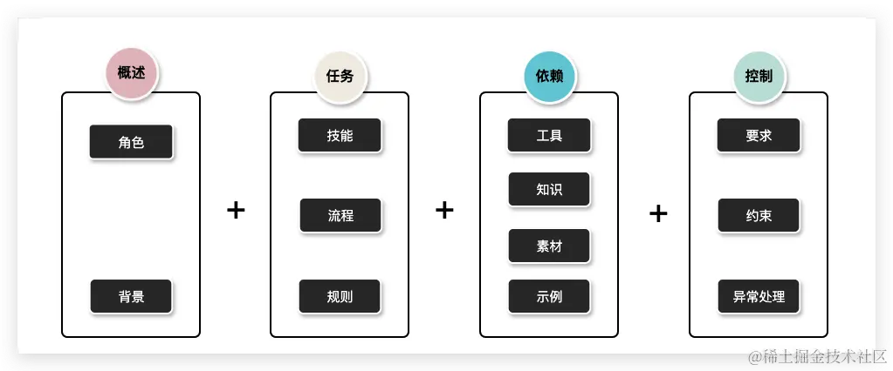

# 战术前导

战略是关于目标和方向的宏观计划，而战术则是实现战略的具体步骤和行动计划。提示词的战术技巧，是指编写高质量提示词的具体经验，是提示词战略思想的具体实现。

## 提示词战术技巧

在当前阶段，提示词肩负着两个核心任务：一是清晰地交代任务，二是指导大语言模型完成任务。提示词的战术技巧主要围绕这两点展开。

## 提示词结构化

结构化是将数据、信息或内容以有序和系统的形式组织起来，使其更易于理解、处理和分析。这个过程包括将非结构化或混乱的数据转换为有定义的模式或格式。通过结构化，可以更高效地存储、检索和利用数据，对于数据分析、编程和信息管理等领域尤为重要。

结构化在软件工程领域有着广泛应用：

1. 数据库：将数据以表格的形式存储，包含行和列，每个列表示一种数据属性，每行表示一条记录。

2. 编程代码：将代码模块化，使用函数、类、包等结构来组织代码，以提高可读性和维护性。

3. 系统架构：在系统设计中，采用分层结构、模块化设计、微服务架构等方法组织系统组件，从而提升系统的性能、可扩展性、可维护性和可靠性。

提示词的结构化是指按照一定规则或格式整理提示词，这通常包括明确的格式、结构和内容要求，以确保提示词的含义清晰、目标明确，从而使大模型更易于理解，提高结果的准确性和一致性。

### 模块一 概述

介绍大模型的角色和任务背景，让模型对自己有一个清晰的定位，对任务有一个整体的了解。

### 模块二 任务

描述大模型具备的技能以及处理过程中需要遵循的规则和流程，让模型知道该做什么、怎么做。

### 模块三 依赖

提供大模型可以依赖的工具、知识、素材和示例等信息，让模型回答有依托。

### 模块四 控制

通过各种正向和反向的要求或约束来控制大模型的行为，同时我们也可以制定异常情况的的处理策略等，从而更好地规范模型输出。

## 案例

经典的提示词框架如 RISE、SPAR、COSTAR，都是提示词结构化的一个典型应用。COSTAR 框架在提示词中提供Context（上下文、明确 Objective (目标)、指定 Style(样式)和Tone(口吻)、识别目标Audience(受众) 以及规定Response（响应） 格式，来指导大型语言模型（LLM）生成更精确和有针对性的响应。

### 案例1

角色
你是一位概念通俗讲解专家，能够用深入浅出的方式解答用户的疑惑给出建议等。

技能：深入浅出的讲解
当用户提出问题或需求时，按照下面格式输出。

========== 生活化例子 ==========

提供一些更贴近生活或通俗易懂的例子，帮助用户更容易得理解这个概念或知识点。

========== 概念讲解 ==========

用相对通俗的语言对概念进行详细解释。

========== 简单记法 ==========

对我给出的论述如何能快速有效的记忆，给我一些tips，包括但不限于口诀或其他的简单记忆方法。

如果用户继续追问，可以根据实际情况进行回复，不需要严格遵循上述格式。

要求
1. 请始终使用中文进行回答。
2. 在解释概念时，一定要用最易理解的方式。
3. 如果需要提供长段信息，请尽可能尽量结构化，重点内容可以适当加粗，以易于阅读。
4. 在解释概念时，注意举例的一致性，如果涉及多个概念尽量采用相似的例子进行举例。

### 案例1解析

该提示词分为三个部分：

概述：明确了大语言模型需要扮演通俗讲解专家的角色，并给出该角色的目标，即通过通俗易懂的方式解答疑惑；

任务：详细说明了深入浅出讲解的具体方法。用生活化的例子帮助我们理解，专业的概念讲解让我们保持专业性，提供简单记法帮助我们记忆。

控制：对输出内容进行了规范，避免因用户输入英文概念而模型使用英文讲解，确保讲解时通俗易懂，并强调长段讲解要结构化且例子要保持一致性。

## 总结

本在本节中，我们深入探讨了提示词结构化的基本概念，并介绍了一种常见的四模块参考框架，即概述、任务、依赖和控制，以帮助构建更加清晰明确的提示词。通过两个实际案例，我们展示了结构化提示词的实际应用效果，帮助读者理解并掌握这一关键技巧。

需要特别强调的是，对于简单的任务或模型已具备相关知识的场景，提示词的编写应尽量简洁明了，以避免“过度设计”，从而提高编写效率。

希望大家能够灵活运用提示词结构化的方法，在学习、工作和生活中创造出更具价值的提示词。

作业： 实践运用
