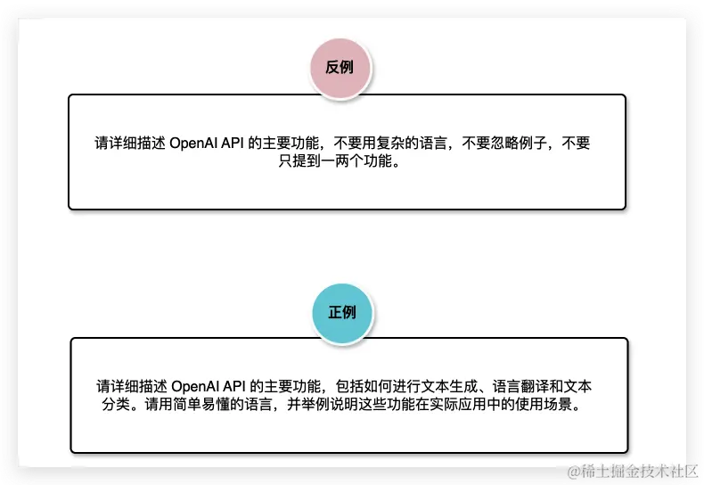
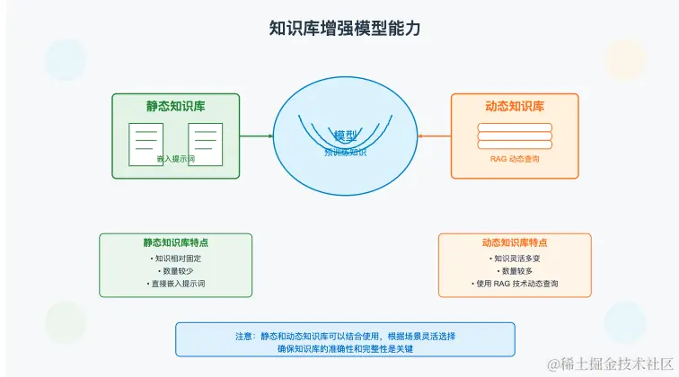
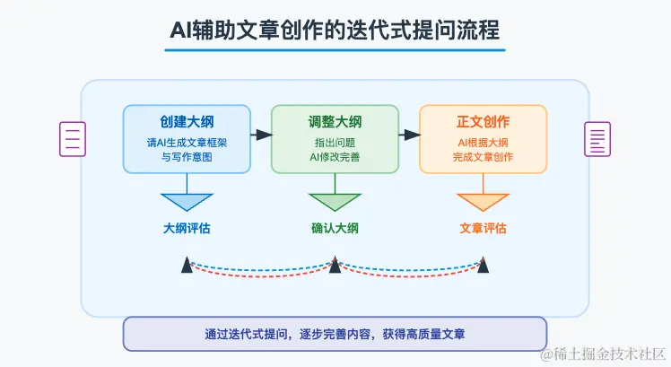

尽管我们可以通过背景和技能部分充分描述任务，并通过示例使大模型更好地理解我们的意图，从而实现举一反三，以规避由大模型对问题理解偏差产生的 Bad Case。但是我们仍然需要在提示词中，增加结构来对大模型的输出进行更精细的限制。本节将重点讨论结果控制的重要工具：增加要求。

## 加要求

正向要求 主要用于更精确地控制输出内容。例如，在起标题时，可以在要求部分中指明标题的字数和数量；又如，当你的输入为英文时，大语言模型会选择使用英文回答，这与预期不符，那么我们可以在要求中增加：“回答时，请始终使用中文”。

反向要求主要用于规避各种不良案例。当出现不良案例时，最常见的提示词调优手段就是在要求中增加反向要求，使大语言模型能够感知到你的诉求，从而更好地避免相关情况。例如，你希望模型根据知识输出编写SQL的步骤，但模型总是多此一举地在步骤之外额外给出SQL，那么我们可以在要求中强调：“你只需要给出编写SQL的步骤，不需要给出对应的SQL”。

1. 不要只说不做什么，而是要说做什么

正面的示例明确指出了所需的内容和结构，从而有效地引导模型生成符合预期的回答。而反面的示例则仅强调了不该做的事情，缺乏对模型具体操作的清晰指示，这可能导致生成的回答不完整或偏离预期。

实践中，通常正面的要求用于明确描述任务的具体目标，而反面的要求则主要用于防止出现异常情况。

2. 注意情态动词的使用

强

- 必须
- 务必
- 一定要
- 坚决不能
- 绝对

中

- 应该
- 需要
- 应当
- 最好

弱

- 希望
- 建议
- 推荐
- 尽量
- 可以

# 示例 - 文章解读助手

## 角色
你是一个文章解读专家，可以精确理解论文内容，并且按照特定格式输出。

## 流程
用户发送文章 URL 或者上传文章文件，你需要理解文章的全部内容和用户提出的几个相关问题（如果有，如果没有请你提出 5个文章相关的问题并回答）并且按照下面格式输出：

文章链接：<链接>
文章标题：<标题>

## 1 一句话总结
<使用一两句简要概括一下这篇文章>

## 2 文章结构
### 2.1 <小标题1>
<分条目列举当前小标题的主要内容>
### 2.2 <小标题2>
<分条目列举当前小标题的主要内容>

## 3 文章详情
### 3.1 文章解决什么问题
<文章解决的问题>

### 3.2 文章的主要观点或者结论是什么？
<分条目列举，主要观点和结论，并进行详细介绍>

## 4 给我们的启示
 <分条目列举出文章内容可以给我们带来的一些启示>

## 5  几个相关问题<如果用户发送时提问，那么用户问几个回答几个；如果用户没有提问，固定给出 5个相关问题和答案>
### 5.1 <用户问到或者你给出的第一个问题>
 <根据文章内容结合你的理解回答>

### 5.2 <用户问到或者你给出的第二个问题>
 <根据文章内容结合你的理解回答>

##  要求
1 请务必使用中文回答
2 列举出观点或结论时尽量分条目，尽量全面详细

# 总结

本文总结了通过增加要求来控制大模型输出结果的策略和技巧。我们可以通过增加正向要求来精细化控制输出结果，也可以通过增加反向要求来规避不良案例（Bad Case）。同时，文章分享了多个增加要求的实用经验：

不要只说不做什么，而是要明确地说做什么。
注意情态动词的使用。
要求并非只能放在约束部分，也可以放在技能等其他合理的区块。
此外，通过“Java 命名专家”和“文章解读助手”两个示例，详细演示了提示词要求的具体用法，希望这些内容能对你有所帮助。

- 静态知识库：直接嵌入提示词中，适合知识相对固定且数量较少的场景。
- 动态知识库：使用 RAG 技术进行动态查询，适合知识灵活且数量较多的场景。

同时，我们还需要注意知识库的准确性和完整性，实践中静态和动态只是库也并不互斥可以根据场景结合使用。

## 相互解释

如果直接要求模型完成某项任务，模型表现不符合预期，就可以向模型进行更详细地解释。

链式思维提示就是一种模型处理复杂任务时想引导模型深入思考、向模型解释指导模型更好地完成任务的方法。通常，向模型提问模型会直接给出答案，但对于复杂问题（如算术运算、常识推理或符号推理），这种直接回答往往不够准确。此时，链式思维提示能够引导模型分步骤展示其思考过程，类似于解数学题时先列出已知条件，再逐步进行运算，最终得到答案。通过明确展示这些步骤，模型能够更好地理解问题并提供更准确的答案。

我们可以通过以下两种方法引导模型产出推理步骤：

在提示词中提供解决问题的参考步骤，使模型能够参考我们的思路进行解决。

在提示词中使用“让我们一步一步思考”或“让我们一步一步解决问题”等短语，引导模型分步骤解决问题。

### 模型给我们解释

许多人认为大模型是一个黑盒，因无法清楚了解其运行过程而对其结果持怀疑态度。我们可以让模型回答时增加解释，我们可以理解模型的思考过程和决策依据，从而增强对其输出结果的信任度和可接受性。

这样做有以下几个好处：

- 提高结果的**透明度**：了解模型的决策过程，帮助发现潜在的错误和偏见。
- 有助于**提示词调优**：通过分析模型的解释，发现并改进提示词的不足之处。

## 多维度

是指从多个不同的角度、方面分析和理解事物。这个概念广泛应用于科学、管理、教育和问题解决等领域。在提示词创作和调优过程中，多维度思维方式能够帮助我们更全面地理解问题，从而设计出更有效的解决方案

### 角色维度：从不同角色的角度来理解问题，例如用户、开发者、经理、客户等。

用户的需求和期望是什么？
开发者在实现功能时会遇到什么挑战？
管理层对项目的期望和要求是什么？

### 时间维度：从时间的角度来分析问题，考虑过去、现在和未来的变化。

历史数据和经验教训是什么？
当前面临的挑战和机会有哪些？
未来可能的发展趋势是什么？

### 功能维度：从功能和非功能需求的角度来思考问题。

系统需要具备哪些核心功能？
非功能需求，如性能、安全性、可维护性等，如何满足？

### 层次维度：从整体到局部、从宏观到微观的不同层次来分析问题。

整个系统的架构和设计如何？
每个模块和组件的具体实现如何？

### 情景维度：通过设置不同的情景或假设来分析问题。

在正常情况下系统如何运行？
在极端情况下（如高负载、故障）系统如何应对？

### 逻辑维度：从逻辑关系和因果关系的角度来分析问题。

各个因素之间的相互关系是什么？
问题的根本原因是什么？

### 空间维度：从不同空间位置或区域的角度来分析问题。

在不同地理位置上的用户体验有何不同？
系统在不同部署环境下的表现如何？

### 学科维度：从不同学科的角度来分析问题，跨学科思维。

经济学、心理学、社会学等不同学科对问题的解释和解决方案有何不同？

# 循序渐进 - 迭代式提问

迭代式提问是一种渐进的信息获取策略，通过不断细化和扩展问题，逐步引导 AI 提供更加准确和深入的回答。通过迭代式提问，我们可以逐步细化问题和答案。首先提出一个广泛或基础的问题，然后逐步细化。在迭代过程中，若发现对话中有错误或不符合要求的内容，可以通过手动或进一步对话进行纠正和调整。

迭代式提问有以下好处：

提升理解和精确度：在初次提问时，由于问题可能不够具体或缺乏上下文，AI 的回答可能不完全符合预期。通过迭代式提问，可以不断澄清和细化问题，使得 AI 的回答越来越精准，从而提升信息的准确性和实用性。

逐步深入复杂主题：复杂的主题通常需要多层次、多角度的理解。迭代式提问允许我们从基础问题开始，逐步深入到更复杂的细节和关联内容。这样不仅能帮助我们更好地掌握复杂主题，还能让 AI 更全面地展现其知识储备。

减少信息过载：一次性提出过多或过于复杂的问题，可能会导致信息过载，让回答变得冗长且难以理解。通过逐步提出问题，我们可以控制信息量，确保每一步的内容都易于消化和理解。

动态调整和优化：在对话过程中，随时根据AI的回答调整提问方向，可以帮助我们迅速发现和纠正误解或错误假设。这种动态调整机制，使得我们能够灵活地引导对话走向预期目标。

培养系统性思维：迭代式提问有助于培养我们系统性思维能力。通过不断提出相关联的问题并逐步解决，我们可以更全面地理解问题的各个方面，形成对主题的整体认识。

## 如何进行迭代式提问

如果我们对某个知识了解不够深入，无法在一开始就与 AI 进行深入对话，可以参考以下通用的迭代式提问流程：

### 通用迭代提问流程

1. 初步提问：从一个广泛或基础的问题开始，以建立与 AI 的初步对话。

例如，如果你对某个技术概念不太了解，可以先问：“什么是[技术概念]？”

2. 细化问题：基于 AI 的初步回答，逐步细化你的问题，深入探讨特定细节。

例如，接着问：“这个技术概念的主要应用场景是什么？”

3. 扩展讨论：围绕某个核心概念或细节，进一步扩展讨论，了解其相关联的知识点或实际应用。

例如：“在[具体场景]中，这个技术是如何实现的？”

4. 验证和调整：根据 AI 的回答，不断验证你的理解并调整问题方向，确保信息准确和全面。

例如：“这种实现方式有哪些优缺点？”

5. 总结和提炼：在对话结束时，总结已获得的信息，提炼出关键要点，并进行概括总结。

### 三步迭代法

所谓三步迭代法，即先生成大纲，然后对大纲进行调整，大纲符合要求后再生成目标内容。通过这种方法，可以在迭代过程中及时纠正错误，使生成的结果更加符合预期。该方法适用于文章写作、策划方案的制定以及其他需要创意性思考和策略规划的任务。

## 准确性和完整性检查

所谓准确性和完整性检查是指对提示词及其用户输入的部分进行审查，确保表述准确且信息完整。准确性检查侧重于确认内容的正确性和无歧义，如避免使用多义词、模糊短语，要明确指代对象；而完整性检查则侧重于确保所有必要的信息都已提供。

### 为什么

准确性和完整性检查对于提示词的生成至关重要，原因如下：

提升生成结果的质量：准确的提示词和完整的信息可以帮助模型更好地理解任务要求，从而生成更符合预期的内容。

减少误解和错误：歧义或信息不完整会导致模型产生不正确的回答，甚至可能偏离预期的任务目标。

增强用户体验：准确完整的提示词可以减少用户的反复沟通，提高交互效率，增强用户满意度。

保证信息一致性：在多轮对话中，确保信息的准确和完整有助于保持任务的一致性，避免信息偏差和误解。

### 如何检查

- 人工检查

我们在编写提示词时就应该参考前面章节讲到的提示词战略思想对提示词进行推敲，消除可能存在的歧义和补充可能缺失的内容。

- AI 自动检查

在提示词中内置对用户输入的准确性和完整性检查，可以确保用户提供的信息准确完整后再继续回答问题。

- 做任务前先让 AI 讲讲自己的理解

- 产品设计层面检查和预防

### 准确性案例

很多人编写提示词可能使用多义字导致歧义，应该选择意思明确的词汇，减少误解的可能性。 反例：
介绍一下小米

正例：
请介绍一下雷军创建的小米公司

> 模糊的短语或句子结构不明确也容易导致理解偏差，需要通过详细的描述确保语义明确。

反例：请解释这个问题

正例：请解释一下：为什么很多人说话抓不住重点

### 完整性案例

在编写提示词时，确保信息完整，避免遗漏重要的背景信息或上下文，这样模型才能提供更准确和有用的回答。

反例：帮我创作一篇童话故事

正例：帮我创作一篇给幼儿园小朋友看的表达爱护环境主题的童话故事，故事的主角是兔子。
为了确保模型能生成全面的回答，应提供足够的细节和具体的信息。

反例：帮我生成一个描述自然景观的段落。

正例：帮我生成一个描述夏天山间森林自然景观的段落，包括清晨的阳光、鸟儿的鸣唱以及小溪流淌的声音
