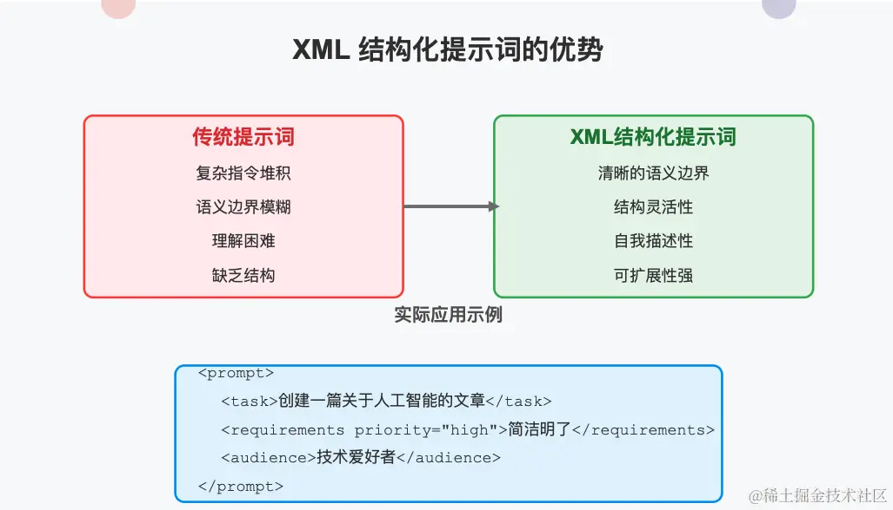

# 如何用 XML 写提示词？

下面我给出一些参考的标签：

基础框架标签

<task> - 定义整体任务描述和目标
<todo> - 代办事项
<role> - 设定AI扮演的角色和身份
<context> - 提供背景信息和相关上下文
<output> - 指定输出格式和要求
<rules> - 设定规则和约束条件
内容输入标签

<background> - 提供详细的背景知识
<user-input> - 用户提供的原始输入内容
<resource> - 参考资料或数据源
<example> - 示例内容或参考案例
<data> - 结构化数据或信息
指令与要求标签

<instructions> - 详细的执行指令
<constraints> - 限制条件和边界
<priority> - 优先级设置
<format> - 格式化要求
<style> - 风格和语调要求
特定场景标签

<article> - 文章创作内容区域
<code> - 代码相关内容
<analysis> - 分析和评估内容
<creative> - 创意内容生成
<conversation> - 对话模式设置
结构与流程标签

<steps> - 步骤和流程说明
<section> - 内容分区或章节
<metadata> - 关于提示词本身的元数据
<input-schema> - 输入数据的结构定义
<output-schema> - 期望输出的结构定义
高级控制标签

<conditional> - 条件性指令
<variables> - 变量定义和使用规则
<persona> - 用户角色或身份定义
<evaluation> - 评估标准和反馈机制
<memory> - 需要记忆或引用的重要信息

这些标签可以根据需要组合使用，以创建结构清晰、易于理解的提示词。你还可以根据特定需求自定义标签或添加属性来提供更精细的控制。


## 示例1：文章创作

比如我们希望编写文章创作的提示词，包括任务、标题、风格、要求、参考资料、我的观点、文章参考结构等部分，由于内容比较多，我们采用 xml 标签进行提示词编写。

```xml
<task>
<!-- 这里是你的任务 -->
你是有25年写作经验的科技作家，请结合 resource-group 中的内容和并重点参考我的观点 my-insight，根据我的语言风格 author-voice，帮我创作一篇文章，文章标题在 content-heading 中，文章的结构参考 structure部分，进行文章的创作。
​
</task>
​
<content-heading>
<!-- 这里我们想创作的标题，你创作是可以选择你认为适合的标题 -->
复杂提示词的结构化
​
</content-heading>
​
<author-voice>
<!-- 这里是我的语言风格 -->
半口语和半书面的口吻
</author-voice>
​
​
​
<rule>
<!-- 这里是你需要遵守的规则 -->
​
1 如果需要插图，请采用 Markdown > 标记给出插图建议即可，我后续会作图替换。一篇文章至少3张图，图应该和内容高度相关。
​
​
</rule>
​
<resource-group>
  <!-- 这里是资源组，通常是相关文章或论文，你创作时可以作为参考资料 -->
​
  <resource priority="high">
  <!-- 这里是要重点参考的资源的标题 -->
​
  </resource>
​
  <resourc priority="low">
  <!-- 这里是要次要参考的资源的标题 -->
​
  </resource>
</resource-group>
​
​
​
<my-insight>
<!-- 这里我将提供我的观点，文章创作是需要重点参考我的观点 -->
1 复杂提示词的结构化应该使用 xml
2 xml 标签模型比较熟悉，而且有开头和结尾，方便区分不同的内容
</my-insight>
​
<structure>
<!-- 这里我将提供文章的参考结构，不一定严格按照这个结构 -->
## 一、前言
一些同学的疑问，引出 xml 的解法
​
## 二、解法
## 2.1 为什么用 XML 标签
## 2.2 XML 标签是什么？
## 2.3 如何用 XML 写提示词？
​
## 三、总结
​
</structure>
```



## 总结

XML标签结构化提示词的主要优势包括：

清晰的语义边界：通过开始和结束标签明确划分不同内容区域，避免混淆
模型熟悉度高：大模型对XML格式非常熟悉，理解准确度更高
结构灵活性：可以根据需求自定义标签和嵌套关系，适应复杂场景
自我描述性：标签本身具有语义，提高可读性
可扩展性强：可以方便地添加属性和新标签，满足不断变化的需求
在实际应用中，我们可以根据不同场景使用各种标签类型，包括基础框架标签、内容输入标签、指令与要求标签等。文章提供的两个示例——文章创作和代码编写，展示了如何在不同情境下构建结构清晰的提示词。

使用 XML 结构化提示词时的建议：

选择语义明确的标签名，让标签本身就能表达内容用途
根据内容复杂度合理嵌套标签，避免过度复杂化
为重要内容添加优先级属性，引导模型关注重点
保持标签使用的一致性，便于模型学习你的提示词模式
必要时添加注释，进一步澄清期望
随着大模型能力的不断提升，提示词的表达方式也会不断演进。XML 结构化只是众多方法中的一种，但因其清晰性和通用性，是复杂提示词场景下的优秀选择。掌握这种结构化方法，将帮助你更有效地与大模型沟通，实现更精准的需求表达。

正如创建单智能体所演示的那样，提示词的编写很难一蹴而就，扣子的多 Agent 模式支持对单个 Agent 进行调试，因此大家可以对每个 Agent 的提示词进行反复调优。此处省略两个 Agent 提示词的多次调优过程。

如果流程过于复杂就很难通过自然语言对多 Agent 进行非常好地编排，推荐大家使用扣子的工作流的方式来实现，如果工作流效果也不好，大家还可以将每个 Agent 单独配置成一个 Bot 手动串流程。

## 总结

本节通过扣子 AI 应用开发平台，以变通解决问题和按照自己的想法解读论文、翻译和润色协作产出高质量译文，演示了如何完成从产生想法到创建 AI 智能体解决问题的过程。

大家可以根据自己的实际情况，在自己喜欢的 AI 智能体平台上编写提示词，创建各种有用的智能体，以解决工作、学习和生活中的各种问题，甚至创造出商业价值。

大家不必纠结用什么平台，关键的是要寻找更多适合的场景用起来，编写好提示词实现自己的需求，并通过提示词调优获得满意的效果。


