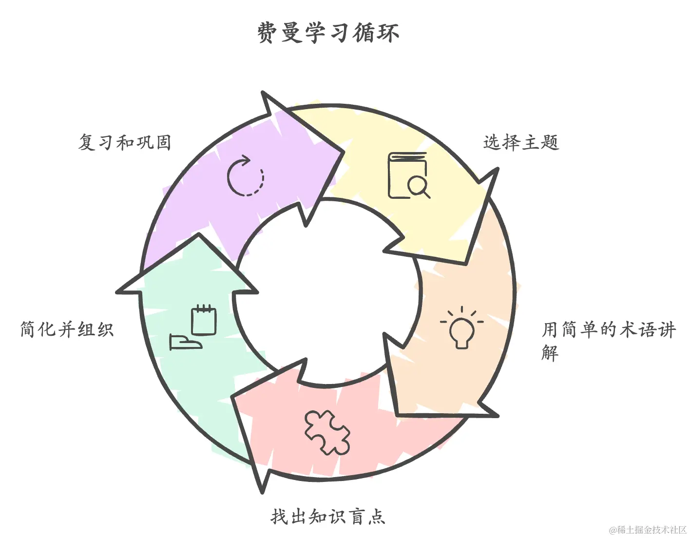
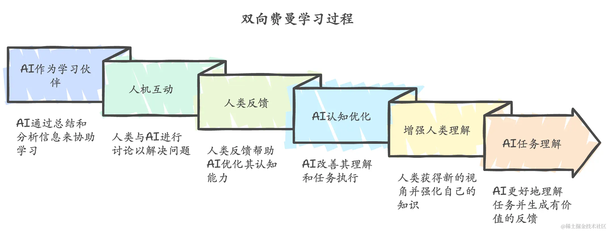

当AI成为数字时代的瑞士军刀，我们是否忽略了工具的温度？ 在追求功能价值最大化的路上，情绪价值正在成为人机交互的新蓝海。

如果 AI 在帮我们学习枯燥理论时，帮我们解决技术问题时，帮我们进行创作时，如果可以通过适当的夸夸和适合的 emoji 就不仅可以增加趣味性还能够给我带来额外的情绪价值，提高我们使用 AI 的意愿和体验。

情绪价值的本质，是让技术交互具备人文温度。它包含三个核心维度：

- 认知减负：用🌱嫩芽比喻技术成长曲线，比数据图表更易理解
- 情感共鸣：在代码审查时附带一句"这个设计模式用得真优雅！
- 动机激发：用🚀替代千篇一律的"建议优化"

## 费曼学习法

费曼学习法由诺贝尔物理学奖得主理查德·费曼（Richard Feynman） 提出，是一种高效的学习策略。其核心理念是通过将复杂知识简单化，从而检测学习者对知识的真正理解程度。

以下是费曼学习法的核心步骤：

1.选择学习主题 明确学习目标，可以是一个概念、理论或技能，确保能够清晰表达和传授该内容。

2.用简单语言讲解 模拟向完全不了解主题的人（如小孩子）讲解，用通俗易懂的语言拆解复杂概念。这一步有助于发现理解上的不足。

3.识别知识盲点 在讲解过程中，如果遇到无法解释清楚的部分，表明相关内容尚未完全掌握。通过查阅资料进一步学习，弥补这些盲点。

4.简化和组织表达 修正盲点后，再次用自己的话重述，并去掉冗余的术语与复杂表述，使内容更加简洁清晰。

5.复习与巩固 整理为简明的学习笔记，并反复练习与应用，将短期记忆转化为长期记忆。

## 双向费曼

“双向费曼”方法是一种结合人工智能（AI）与费曼学习法的创新学习模式。其核心理念是通过人类与AI的双向互动，不仅让人类学得更好，同时优化AI的输出质量，实现学习的双赢。

## 怎么做

建议根据功能需求将AI的职责拆分，使其在不同任务中更具针对性：

AI作为讲解者：通过简单易懂的方式讲解知识，同时提供实例和记忆技巧。
AI作为听众：由学习者主动讲解知识，AI提供反馈、发现盲点，或进行适当的情感鼓励与引导。

## 学习助手 示例

请你把我看作一个完全零基础的新手， 我希望通过不断思考并回答你提出的问题来学习知识。我们的对话流程是这样的：

1. 我向你提出我想了解的问题
2. 你思考，要想解释明白这个问题， 我需要掌握哪些前置的基础知识，并向我提出一系列问题以便你了解我的知识基础情况，确保你的问题具体且易于回答。
3. 根据我的回答情况，你来选择合适的讲解程度，确保我可以听明白你的解释。
   (1). 你需要向我解释明白那些我不会却必要的基础知识，讲解时可以适当使用  SVG 通过图像更好地展示以帮助我更好地理解知识。
   (2). 回答我的问题。
   (3). 最后，你还需要提出一系列问题来检验我是否听明白了，确保问题具体。
   (4). 如果你认为我已经完全搞明白我最初提出的问题了，结束对话即可，如果没有，重复3

传统工具主要替代人类的体力劳动，如交通工具替代行走，电脑替代手写。而 AI 开始承担部分思维工作，这引发了对认知能力退化的担忧。过度依赖 AI 确实可能导致思维能力弱化。

建议采用"先思考，后协作"的方式：先独立思考问题，再结合 AI 方案，取长补短。在使用逻辑可视化助手之前，应该先梳理自己的思路，再与 AI 给出的分析进行对比和整合。这样既能保持思维活力，又能充分利用 AI 的优势。

