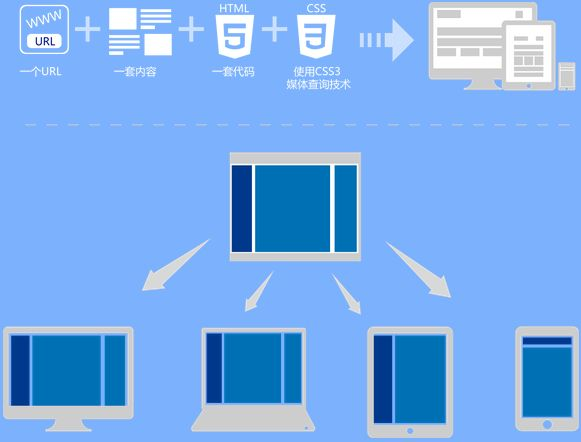
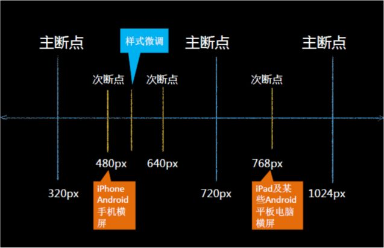

# CSS小知识

## 文档流

> 自上而下，自左到右

## 盒模型

  标准盒模型

  盒子宽度(230) = 自身width(200) + 左右内边距(10+10) + 左右边框宽度(5+5)

  盒子高度同理，外边距不会计算到盒子中

  怪异盒模型
  设置的盒子宽度(200) = 自身宽度 + 左右内边距(10+10) + 左右边框宽度(5+5)  

### BFC: block formatting context

BFC 块级格式化上下文，是页面上的一个隔离的独立容器，容器里面的子元素不会影响到外面元素，反之亦然

## 布局相关

### display 普通流

* block
* inline
* inline-block
* flex
* grid

### float 浮动流

* float: left
* float: right
* float: none (取消浮动变为正常文档流)

  

    盒子里的内容仍属于正常文档流，容器高度并不会作用于或者说是限制容器内子节点/元素的高度，因此需要overflow: hidden 让超出的内容隐藏. BFC中左右边距不会发生重叠
  

  

    盒子里的内容仍属于正常文档流，容器高度并不会作用于或者说是限制容器内子节点/元素的高度，因此需要
  

   
  

    relative盒子, transform:translate3d(50px, 50px, 50px)
  

### position 定位流

* position: static
* position: relative
* position: absolute
* position: fixed

  
static, relative 是在正常文档流内的。relative可用于定位，赋给父级容器

  

像正常文字内加显示更多，这样的一行布局，但右边的查看更多通常不在正常文档流内

    <a style="position:absolute; right:0; top:0;">查看更多</a>
  

position: fixed

## 浏览器从服务器拿到html后怎么进行渲染？

1. 解析HTML以构建DOM树：渲染引擎开始解析HTML文档，转换树中的html标签或js生成的标签到DOM节点，它被称为 -- 内容树。
2. 构建渲染树：解析CSS（包括外部CSS文件和样式元素以及js生成的样式），根据CSS选择器计算出节点的样式，创建另一个树 —- 渲染树。
3. 布局渲染树: 从根节点递归调用，计算每一个元素的大小、位置等，给每个节点所应该出现在屏幕上的精确坐标。
4. 绘制渲染树: 遍历渲染树，每个节点将使用UI后端层来绘制。

注：Repain 和 Reflow 分别出现在了第三和第四步

## 引起Repain和Reflow的一些操作

* 增加、删除、修改 DOM 结点时，会导致 Reflow 或 Repaint
* 移动 DOM 的位置，或是搞个动画的时候
* 修改 CSS 样式的时候
* Resize 窗口的时候（移动端没有这个问题），或是滚动的时候
* 修改网页的默认字体时

---

# 响应式设计

## 响应式图片 response image

  

  

这里不得不提到**viewport**

响应式网页，一般会在head里加上这一段

    <meta name="viewport" content="width=device-width, initial-scale=1.0, maximum-scale=1.0, minimum-scale=1.0, user-scalable=0">

该meta标签的作用是让当前viewport的宽度等于设备的宽度，同时不允许用户手动缩放。也许允不允许用户缩放不同的网站有不同的要求，但让viewport的宽度等于设备的宽度，这个应该是大家都想要的效果，如果你不这样的设定的话，那就会使用那个比屏幕宽的默认viewport，也就是说会出现横向滚动条。

## 流式布局 fluid layout

  
  

## 媒体查询 media query

  

