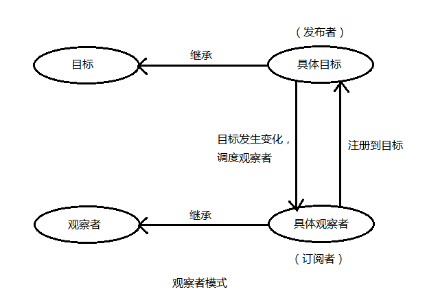

https://www.cnblogs.com/lovesong/p/5272752.html

这篇写得很好，读了很有收获，于是就转过来了。顺便再读一遍

观察者模式 Observer
订阅/发布模式 Publish/Subscribe

还是有差异的，虽然它们都有订阅者和发布者，本质的区别在于调度的地方不同

## 观察者模式

目标和观察者是基类，目标提供维护观察者的一系列方法，观察者提供更新接口。具体观察者和具体目标继承各自的基类，然后具体观察把自己注册到具体目标里，在具体目标发生变化时，调度观察者的更新方法。

比如有个“天气中心”的具体目标A，专门监听天气变化，而有个显示天气的界面的观察者B，B就把自己注册到A里，当A触发天气变化，就调度B的更新方法，并带上自己的上下文。

## 发布订阅模式

订阅者把自己想订阅的事件注册到调度中心，当该事件触发时，发布者发布该事件到调度中心（顺带上下文）有调度中心统一调度订阅者注册到调度中心的处理代码。

比如有个界面是实时显示天气，它就订阅天气事件（注册到调度中心，包括处理程序）当天气变化时（定时获取数据）就作为发布者发布天气信息到调度中心，调度中心就调度订阅者的天气处理程序。

## 总结

* 两者最大的区别是调度的地方

虽然两种模式都存在订阅者和发布者（具体观察者可认为是订阅者，具体目标可认为是观察者），但是观察者模式是由具体目标调度的，而发布/订阅模式是统一由调度中心调度的。所以观察者模式的订阅者和发布者之间是存在依赖的，而发布/订阅模式则不会

* 两种模式都可以用于松散耦合，改进代码管理和潜在的复用
