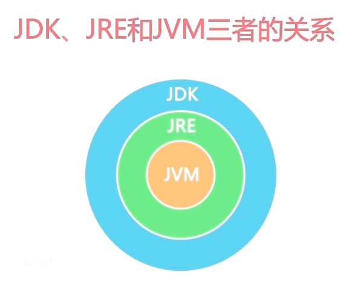

# Java简介

* java是一门面向对象的程序设计语言
* 1995年由sun公司发布
* 2010年sum公司被Oracle公司收购
* 现在的JDK版本是8.0

## 一些概念

### JVM

* JVM Java Virtual Machine，Java虚拟机
* JVM是Java平台无关性实现的关键

### Java程序执行过程

.java源文件 -> compiler -> 字节码文件 -> 解释器interpreter -> Program

### JDK - 面向开发人员

JDK Java Development Kit，Java语言的软件开发工具包
 
两个主要组件：

* Javac - 编译器，将源程序转成字节码
* java - 运行编译后的java程序（.class后缀的）

### JRE - 面向使用者

* JRE Java Running Environment
* 包括java虚拟机JVM、java核心类库和支持文件
* 如果只需要运行java程序，下载并安装JRE即可
* 如果要开发Java软件，需要下载JDK
* 在JDK中附带有JRE

JRE = JVM + JavaSE标准类库

JDK = JRE + 开发工具集（如Javac编译工具等）

### Java平台

Java SE 桌面程序 Java标准版

Java EE Web程序 Java企业版

Java ME 移动设备 Java微型版 少

