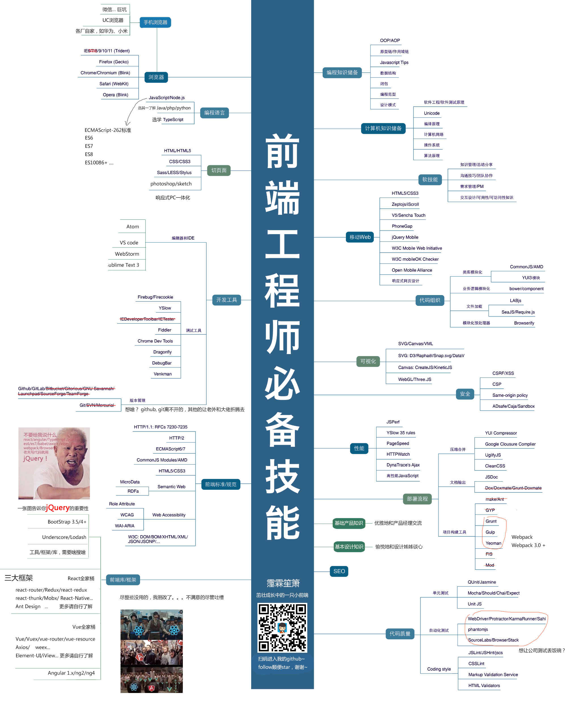

# Fridolph Notes

<p align="center">
  <a href="https://github.com/Fridolph/Fridolph/actions/workflows/docs-check.yml">
    
  </a>
  <a href="https://github.com/Fridolph/Fridolph/actions/workflows/static.yml">
    
  </a>
  <a href="https://fridolph.github.io/Fridolph/">
    
  </a>
  <a href="./LICENSE">
    
  </a>
</p>

<p align="center">
  一个持续整理中的前端与工程知识库，覆盖学习笔记、实践 Demo、专题资料、方法沉淀与站点化展示。
</p>

## Overview

`Fridolph Notes` 是一个以 Markdown 为核心的个人知识仓库，同时也是一个可以持续构建、检查和发布的静态文档站点。

仓库中的内容既包含日常学习过程中的原始资料，也包含经过二次整理后的专题文档、目录治理结果和站点化输出。当前站点通过 VitePress 构建，并在 `main` 分支更新后自动发布到 GitHub Pages。

- 在线站点：[https://fridolph.github.io/Fridolph/](https://fridolph.github.io/Fridolph/)
- 仓库地址：[https://github.com/Fridolph/Fridolph](https://github.com/Fridolph/Fridolph)

## Highlights

- 以 Markdown 为主的数据源，便于长期积累、迁移和重构。
- 覆盖前端、JavaScript、CSS、TypeScript、Vue、Node.js、AI 等多个主题方向。
- 使用 VitePress 生成静态站点，便于检索、导航和公开展示。
- 内置文档质量检查链路，持续追踪标题缺失、占位页、缺失资源和重复标题等问题。
- 使用 GitHub Actions + GitHub Pages 实现自动构建与自动部署。

根据当前生成结果，站点已覆盖：

- `21` 个内容模块
- `1346` 篇 Markdown 文档

## Preview

### Knowledge Map



### Content Examples

你可以从这些内容开始浏览：

- CSS
  - [Tailwind CSS 学习笔记](https://fridolph.github.io/Fridolph/02CSS相关/TailwindCss/07尺寸/Width)
  - [响应式布局整理](https://fridolph.github.io/Fridolph/02CSS相关/响应式布局/响应设计)
- JavaScript
  - [柯里化](https://fridolph.github.io/Fridolph/03JavaScript/技巧/柯里化)
  - [函数式编程术语](https://fridolph.github.io/Fridolph/03JavaScript/函数式编程/函数式编程术语)
- TypeScript
  - [泛型学习笔记](https://fridolph.github.io/Fridolph/06TypeScript/LearnTypeScript/06泛型/泛型)
- Security / Other
  - [你真的了解 EDR 吗](https://fridolph.github.io/Fridolph/00面试相关整理/前端安全实战/0你真的了解EDR吗)

## Repository Structure

仓库目前既包含内容源文件，也包含站点与构建脚本。核心结构如下：

```text
.
├── .github/workflows/        # GitHub Actions：质量检查与 Pages 部署
├── docs-site/                # VitePress 站点工程
├── docs/                     # 项目文档与里程碑沉淀
├── scripts/                  # 站点生成、质量检查与文档修复脚本
├── 日志/                     # 阶段交接与开发日志
├── 00面试相关整理/            # 面试、专题与知识整理
├── 01HTML5/                  # HTML5 相关内容
├── 02CSS相关/                # CSS、Tailwind、Stylus 等内容
├── 03JavaScript/             # JavaScript、ES6、API、跨域等内容
├── 05Nodejs/                 # Node.js 相关内容
├── 06TypeScript/             # TypeScript 相关内容
├── 11Vue学习/                # Vue / Nuxt / 组件化思维等内容
└── ...
```

## Tech Stack

- [VitePress](https://vitepress.dev/)：静态站点生成
- Node.js `22`
- npm：依赖管理与脚本执行
- GitHub Actions：CI/CD
- GitHub Pages：静态站点托管

## Getting Started

### Prerequisites

你需要先准备：

- Node.js `22` 或更高版本
- npm
- Git

### Installation

```bash
npm ci
```

### Local Development

```bash
npm run dev
```

默认本地开发地址：

- [http://127.0.0.1:5173/](http://127.0.0.1:5173/)

### Production Build

```bash
npm run docs:build
```

构建产物输出到：

```text
docs-site/.vitepress/dist
```

## Available Scripts

### Core Scripts

| Script | Description |
| --- | --- |
| `npm run dev` | 启动本地 VitePress 开发环境 |
| `npm run docs:sync` | 重新生成导航、索引和质量报告 |
| `npm run docs:build` | 构建静态站点 |
| `npm run docs:check` | 执行完整文档检查链路 |
| `npm run preview` | 预览构建后的站点 |

### Directory Governance Scripts

仓库内还提供了大量 `docs:fix-h1:*` 脚本，用于对指定目录执行缺失一级标题修复。例如：

```bash
npm run docs:fix-h1:h5-routing
npm run docs:fix-h1:h5-canvas
npm run docs:fix-h1:css-study
```

这些脚本通常与内容治理、目录收口和质量基线下降一起使用。

## CI/CD

项目已经接入 GitHub Actions，并以 `main` 作为唯一主线分支。

### 1. 文档质量检查

工作流文件：

- `.github/workflows/docs-check.yml`

触发时机：

- 推送到 `main`
- 向 `main` 发起 Pull Request
- 手动触发

执行内容：

- 安装依赖
- 构建站点
- 运行文档质量检查
- 上传质量报告产物

### 2. GitHub Pages 自动部署

工作流文件：

- `.github/workflows/static.yml`

触发时机：

- 推送到 `main`
- 手动触发

执行内容：

- 安装依赖
- 构建 VitePress 站点
- 上传 `docs-site/.vitepress/dist`
- 发布到 GitHub Pages

## Deployment

当前部署方式为 **GitHub Actions + GitHub Pages**。

### Deployment Flow

```text
push to main
  -> GitHub Actions build
  -> VitePress output to docs-site/.vitepress/dist
  -> deploy-pages action publishes artifact
  -> GitHub Pages updates site
```

### Production Site

- Site URL: [https://fridolph.github.io/Fridolph/](https://fridolph.github.io/Fridolph/)
- Base Path: `/Fridolph/`

如果你 fork 这个项目并打算发布自己的项目页，需要同步调整：

- `docs-site/.vitepress/config.mts` 中的 `productionBase`
- `docs-site/.vitepress/config.mts` 中的 `productionSiteUrl`

## Quality Baseline

仓库内置了文档质量基线文件：

- `scripts/docs-quality-baseline.json`

当前检查会重点关注：

- 占位或空页面数量
- 缺失一级标题数量
- 缺失资源引用数量
- 重复标题数量

这些指标会在治理型迭代中持续下降，并作为提交前自测的一部分。

## Public Snapshot Policy

这个仓库的公开分支主要服务于站点展示与内容输出。部分内部方法文档、工作过程材料和私有化沉淀内容不会长期保留在公开快照中。

也就是说，公开分支优先面向：

- 内容浏览
- 文档展示
- 站点构建
- 开源协作

而不是完整暴露所有内部整理过程。

## Related Repositories

以下仓库与本项目互补：

- 面试资料仓库：[Fridolph/fri-prepare-interview](https://github.com/Fridolph/fri-prepare-interview)
- Demo / 练习仓库：[Fridolph/my-program](https://github.com/Fridolph/my-program)

## Contributing

欢迎你通过以下方式参与：

- 提交 issue 反馈内容错误或链接问题
- 提交 PR 改进文档、修复资源引用或补充示例
- 提出内容整理建议、导航优化建议或检索体验建议

如果你准备提交内容，建议优先保证：

- 标题语义明确
- 资源引用有效
- Markdown 渲染正常
- 本地 `npm run docs:check` 通过

## Roadmap

当前公开仓库的后续方向主要包括：

- 持续压降缺失一级标题与弱语义标题
- 优化模块导航与内容检索体验
- 继续扩充 HTML5、CSS、JavaScript 等模块的治理覆盖面
- 保持 `main -> build -> GitHub Pages` 自动发布链路稳定

## License

本项目使用 [MIT License](./LICENSE)。

---

如果这个仓库对你有帮助，欢迎 `Star`、`Watch` 或分享给更多正在整理知识体系的开发者。
