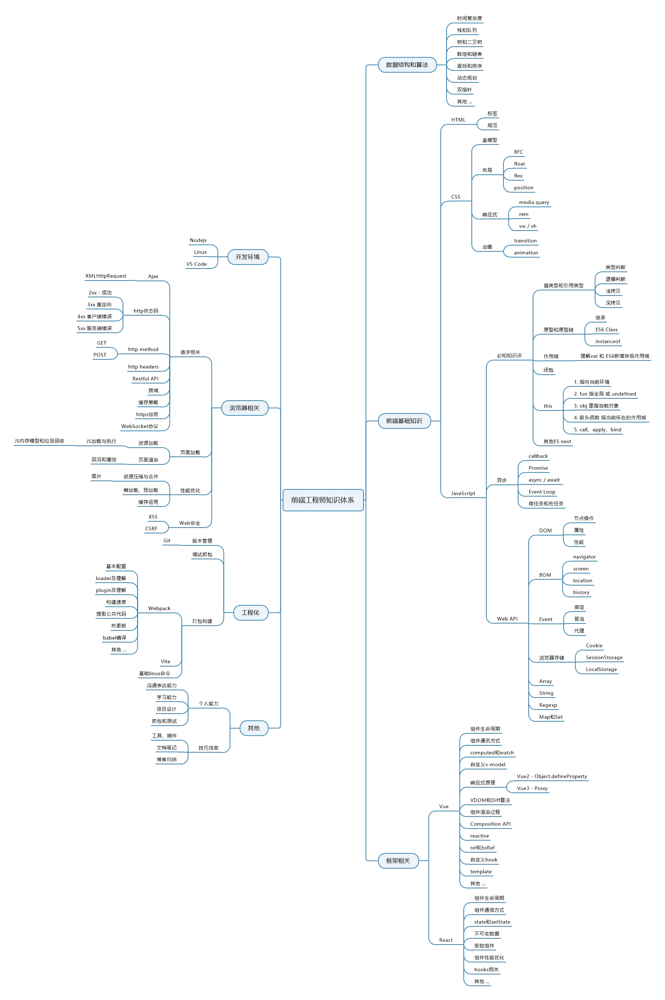

# Fridolph

你好, 该项目用于存放和整理我个人的学习相关资料和过程

欢迎相互学习交流，若你觉得有帮助可以watch或star，谢谢~

**仓库里内容会进行二次整理，主要是以写技术博客的方式**

欢迎访问我的博客 <https://fridolph.top>

二次整理的一些资料内容，特别是**面试相关**的已整理到另一个仓库了
可放心Fork + Star <https://github.com/Fridolph/fri-prepare-interview>

## 为什么会建立这个仓库？

- 结合学习路线慢慢扩充整理可提高积累自己的知识面；
- 通过这样的二次整理可以有效巩固学习过的知识点，不至于遗忘得太快；
- 可通过画知识脑图的方式，不断增加补充，提升自己的职场竞争力
- 顺便还刷刷commit，激励自己

## 推荐内容

### CSS
- [学习TailWindCSS](/02CSS相关/TailwindCss/07尺寸/Width.md)
- [学习响应式设计](/02CSS相关/响应式布局/响应设计.md)

### JS

- [柯里化函数](/03JavaScript/技巧/柯里化.md)
- [一些常用到的函数式编程术语及讲解](/03JavaScript/函数式编程/函数式编程术语.md)

### TS

- [TS学习笔记之泛型](/06TypeScript/LearnTypeScript/06泛型/泛型.md)

### 其他

- [安全-你真的了解EDR吗](/10其他/前端安全实战/0你真的了解EDR吗.md)

## 前端学习路线及经历

