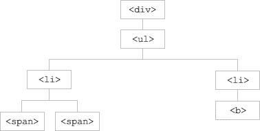

在数据结构中有遍历这个概念，简单点就是将数据的所有节点都查询一遍，但不同的数据结构有不同的遍历方法，而且同一种数据结构也有不同的遍历方法。

jQuery 遍历函数包括了用于筛选、查找和串联元素的方法。

来自w3school是这么解释的：

jQuery 遍历，意为“移动”，用于根据其相对于其他元素的关系来“查找”（或选取）HTML 元素。以某项选择开始，并沿着这个选择移动，直到抵达您期望的元素为止。
下图展示了一个家族树。通过 jQuery 遍历，您能够从被选（当前的）元素开始，轻松地在家族树中向上移动（祖先），向下移动（子孙），水平移动（同胞）。这种移动被称为对 DOM 进行遍历。

图示解释：

 

  ☑ 
 元素是 <ul> 的父元素，同时是其中所有内容的祖先。
  ☑ <ul> 元素是 <li> 元素的父元素，同时是 
 的子元素
  ☑ 左边的 <li> 元素是  的父元素，<ul> 的子元素，同时是 
 的后代。
  ☑  元素是 <li> 的子元素，同时是 <ul> 和 
 的后代。
  ☑ 两个 <li> 元素是同胞（拥有相同的父元素）。
  ☑ 右边的 <li> 元素是 <b> 的父元素，<ul> 的子元素，同时是 
 的后代。
  ☑ <b> 元素是右边的 <li> 的子元素，同时是 <ul> 和 
 的后代。

提示：祖先是父、祖父、曾祖父等等。后代是子、孙、曾孙等等。同胞拥有相同的父。

jQuery的遍历处理不仅只是针对基本的层级关系，还扩展了大量的筛选接口，包括了用于筛选、查找和串联元素的方法。之后我们会介绍到各自的实现。