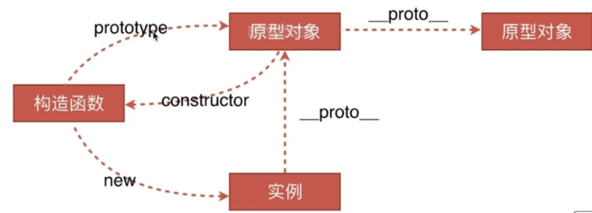
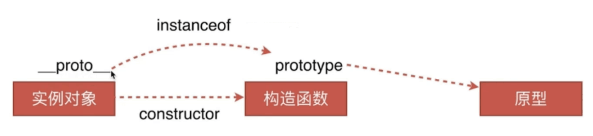

# 原型链

创建对象的几种方法
原型、构造函数、实例、原型链
instanceof的原理
new 运算符

## 创建对象的3种方法

```js
// 1 字面量
var o1 = {name: 'o1'}
var o11 = new Object({name: 'o11'})

// 2 构造函数
var M = function() {this.name = 'o2'}
var o2 = new M()

// 3 Object.create
var P = {name: 'o3'}
var o3 = Object.create(P)
```

Object.create() 创建的对象是用原型链联系的。

## 原型、构造函数、实例、原型链



---

instanceof 原理， 如下图：

 

instanceof 原理，判断实例对象的 __proto__ 属性 和构造函数的 prototype属性，是不是同一个地址引用

### new 运算符

1. 一个新对象被创建，它继承自 构造函数的prototype

2. 构造函数被执行。执行的时候，相应的传参会被传入，同时上下文this会被指定为这个新实例。new foo 等同于 new foo() 只能用在不传递任何参数的情况

3. 如果构造函数返回了一个对象，那么这个对象会取代整个new出来的结果。如果构造函数没有返回对象，那么new出来的结果为步骤1创建的对象

