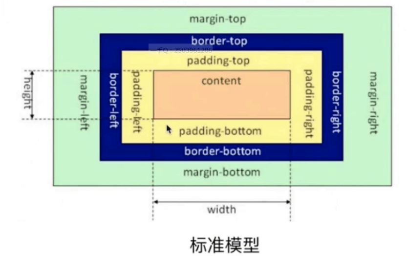
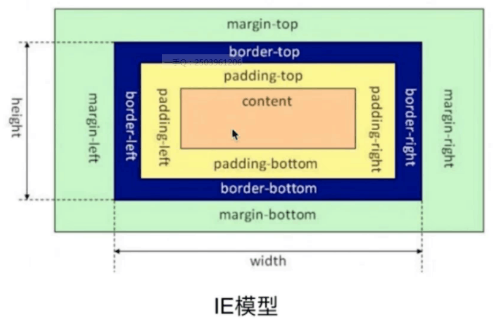

# CSS盒模型

基本概念：

标准模型 margin border padding

IE模型 width(内容宽 + padding + border) + margin

标准模型和IE模型的区别

计算宽度和高度的不同

## CSS如何设置这两种模型

box-sizing: content-box; // 默认 标准模型
box-sizing: border-box; // IE模型

## JS如何设置获取盒模型对应的宽和高

1. dom.style.width|height 只能取内联的宽高
2. dom.currentStyle.width|height  相对较准备，但只有IE支持
3. window.getComputedStyle(dom).width|height 支持相对较好
4. dom.getBoundingClientRect().width|height 计算元素的绝对位置，根据视窗来获取的

## 实例题：根据盒模型解释边距重叠

BFC 边距重叠解决方案

BFC的基本概念：块级格式化上下文（IFC：内联格式化上下文）
BFC的原理：
1. 在BFC元素内上下外边距重叠
2. BFC区域不会与浮动元素的盒子重叠
3. BFC在页面是一个独立的容器（外部不影响内里）
4. 计算BFC高度时浮动元素也参与计算

