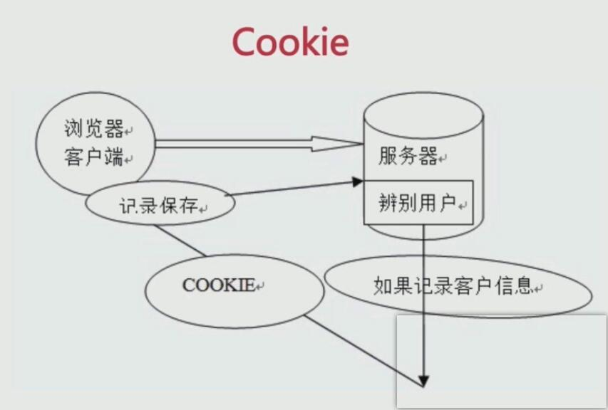

# 浏览器存储

* 理解localStorage、cookie、sessionStorage、indexDB的概念和使用
* 学习理解PWA和Service Worker的应用

多种浏览器存储方式并存，如何选择？

## Cookie

因为HTTP请求无状态
所以需要cookie去维持客户端状态 

### Cookie的生成方式
http response header 中的 set-cookie

1. 用于浏览器端和服务器端的交互
2. 客户端自身数据的存储

### 过期时间 expire

因为HTTP请求无状态，所以需要Cookie去维持客户端状态

### Cookie存储限制

1. 作为浏览器存储 大小4KB左右
2. 需要设置过期时间 expire

浏览器端存储能力被 localStorage 替代

当前这个cookie属性有httponly 是不支持js读写的

cookie中在相关下面 —— CDN的流量损耗  CDN域名不要携带cookie

解决方法：CDN的域名和主站的域名要分开

## LocalStorage

* HTML5设计出来专门用于浏览器存储的
* 大小为5M左右
* 仅在客户端使用，不和服务端进行通信
* 接口封装较好
* 浏览器本地缓存方案

## SessionStorage

* 会话级别的浏览器存储
* 大小为5M左右
* 仅在客户端使用，不和服务端进行通信
* 接口封装较好
* 对于表单信息的维护

## IndexDB

IndexDB是一种低级API，用于客户端存储大量数据化数据。该API使用索引来实现对该数据的高性能搜索。
虽然Web Storage对于存储较少量数据很有用，但对于存储更大量结构化数据来说，这种方法不太有用，IndexDB提供了一个解决方案

为应用创建离线版本

## Service Workers

Service Worker 是一个脚本，浏览器独立于当前网页，将其在后台运行，为实现一些不依赖页面或者用户交互的特性打开了一扇大门。
在未来这些特性将包括推送消息，背景后台同步，geofencing(地理围栏定位)，但它将推送的第一个首要特性就是拦截和处理网络请求的能力，包括以编程方式来管理被缓存的响应。

## PWA

Progressive Web Apps 是一种Web APP新模型，并不是具体指某一种前沿技术或者某一个单一的知识点。
这是一系列新的Web特性，配合优秀的UI交互设计，逐步地增强Web APP的用户体验

* 可靠：在没有网络的环境也能提供基本的页面访问，而不会出现未连接到互联网的页面
* 快速：针对网页渲染及网络数据访问有较好地优化
* 融入：应用可以被增加到手机桌面，并且和普通应用一样有全屏、推送等特性