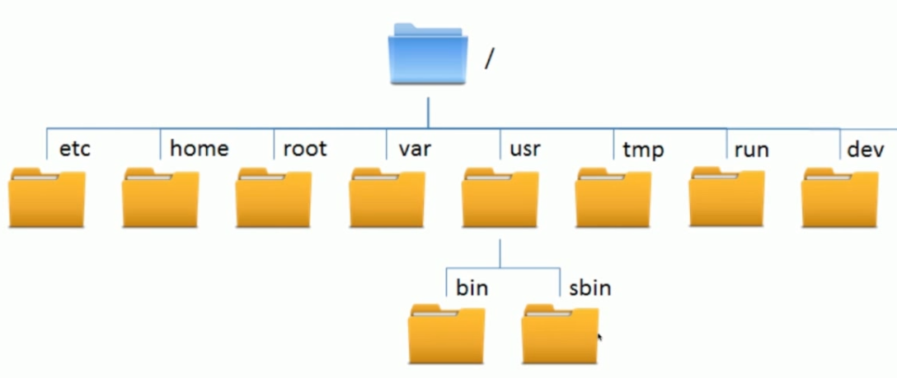

## linux文件的目录结构

* 根目录 /
* 家目录 /home
* 临时目录 /temp
* 配置目录 /etc
* 用户程序目录 /usr

## 文件基本操作

* 文件权限 4-2-1

二进制位数 有这个权限，则这一位就为1

* 文件搜搜、查找、读取
* 文件压缩与解压

### 文件操作基本命令

**ls 查看目录下的文件**

ls -a 隐藏文件  ls -al 所有文件详细信息

**touch 新建文件**

**mkdir 新建文件夹**

mkdir -p test/test1/test2 创建多个目录

**cd 进入目录**

**rm 删除文件和目录**

rm -r 循环
rm -rf 强制删除 慎用

**cp 复制**

**mv 移动 相当于剪切**

**pwd 显示路径**

### 文件搜索、查找、读取

tail 从文件尾部开始读
head 从文件头部读
cat 读取整个文件
more 分页读取
less 可控分页
grep 搜索关键字 grep -n 显示行数
find 查找文件
wc 统计个数

#### find

find . 当前目录下的所有文件
find . -type d 文件夹
find . -type f 文件

#### 文件解压缩

tar -cf 文件名.tar 文件名

tar -tf 压缩包名 或者 -tvf 查看压缩包文件

tar -xf imooc.tar 将压缩包解压到当前文件下