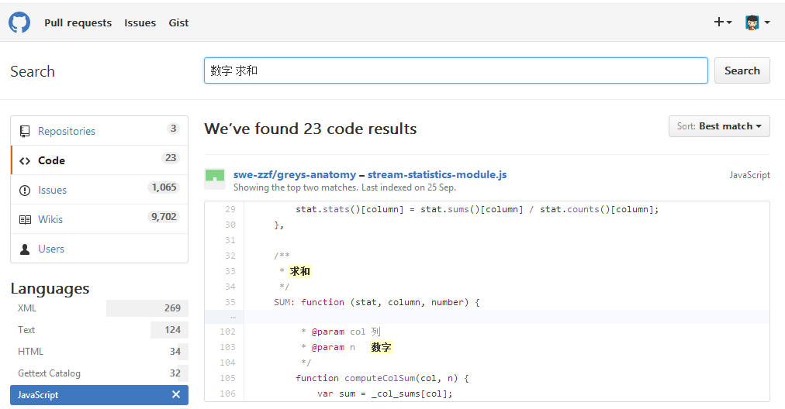

# 分享主题【伪攻略集】玩转js前端开发联盟群

## 前言

感谢群主提供这样的平台，希望通过这次分享对彼此有所帮助，互相学习 ^_^
本次分享的主题是——【伪攻略集】玩转js前端开发联盟群。

本想分享自学前端到工作的一些心得体会（群里有过这类分享，这类大家可以参考群文件，很适合我们）
周末和大学同学聚了聚，聊到学习和习惯相关的话题，正愁分享内容灵光一闪，就换成这个主题了。

** 本次分享的内容包括但不限于以下三点: **
1. 拣起那些你忽略了的宝贵资源
2. 深入学习，从培养N个好习惯开始
3. 工作后如何利用琐碎时间学习

因本人专业水平有限，不会有过多技术性话题，若有错误还请批评指教，感谢。
本次分享内容也会同时整理到我的博客（之后会分享，请多关照^_^）
那就开始吧：  

    // 首先声明一个全局函数，下面会用到... 无视掉就好
    function iSay(tucao) {
      tucao.toString();
      console.log(tucao);
    }
  

## 一、拣起那些你忽略了的宝贵资源
  
### 1.1不要忽略了身边宝贵的"财富"
  如何学习？如何提高？如何参与？ 请问有XX资源？ 哪位大神能帮下XXX？
  答案近在眼前。
  [答案](http://www.kancloud.cn/jikeytang/qq/81139)http://www.kancloud.cn/jikeytang/qq/81139
  iSay("无论要学什么新东西, 官方文档是你的最好助手");

  [fsfront](https://github.com/jsfront)https://github.com/jsfront
  所谓前人栽树，后人乘凉~

### 1.2 开始创建并扩充自己的资源库

打开上面的地址这不就是我们常常…… 嗯，就是这样。
我们也可借鉴下该目录结构，在自己的硬盘上创建这样一个资源目录：
  
X:/
　　前端资料库/
　　　　资源教程/
　　　　　　HTML5
　　　　　　CSS3
　　　　　　JavaScript
　　　　API/
　　　　　　jQuery
　　　　　　ECMA
　　　　　　移动端
　　　　　　...
　　　　性能优化/
　　　　　　案例
　　　　　　工具
　　　　　　...
　　　　Node.js/
　　　　　　...
　　...

  优点：
    1.结构清晰, 便于查找
    2.根据种类来划分，便于扩展      
  iSay("其实这和我们写组件的道理一样，高复用易维护");
    
### 1.3 拒绝闲聊，深入讨论
  
  更多人为了提高自己、获取高质资源加群，那闲聊肯定得打住(群风正, 先赞)
  特别是平时或工作时间, 更提倡大家充分筛选资源，获取高质信息。 
  就我个人，每2小时左右会强制休息会儿，揉揉眼洗下脸什么的
  然后习惯性地花几分钟整理下零碎信息
  比如看看群里99+ 有人提问？什么问题，我遇到过没？ 会不会？ 怎样解决的？ 还有其他什么思路？ 有参考资料没？
  顺便花几分钟简单记下来即可，如：

  2016.11.11 - 光棍节闯关    
    光棍节闯关 https://1111.segmentfault.com/
    做到不会再看的[解答地址](http://www.cnblogs.com/partoo/archive/2012/11/11/2765070.html)http://www.cnblogs.com/partoo/archive/2012/11/11/2765070.html
    备注 10道不错的题目，可从各方面考察自己对前端的一些理解 ps 今后要恶补HTTP了
  
  2016.11.11 - 图片转base64编码
    https://developer.mozilla.org/zh-CN/docs/Web/API/HTMLCanvasElement/toDataURL
  
  2016.11.11 - JS练习小项目
    http://www.lixuejiang.me/2016/11/01/JavaScript%E7%9A%84%E7%BB%83%E4%B9%A0%E7%BD%91%E7%AB%99%E6%94%B6%E9%9B%86/

  2016.11.11 - github里找代码
    
    [示例地址](https://github.com/search?l=JavaScript&q=%E6%95%B0%E5%AD%97+%E6%B1%82%E5%92%8C&ref=searchresults&type=Code&utf8=%E2%9C%93)
    https://github.com/search?l=JavaScript&q=%E6%95%B0%E5%AD%97+%E6%B1%82%E5%92%8C&ref=searchresults&type=Code&utf8=%E2%9C%93

  15号还有 成都-巫师写了正则相关很优质的回答，感兴趣可以翻下，篇幅较多这里就不贴出来了。
  
  Ps 豪情哥的回答言简意赅，附带的链接很经典，若自己不会，推荐整理收藏~
  （聊天记录 搜 "谢"、"请问"、"吗"等的关键词会提高你的筛选效率）
  当然，深入讨论也是一样。感谢别人的解答只是一方面，自己动手论证，得出结果才是最好的反馈。
  之前潜水收藏了这句，感觉很经典，在这里引用下：

  > "仅凭个人经验给出的建议，是不是这个问题，能不能解决，还得依赖提问者的技术储备或对技术的坚持执著。"   ——豪情

  毕竟大家工作学习也很忙，如果错过了，月报里也可以常翻翻。也许会有惊喜：
  [月报](http://www.kancloud.cn/jsfront/month/82796)http://www.kancloud.cn/jsfront/month/82796

### 1.4 定期整理自己的仓库

  以上的记录可新建一个文件

X:/
　　前端资料库/
　　...
　　群记录/
　　　　11月/
　　　　　　11.11

  经常整理，无论是以后写博客还是自己找就可以更方便寻找了
  iSay("可以理解为缓存机制，有缓存加载肯定会更快，本地访问比网上乱搜来得快");

### 1.5 扩展资源库
  
  学习前端的你，响应式是必将会度过的槛。选择一套代码多端适配，还是多端多套可自己…
  我是想说，除了电脑，移动设备等也是很好的信息获取方式。
  QQ、微信里的收藏，浏览器的书签等，最后你需要把它整合起来。
  iSay("也许我们决定不了是选择性能或效率，但最基本的性能优化是本分。");

  [目录结构可参考群仓库](https://github.com/jsfront)https://github.com/jsfront

##二、深入学习，从培养N个好习惯开始

  > 无论是从事什么行业，这与我们日后的职业发展戚戚相关，莫不可小视。

###2.0 先模仿开始
  
  “读书百遍，其义自见”, 对于编程同样有用，如果欠缺基础建筑那就用勤奋补上吧。
  刚开始工作时, 最重要是完成任务保证生存，才能求后续发展。
  这阶段我们可能接触到很多"优秀代码"、"项目组织结构"、"代码规范"、"命名规范"等等，
  多学多看多问多写，待熟练业务逻辑，能独立完成任务就算是进门了。  
  
### 2.1 做个行动派，觉得不错的内容都放到资源库
  
  总有错过的，不用纠结，但如果你看到了，复制粘贴就好，花不了1分钟就可以记录下一个问题或相关资料，
  1天1问，每月再花一两小时整理下，算算一年下来会是多少？
  再强调下上述观点，定期整理，定期整理，定期整理…… 
  很重要说三遍。资源库的管理是为了搜索时快速定位，
  不好好管理，之后麻烦更大，所以一开始做了，那就坚持着从头到尾都做好吧。

### 2.2 尊重他人及他人的劳动成果
  
  群里经常在发，怎样提问 这样的链接。放到工作也是一样的，这点对刚入职的新人尤为重要。
  前辈、同事们并不介意新人提问，只要你够耐心、努力有诚意，他们很乐意分享的。
  [如何提问](http://www.kancloud.cn/jikeytang/qq/81137)http://www.kancloud.cn/jikeytang/qq/81137
  
  如果你没看过建议你再看一遍。
  高质量的提问无疑会让上司、同事更看重。
  当然，这也让自己变得更严谨。
  ps 如果要发表的话，引用内容最好征求原作者同意，联系不上可先放上署名和地址
  不为自己埋坑，以后省下不少麻烦。

### 2.3 代码, 多敲 → 多写 → 重构

  敲，机械地，没带太多思考。就像学英语时，重复一段读N次，代码也同样，如果敲出来，运行了还是理解不了。
  就直接用写的吧… 拿出笔和纸，对，就是这样… 如果还是理解不到就放一放，水平不够没什么丢人的，
  与其纠结，不如看看是哪的基本功没打好。
  我在学Redux时，看官方解析似懂非懂，后来觉得自己JS基础太差，不牢固…… 
  于是现在也在看JS，进步不是一天的事，当哪天觉得自己能理解一些东西的时候，
  试着去用新的理解，重构以前的代码吧。
  贴段之前的代码，是一个标签切换效果。

  
    $(".tab-nav").click(function() {
      $(".tab-nav").removeClass(".tab-active")
      $(this).addClass("tab-active");
      
      $("tab-content").hide();
      $("tab-content").eq($(this).index()).show();
    });
  

  考虑到重用，就封装成函数了：
  
    /**
     * [tabNavShowContent 按钮切换，按钮index对应内容变换]
     * @param  {[string]}  btn           [要操作的按钮名]
     * @param  {[string]}  tEvent        [触发的事件类型]
     * @param  {[string]}  selectedName  [toggle的class名]
     * @param  {[string]}  tabConDOM     [要显示的内容]
     * @param  {[string]}  entrance      [入场效果]
     */
    function tabNavShowContent(btn, tEvent, selectedName, tabConDOM, entrance) {
      $(btn).on(tEvent, function() {
        $(this).addClass(btnClassName);
        $(this).siblings().removeClass(btnClassName);

        $(tabConDOM).hide();
        $(tabConDOM).eq($(this).index()).show(entrance);
      });
    }
  
  当然这么写，每次都要传参，很麻烦，常用的只有btn,tEvent和tabConDOM，可以传默认参数进去
  会用到参数检测的一些技巧，这里就不贴了，感兴趣可以去了解下。

### 2.4 坚持阅读  
> 尤大曾评论说自己利用坐地铁的时间读完了整本《JavaScript权威指南》

当然，每人有各自不同的生活方式，但阅读是提高之路不可或缺的一环。
犀牛书可以留着慢慢看…… 反正我是没碰过 XD, 为大家推荐下我的书单，很适合入门和前期进阶学习：

适合工作累了，不想敲代码，睡前看的：

**《编写可维护的JavaScript》**  压力大时可读读这类，较轻松，也易理解。
**《Javascript语言精粹》** 同上，很薄，适合浅读，然后过段时间再重读，如此往复。
**《你不知道的JavaScript》** 系列 上中出了，下还没中文版…  刚把上读完了，受益匪浅，都是面试常客，类型，闭包，this，原型。中买了还没读…

如果晚上还有精力敲代码：
**《JavaScript忍者秘籍》** 写jQuery的大神著，值得一看，很多经典代码段，适合多敲
**《精通JavaScript》** 代码段多的，都是觉得光看不行，得敲出来运行下看看… 属这类
**《JavaScript设计模式与开发实践》** 进阶力推……虽然我还没看，慢慢来了

以上仅个人建议，大家都知道的（红绿两本宝典我就不说了）
（我看书很慢。。效率还低…… T_T有好的方法请告诉我）

ps 群共享的书单也是不错的参考 
[群共享](http://note.youdao.com/share/?id=2bad532efc16e76e77ad6653e388c055&type=note)http://note.youdao.com/share/?id=2bad532efc16e76e77ad6653e388c055&type=note

##三、利用琐碎时间学习 

之前的是前提，有了这个基础后，继续来说。 
不知是否具有代表性，我所在公司965工作制，偶尔加班，顺便蹭网基本上7点后才走。 回家吃了饭基本8点半以后了，其他为自由时间。周末，没特别的安排都会至少留2小时学习。

> 没女朋友的抓紧时间深造吧，你"女朋友"还在读高三，别急，学几年有好日子过。
有女朋友的还不学，周末钱够花吗…… 
这不是我说的，拒绝仇恨值……

###3.1 琐碎时间哪里来

  那么，为自己写个日常时间管理，写段代码压压惊：
  
    var 可利用时间 = [],
        琐碎时间 = [ ... ];            
    if ( 琐碎时间 ) {
      for ( var i = 0; i < 琐碎时间.length; i++ ) {
        可利用时间.push( 海绵里的水(琐碎时间[i]) );
      }
    }         
    function 海绵里的水(我挤) {        
        // 能挤就挤，挤不出别勉强……                
        return 宝贵的时间;
    }
    console.log( 可利用时间 );
    // [上下班地铁公交上50分, 午休可利用20分, 睡前1小时+]
    总共多少时间来着? 写个求和函数，不会？上文有提到，赶紧github搜一搜，于是
    function sumArray() {
      // ... 
    } 
    sumArray( 可利用时间 );  // 只要你想，每天至少有1个半小时可用来学习

###3.2 时间管理相关

  乐子就先过了… 对于时间管理，大家可以参考下之后的(马上来福利)

  我自身也有很多问题和不足，如果大家有好的建议和想法也可分享出来，让更多人了解和学习到。
  让我们的圈子更美好。
  记得之前还有小白问到：群主一天哪来这么管理群，不工作吗之类的… /偷笑 

  希望借此机会能让豪情大哥为大家分享下：

> 信仰，目标，计划，执行力，自控力，毅力。
> 首先建立自己的信仰，也可以叫世界观价值观。粗糙来说是用自己勤劳的双手来改变自己的生活，往细说就是用编程这个技术来实现自己的梦想。不只是混口饭吃，拿份工资这么简单，生活因为梦想而精彩。
> 目标就是先盯着一个小目标，比如找个工作，当个初级程序员计划，找工作时先熟悉基础的概念，了解基础编程的流程，然后罗列一个简单的学习计划。比如一周熟悉css选择器，一个月熟悉js的变量类型等。
> 执行力就是对计划的强有力执行，一周就是一周，不能超时，如果超时，下次精准的估时。
> 自控力就是执行力的内在修行，从意志力自我内心世界剖析可以成长的点。
> 毅力就是长时间的去坚持做一件事情。

下面附属参考网址
[执行力](http://baike.baidu.com/view/63421.htm)http://baike.baidu.com/view/63421.htm
[自控力](http://baike.baidu.com/item/%E8%87%AA%E6%8E%A7%E5%8A%9B/4038092)http://baike.baidu.com/item/%E8%87%AA%E6%8E%A7%E5%8A%9B/4038092
[番茄工作法](http://baike.baidu.com/view/5259318.htm)http://baike.baidu.com/view/5259318.htm
[一万小时定律](http://baike.baidu.com/view/3244949.htm)http://baike.baidu.com/view/3244949.htm
个人看法，仅供参考
***

###3.3 利用琐碎时间，思考更进一步        
  
  如何学习，学什么，怎么进一步提高，这也是我们现在很关心的问题。
  别人的建议总是好的，无论是多写代码，多练习，多看博客多写博客等等，最终都需我们用行动来贯彻。

  这是我收藏的几篇，感觉挺适合入门到进阶，与大家分享下： 
    [提高你的Javascript水平 作者: 安生、墨白](http://mp.weixin.qq.com/s?__biz=MjM5MTA1MjAxMQ==&mid=402435316&idx=1&sn=a4e50c04c0751c3e31b6bfa1c8702f8d&scene=21#wechat_redirect)
    [提升你的CSS 作者: 安生、墨白](http://mp.weixin.qq.com/s?__biz=MjM5MTA1MjAxMQ==&mid=2651223373&idx=1&sn=1a17b691964b0545547051bf5d01184c&chksm=bd49acc98a3e25df55e119059466bbf4bee71d8c555af280895b3f98f49675b62cb5ded8f25e&scene=21#wechat_redirect)
    [CSS最佳实践——成为CSS忍者的十四步(上) 作者: 安生](http://mp.weixin.qq.com/s?__biz=MjM5MTA1MjAxMQ==&mid=2651223881&idx=1&sn=5d5a0d9cda9901a086e279b9bd03f463&chksm=bd49aecd8a3e27db9ecc252fa8777d8a3dc1d2d3f9288f695a83aa0931a97a9cf90e368e4609&mpshare=1&scene=1&srcid=1114h2y4N1jB105dh20H3cKK#rd)
    [CSS最佳实践——成为CSS忍者的十四步(下) 作者: 安生](http://mp.weixin.qq.com/s?__biz=MjM5MTA1MjAxMQ==&mid=2651223881&idx=2&sn=96ce8b35c33385908c9d1d487b7e8c62&chksm=bd49aecd8a3e27db106915c4eb9eb68a659f45f55f15facd607de6e32132c9e1a3b28cc8cccb&mpshare=1&scene=1&srcid=1114YjasKsRfloC1igvIBg7p#rd)

这里贴下原文地址~ 
[原文](http://blog.alexdevero.com/css-best-practices-become-css-ninja-pt1/)http://blog.alexdevero.com/css-best-practices-become-css-ninja-pt1/

###3.4 厚积薄发
  
  这是成长阶段很关键的一点。积累的东西很多，可以是各种复杂问题或是兼容的解决方案，不同的项目架构、实践经验、理解，甚至是产品或是设计相关，产品需求，设计规范等等，这都有助于我们的成长。
  简言之就是，增加阅读量，提高自己的素养和内涵，全方位提高自己的职场竞争力。
  iSay("优秀的人各方面都很优秀, 别为了敲代码而敲代码。加油~ ");  

***
###临时添加的一些感言：

为何我会分享这样的主题？ 
自己从校门走出也没多久，当初满怀壮志的兄弟们很多被生活、惰性、现实打败了，早7出晚8归，累成狗，还要加班，哪还想学习，哪还想看书？ 总是用着各种借口逃避，去玩1小时游戏不多，每天看集连续剧也不多，于是，当初计划要写的博客还是没几篇，github上说好要连100+， 结果连1周都没破。 热情来得快去得也快，就像豪情哥所分享的，我们与大牛的差距，除了看得到的技术、经验、项目积累，还有那些看不到的——信仰，目标，计划，执行力，自控力，毅力 … 

自己抛出的问题还没回答… 嗯，因为我就是这样莫名其妙混过了一年，没进步，没一个完整的作品…
所以，自省的同时也告诫在场的你。 忍一时痛，成百年业。加油！
***

我的分享就到这里了，谢谢大家捧场 　/大笑　/鞠躬
若有纰漏还请批评指出，有好的建议和想法请提出来，大家一起讨论分享，共同提高。

***
结束
再次感谢群主提供这样一个平台，谢谢大家的捧场。
这也是自我提高的方式之一，希望大家多多参与，不负群主的美意。

  
