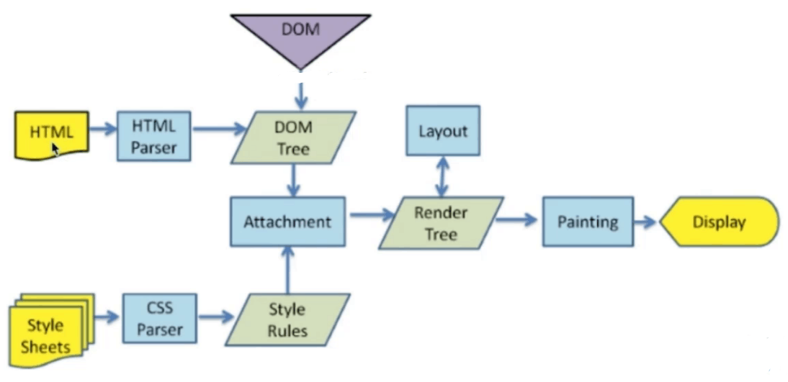

# 面试模拟

渲染机制

JS运行机制

页面性能

错误监控

---

## 渲染机制

### DOCTYPE及作用

DTD document type definition 文档类型定义，是一系列的语法规则，用来定义XML或(X)HTML的文档类型。浏览器会使用它来判断文档类型，决定使用何种协议来解析，以及切换浏览器模式。

DOCTYPE是用来声明文档类型和DTD规范的，一个主要的用于便是文件的合法性验证。如果文档代码不合法，那么浏览器解析时便会出一些差错。

### 浏览器渲染流程

### 重排 Reflow

DOM结构中的各个元素都有自己的盒子模型，这些都需要浏览器根据各种样式来计算，并根据计算结果将元素放到它该出现的位置，这个过程称之为reflow。

**触发Relow**

* 当增加、删除、修改DOM节点时，会导致Reflow及Repaint
* 当移动DOM位置，或是有动画时（改变位置，大小等），Reflow和Repaint
* 当修改CSS样式时
* 当resize窗口时（移动端无）或是scroll滚动时，有可能触发Reflow
* 当修改网页默认字体时

### 重绘 Repaint

当各种盒子的位置、大小以及其他属性，例如颜色、字体大小等都确定下来以后，浏览器把这些元素都按照各自的特性绘制了一遍，于是页面内容出现了，这个过程称之为Repaint。

**触发Repaint**

* DOM改动
* CSS改动

### 布局 Layout

