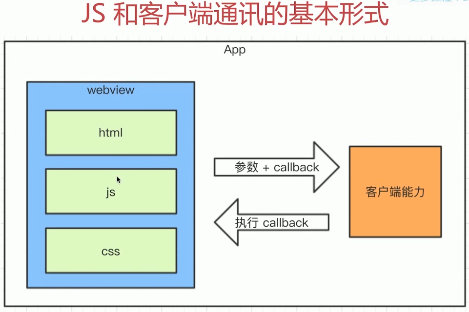

# 前端和客户端通讯

* JS和客户端通讯的基本形式
* Schema协议简介和使用
* Schema使用的封装

## 遗留问题

**新闻详情页适用于hybrid，前端如何获取新闻内容**

1. 不能用ajax获取。跨域，且慢  
2. 客户端获取新闻内容，然后JS通讯拿到内容，再渲染



## Schema

**简介和使用**

```js
// 如果要加上参数和callback 就要这么写
window['_weixin_scan_callback'] = function(result) {
  console.log(result)
}
// 省略
iframe.src = 'weixin://dl/scan?k1=v1&k2=v2&k3=v3&callback=_weixin_scan_callback'
// -------------------------------------
// 以下是演示， 外部页面不能随意使用Schema
var iframe = document.craeteElement('iframe')
iframe.style.display = 'none'
iframe.src = 'weixin://dl/scan' // iframe访问schema
var body = document.body || document.getElementsByTagName('body')[0]
body.append(iframe)
setTimeout(function() {
  body.removeChild(iframe) // 销毁iframe
  iframe = null
})
```

### Schema使用的封装

```js
/* 傻瓜式调用，而且不用再自己定义全局函数 */
window.invoke.share({
  title: 'xxx',
  content: 'xxx'
}, function(result) {
  if (result.errno === 0) {
    alert('分享成功')
  } else {
    alert(result.message) // 分享失败
  }
})
```

方法暴露

```js
// 分享
function invokeShare(data,callback) {
  _invoke('share', data, callback)
}
// 登录
function invokeLogin(data, callback) {
  _invoke('login', data, callback)
}
// 扫一扫
function invokeScan(data, callback) {
  _invoke('scan', data, callback)
}
// 暴露给全局
window.invoke = {
  share: invokeShare,
  login: invokeLogin,
  scan: invokeScan
}
```

```js
function _invoke(action, data, callback) {
  // 拼接 Schema 协议
  var schema = 'myapp://utils'
  schema += '/' + action
  schema += '?a=a'
  var key 
  for (key in data) {
    if (data.hasOwnProperty(key)) {
      schema += '&' + key + '=' + data[key]
    }
  }
  // 处理callback
  var callbackName = ''
  if (typeof callback === 'string') {
    callbackName = callback
  } else {
    callbackName = action + Date.now()
    window[callbackName] = callback
  }
  schema += '&callback=' + callbackName
  // iframe中调用schema  
}
```


### 完整封装

```js
;(function(window, undefined) {
  // 调用 schema 封装
  function _invoke(action, data, callback) {
    // 拼装schema协议
    var schema = 'myapp://utils/' + action
    // 拼接参数
    schema += '?a=a'
    var key
    for (key in data) {
      if (data.hasOwnProperty(key)) {
        schema += '&' + key + data[key]
      }
    }
    // 处理 callback
    var callbackName = ''
    if (typeof callback === 'string') {
      callbackName = callback
    } else {
      callbackName = action + Date.now()
      window[callbackName] = callback
    }
    schema += 'callback=callbackName'

    // 触发
    var iframe = document.createElement('iframe')
    iframe.style.display = 'none'
    iframe.src = schema
    var body = document.body || document.getElementsByTagName('body')[0]
    body.append(iframe)
    setTimeout(function() {
      body.removeChild(iframe)
      iframe = null
    })
  }

  window.invoke = {
    share: function(data, callback) {
      _invoke('share', data, callback)
    },
    scan: function(data, callback) {
      _invoke('scan', data, callback)
    },
    login: function(data, callback) {
      _invoke('login', data, callback)
    }
  }
})(window)
```

### 内置上线

* 将以上封装的代码打包，叫做invoke.js，内置到客户端
* 客户端每次启动webview，都默认执行invoke.js
* 本地加载，免去网络加载时间，更快
* 本地加载，没有网络请求，用户看不到schema协议，更安全

